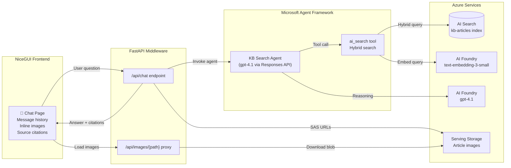

# Epic 002 — KB Search Web App (Agent + NiceGUI)

> **Status:** Not Started
> **Created:** February 17, 2026
> **Updated:** February 17, 2026

## Objective

Build a local-first web application that demonstrates consuming the `kb-articles` AI Search index via a conversational agent. The app uses a **FastAPI** backend middleware, a single **Microsoft Agent Framework** agent with the **Responses API**, and **NiceGUI** for the chat UI. The agent uses Azure AI Search as a tool to answer knowledge-base questions, returning text answers with inline images (served via Blob SAS URLs) and source citations.

## Success Criteria

- [ ] `make web-app` starts a local NiceGUI + FastAPI app on `http://localhost:8080`
- [ ] User can type a KB question and receive a conversational answer grounded in indexed content
- [ ] Search results include inline images (PNGs from serving blob storage, delivered via SAS URLs)
- [ ] Each answer shows source citations (article title, section header, chunk link)
- [ ] Agent uses hybrid search (vector + keyword) against the `kb-articles` index
- [ ] All tests pass for the web-app module

---

## Architecture



### Key Design Decisions

| # | Decision | Rationale |
|---|----------|-----------|
| 1 | **gpt-4.1** for agent reasoning | Already deployed in infra (30K TPM). Stronger reasoning than gpt-5-mini for grounded Q&A with tool calls. |
| 2 | **Blob SAS URLs** for images | Images live in Azure Blob Storage serving account. User delegation SAS provides time-limited, identity-based access without shared keys. Falls back to FastAPI proxy for reliability. |
| 3 | **Hybrid search** (vector + keyword) | Best relevance — embeds the user query with `text-embedding-3-small` for vector similarity, combined with keyword matching for precise term hits. |
| 4 | **NiceGUI** for frontend | Python-native UI framework with built-in chat components, Markdown rendering, and image support. Single-language stack (no separate JS build). |
| 5 | **Responses API** | Modern stateless API for agent interactions. Each request is self-contained with tool definitions, no server-side session management required. |
| 6 | **FastAPI middleware** | Separates agent logic from UI. NiceGUI runs on top of FastAPI (Starlette), so both share the same ASGI server. |
| 7 | **Source citations** | Each answer includes which article/section the information came from, building user trust and enabling drill-down. |

### Index Schema Reference

The `kb-articles` index (created by Epic 001) contains these fields:

| Field | Type | Purpose |
|-------|------|---------|
| `id` | String (key) | `{article_id}_{chunk_index}` |
| `article_id` | String (filterable) | Article folder name |
| `chunk_index` | Int32 (sortable) | Position within article |
| `content` | String (searchable) | Chunk text with inline image descriptions |
| `content_vector` | Collection(Single) | 1536-dim embedding (text-embedding-3-small) |
| `image_urls` | Collection(String) | Relative paths: `images/filename.png` |
| `source_url` | String | (reserved for future use) |
| `title` | String (searchable) | Article title (H1) |
| `section_header` | String (filterable) | Section heading for this chunk |
| `key_topics` | Collection(String) (filterable) | (reserved for future use) |

Image full blob path: `{SERVING_BLOB_ENDPOINT}/serving/{article_id}/{image_url}`

---

## Source Layout

```
src/
└── web-app/
    ├── pyproject.toml               # UV project — NiceGUI, FastAPI, Azure SDKs
    ├── .env.sample                  # Required environment variables
    ├── .python-version              # Python 3.11
    │
    ├── app/
    │   ├── __init__.py
    │   ├── main.py                  # NiceGUI app entry point + FastAPI mount
    │   ├── config.py                # Environment config (typed dataclass)
    │   │
    │   ├── agent/
    │   │   ├── __init__.py
    │   │   ├── search_tool.py       # AI Search hybrid query tool
    │   │   ├── image_service.py     # Blob SAS URL generation
    │   │   └── kb_agent.py          # Agent definition + Responses API interaction
    │   │
    │   └── ui/
    │       ├── __init__.py
    │       └── chat_page.py         # NiceGUI chat page with citations
    │
    └── tests/
        ├── __init__.py
        ├── conftest.py
        ├── test_search_tool.py
        ├── test_image_service.py
        └── test_kb_agent.py
```

---

## Stories

---

### Story 1 — Project Scaffolding

> **Status:** Not Started

Set up the `/src/web-app` project with UV, NiceGUI + FastAPI, Azure SDK dependencies, configuration module, and Makefile integration.

#### Deliverables

- [ ] Create `/src/web-app/` directory structure matching the layout above
- [ ] Create `src/web-app/pyproject.toml` with dependencies:
  - `nicegui>=2.0` — UI framework (includes FastAPI/Uvicorn)
  - `azure-identity>=1.19.0` — DefaultAzureCredential
  - `azure-search-documents>=11.6.0` — AI Search client
  - `azure-ai-inference>=1.0.0` — Embeddings client
  - `azure-storage-blob>=12.24.0` — Blob SAS URL generation
  - `openai>=1.60.0` — Responses API client (Azure OpenAI)
  - `python-dotenv>=1.0.0` — Environment loading
  - Dev: `pytest`, `pytest-asyncio`
- [ ] Create `src/web-app/.python-version` → `3.11`
- [ ] Create `src/web-app/.env.sample` with required variables:
  ```
  # Azure AI Services (Foundry) — agent model + embeddings
  AI_SERVICES_ENDPOINT=https://ai-kbidx-{env}.cognitiveservices.azure.com/
  AGENT_MODEL_DEPLOYMENT_NAME=gpt-4.1
  EMBEDDING_DEPLOYMENT_NAME=text-embedding-3-small

  # Azure AI Search
  SEARCH_ENDPOINT=https://srch-kbidx-{env}.search.windows.net
  SEARCH_INDEX_NAME=kb-articles

  # Azure Blob Storage — serving account (images)
  SERVING_BLOB_ENDPOINT=https://stkbidxserving{env}.blob.core.windows.net/
  SERVING_CONTAINER_NAME=serving
  ```
- [ ] Implement `src/web-app/app/config.py`:
  - Typed `Config` dataclass, loads `.env`, validates required vars on import
  - Follows the same pattern as `src/functions/shared/config.py`
  - Singleton `config` instance
- [ ] Add Makefile targets:
  - `web-app` — `cd src/web-app && uv run python -m app.main`
  - `web-app-setup` — `cd src/web-app && uv sync --extra dev`
  - `web-app-test` — `cd src/web-app && uv run pytest tests/ -v`
- [ ] `uv sync --extra dev` succeeds in `src/web-app/` with no errors

| File | Status |
|------|--------|
| `src/web-app/pyproject.toml` | |
| `src/web-app/.python-version` | |
| `src/web-app/.env.sample` | |
| `src/web-app/app/__init__.py` | |
| `src/web-app/app/main.py` | |
| `src/web-app/app/config.py` | |
| `Makefile` | |

#### Definition of Done

- [ ] `cd src/web-app && uv sync --extra dev` installs all dependencies
- [ ] `make web-app` starts and displays a placeholder page at `http://localhost:8080`
- [ ] Config loads from `.env` and validates required variables
- [ ] `make help` shows updated targets

---

### Story 2 — AI Search Hybrid Query Tool

> **Status:** Not Started

Implement the AI Search tool function that performs hybrid (vector + keyword) search against the `kb-articles` index and returns typed results with image references.

#### Deliverables

- [ ] Implement `src/web-app/app/agent/search_tool.py`:
  - `search_kb(query: str, top: int = 5) -> list[SearchResult]`
  - Embeds `query` using `text-embedding-3-small` (same embedder as fn-index)
  - Performs hybrid search: vector similarity on `content_vector` + keyword search on `content`
  - Returns `SearchResult` dataclass:
    ```python
    @dataclass
    class SearchResult:
        id: str
        article_id: str
        chunk_index: int
        content: str
        title: str
        section_header: str
        image_urls: list[str]   # relative paths from index
        score: float
    ```
  - Uses `DefaultAzureCredential` for auth
  - Handles empty results gracefully
- [ ] Unit test: `tests/test_search_tool.py`:
  - Test hybrid search returns results for a known query
  - Test result dataclass fields are populated
  - Test empty query handling

| File | Status |
|------|--------|
| `src/web-app/app/agent/search_tool.py` | |
| `src/web-app/tests/test_search_tool.py` | |

#### Definition of Done

- [ ] Hybrid search returns relevant chunks for sample queries (e.g., "What is Content Understanding?")
- [ ] Results include `image_urls` for chunks that have images
- [ ] Vector embeddings use the same model (`text-embedding-3-small`, 1536 dims) as the index
- [ ] Tests pass

---

### Story 3 — Image Service (Blob SAS URLs)

> **Status:** Not Started

Implement the image service that generates time-limited SAS URLs for article images stored in the serving blob storage account, using user delegation keys (no shared keys).

#### Deliverables

- [ ] Implement `src/web-app/app/agent/image_service.py`:
  - `get_image_url(article_id: str, image_path: str) -> str`
    - Constructs full blob path: `{article_id}/{image_path}` in the serving container
    - Generates a user delegation SAS URL valid for 1 hour
    - Caches the user delegation key (valid for up to 7 days, refresh when near expiry)
  - `resolve_image_urls(article_id: str, image_urls: list[str]) -> list[str]`
    - Batch-resolves a list of relative image paths to SAS URLs
  - Uses `DefaultAzureCredential` → `BlobServiceClient` → user delegation key
  - Handles missing blobs gracefully (returns empty string, logs warning)
- [ ] Unit test: `tests/test_image_service.py`:
  - Test SAS URL generation produces valid URLs
  - Test user delegation key caching
  - Test missing blob handling

> **RBAC Note:** The developer's identity needs the `Storage Blob Delegator` role on the serving storage account in addition to `Storage Blob Data Contributor` (already granted). Add this to the Bicep template or `grant-dev-roles` documentation.

| File | Status |
|------|--------|
| `src/web-app/app/agent/image_service.py` | |
| `src/web-app/tests/test_image_service.py` | |

#### Definition of Done

- [ ] SAS URLs are generated for known images in the serving blob
- [ ] URLs are accessible in a browser (image loads)
- [ ] User delegation key is cached and reused across calls
- [ ] Tests pass

---

### Story 4 — KB Search Agent (Responses API)

> **Status:** Not Started

Implement the agent using the Microsoft Agent Framework with the Responses API. The agent has a system prompt for KB search assistance and a single tool (AI Search). When the model calls the tool, we execute the search, resolve image SAS URLs, and return results. The agent's final answer includes grounded text and structured citations.

#### Deliverables

- [ ] Implement `src/web-app/app/agent/kb_agent.py`:
  - `KBAgent` class:
    - Initializes with Azure OpenAI client (Responses API), model deployment name, tool definitions
    - System prompt: instructs the agent to answer KB questions using the search tool, cite sources, reference images when relevant
    - Tool definition for `search_kb`:
      ```json
      {
        "type": "function",
        "name": "search_kb",
        "description": "Search the knowledge base for articles about Azure services, features, and how-to guides. Returns relevant text chunks with optional images.",
        "parameters": {
          "type": "object",
          "properties": {
            "query": {
              "type": "string",
              "description": "The search query — use natural language describing what information is needed"
            }
          },
          "required": ["query"]
        }
      }
      ```
    - `async chat(user_message: str, conversation_history: list) -> AgentResponse`:
      1. Send conversation + tool definitions to Responses API
      2. If model returns tool calls → execute `search_kb`, resolve image SAS URLs, feed results back
      3. Loop until model returns a final text response (handle multi-turn tool calls)
      4. Extract citations from search results used
      5. Return `AgentResponse(text, citations, images)`
  - `AgentResponse` dataclass:
    ```python
    @dataclass
    class Citation:
        article_id: str
        title: str
        section_header: str
        chunk_index: int

    @dataclass
    class AgentResponse:
        text: str                    # Agent's markdown answer
        citations: list[Citation]    # Sources used
        images: list[str]            # SAS URLs for relevant images
    ```
  - Uses `openai.AzureOpenAI` client with `DefaultAzureCredential` (token provider)
  - Handles errors gracefully (search failures, model errors)
- [ ] Unit test: `tests/test_kb_agent.py`:
  - Test tool definition schema is valid
  - Test agent response parsing
  - Test conversation history management
  - Test error handling for failed tool calls

| File | Status |
|------|--------|
| `src/web-app/app/agent/kb_agent.py` | |
| `src/web-app/tests/test_kb_agent.py` | |

#### Definition of Done

- [ ] Agent answers KB questions using search results as grounding
- [ ] Tool calls are executed and results fed back to the model correctly
- [ ] Responses include structured citations (article, section, chunk)
- [ ] Image SAS URLs are included when chunks contain images
- [ ] Multi-turn tool calls are handled (agent can search multiple times)
- [ ] Tests pass

---

### Story 5 — NiceGUI Chat Interface

> **Status:** Not Started

Implement the NiceGUI chat page with conversational history, Markdown-rendered answers, inline image display, and source citations panel.

#### Deliverables

- [ ] Implement `src/web-app/app/ui/chat_page.py`:
  - Single-page chat interface using `ui.chat_message` components
  - Text input with send button (and Enter key support)
  - User messages displayed on the right, agent responses on the left
  - Agent responses rendered as Markdown (supports headers, lists, code blocks, bold/italic)
  - Inline images: when `AgentResponse.images` is non-empty, display them within the response message
  - Citations panel below each agent message:
    - Shows "Sources: Article Title > Section Header" for each citation
    - Collapsed by default, expandable
  - Loading spinner while agent is processing
  - Auto-scroll to latest message
  - Conversation history maintained in session state (in-memory, not persisted)
- [ ] Update `src/web-app/app/main.py`:
  - Mount the chat page as the root route (`/`)
  - Configure NiceGUI settings (title, favicon, dark mode)
  - Initialize the `KBAgent` singleton on startup
- [ ] Style:
  - Clean, minimal design
  - Responsive layout (works on desktop browsers)
  - Dark mode support (NiceGUI built-in)

| File | Status |
|------|--------|
| `src/web-app/app/ui/chat_page.py` | |
| `src/web-app/app/main.py` | |

#### Definition of Done

- [ ] Chat page loads at `http://localhost:8080`
- [ ] User can type a question and see the agent's answer with Markdown formatting
- [ ] Images from search results are displayed inline in the chat
- [ ] Source citations are shown below each answer (expandable)
- [ ] Multiple messages in a row work correctly (conversation history maintained)
- [ ] Loading state is visible while agent processes

---

### Story 6 — Local E2E & Documentation

> **Status:** Not Started

Wire everything end-to-end, verify the full flow locally, and update project documentation.

#### Deliverables

- [ ] Verify end-to-end flow:
  - [ ] `make web-app-setup` installs all dependencies
  - [ ] `make web-app` starts the app at `http://localhost:8080`
  - [ ] Ask "What is Azure Content Understanding?" → get a grounded answer with the framework image
  - [ ] Ask "How does search security work?" → get an answer citing the security article
  - [ ] Ask a follow-up question → agent uses conversation history
  - [ ] Images load correctly from blob storage via SAS URLs
  - [ ] Citations show correct article and section references
- [ ] Update `README.md`:
  - Add "Web App" section to Getting Started
  - Document `.env` setup (reuse from AZD outputs)
  - Document `make web-app` workflow
- [ ] Update `docs/specs/architecture.md`:
  - Add web app as a consumer of the `kb-articles` index
  - Reference the agent architecture diagram
- [ ] Add RBAC note: developer needs `Storage Blob Delegator` role on serving storage
- [ ] All web-app tests pass: `make web-app-test`

| File | Status |
|------|--------|
| `README.md` | |
| `docs/specs/architecture.md` | |
| `Makefile` | |

#### Definition of Done

- [ ] Full local demo works: question → search → agent answer with images and citations
- [ ] `make web-app-test` passes
- [ ] README.md has accurate web-app setup and run instructions
- [ ] Architecture doc updated with the web app consumer layer
- [ ] Epic marked complete

---

## Implementation Notes

- **Local-first:** The web app runs locally against live Azure services (AI Search, AI Foundry, Blob Storage). No Azure hosting required for this epic.
- **Shared Azure services:** Reuses the same Azure infrastructure from Epic 001 — no new services to provision. The `gpt-4.1` model is already deployed.
- **`.env` reuse:** The web app `.env` uses the same variables as `src/functions/.env` (plus `SERVING_CONTAINER_NAME`). Run `azd env get-values > src/web-app/.env` to populate.
- **Developer RBAC:** The developer's `az login` identity needs existing roles (Cognitive Services OpenAI User, Search Index Data Contributor) plus `Storage Blob Delegator` on the serving storage account for SAS URL generation.
- **NiceGUI + FastAPI:** NiceGUI runs on top of Starlette/FastAPI. The agent API endpoint and image proxy share the same ASGI server — no separate backend process needed.
- **Responses API:** Uses the `openai` Python SDK with Azure configuration. Each chat turn sends the full conversation history + tool definitions. The API is stateless — no server-side threads or sessions.
- **Image flow:** Search results include `image_urls` (relative paths like `images/fig.png`). Combined with `article_id`, we construct the blob path → generate a SAS URL → embed `` in the chat message. Images are served directly from Azure Blob Storage to the browser.
- **No persistence:** Conversation history is in-memory per browser session. Page refresh clears history. Persistence is out of scope for this epic.
