# Epic 002 — Context Aware & Vision Grounded KB Agent (Chainlit + Agent Framework) ✅

> **Status:** Done
> **Created:** February 17, 2026
> **Updated:** February 17, 2026

## Objective

Build a local-first web application that demonstrates consuming the `kb-articles` AI Search index via a conversational agent. The app uses **Chainlit** for the chat UI with native streaming support, a single **Microsoft Agent Framework** agent, and Azure AI Search as a tool to answer knowledge-base questions, returning text answers with inline images (served via Blob SAS URLs) and source citations.

## Success Criteria

- [x] `make app` starts a local Chainlit app on `http://localhost:8080`
- [x] User can type a KB question and receive a conversational answer grounded in indexed content
- [x] Search results include inline images (PNGs from serving blob storage, delivered via SAS URLs)
- [x] Each answer shows source citations (article title, section header, chunk link)
- [x] Agent uses hybrid search (vector + keyword) against the `kb-articles` index
- [x] All tests pass for the web-app module

---

## Architecture

```mermaid
flowchart LR
    subgraph UI["Chainlit Frontend"]
        CHAT["💬 Chat Page<br/>Streaming responses<br/>Inline images<br/>Source citations"]
    end

    subgraph Agent["Microsoft Agent Framework"]
        AG["KB Search Agent<br/>(gpt-4.1 via Responses API)"]
        TOOL["ai_search tool<br/>Hybrid search"]
    end

    subgraph Azure["Azure Services"]
        SRCH[("AI Search<br/>kb-articles index")]
        EMBED["AI Foundry<br/>text-embedding-3-small"]
        MODEL["AI Foundry<br/>gpt-4.1"]
        BLOB["Serving Storage<br/>Article images"]
    end

    CHAT -->|User question| AG
    AG -->|Tool call| TOOL
    TOOL -->|Hybrid query| SRCH
    TOOL -->|Embed query| EMBED
    AG -->|Reasoning| MODEL
    AG -->|SAS URLs| BLOB
    AG -->|Streamed answer + citations| CHAT
```



### Key Design Decisions

| # | Decision | Rationale |
|---|----------|-----------|
| 1 | **gpt-4.1** for agent reasoning | Already deployed in infra (30K TPM). Stronger reasoning than gpt-5-mini for grounded Q&A with tool calls. |
| 2 | **Blob SAS URLs** for images | Images live in Azure Blob Storage serving account. User delegation SAS provides time-limited, identity-based access without shared keys. Falls back to FastAPI proxy for reliability. |
| 3 | **Hybrid search** (vector + keyword) | Best relevance — embeds the user query with `text-embedding-3-small` for vector similarity, combined with keyword matching for precise term hits. |
| 4 | **Chainlit** for frontend | Purpose-built chat UI framework with native streaming, citations, and multi-turn support. Eliminates custom WebSocket/queue plumbing. Single `chainlit run` command. |
| 5 | **Responses API** | Modern stateless API for agent interactions. Each request is self-contained with tool definitions, no server-side session management required. |
| 6 | **Direct agent calls** | Chainlit calls the agent directly — no separate FastAPI middleware layer needed. Simpler architecture. |
| 7 | **Source citations** | Each answer includes which article/section the information came from, building user trust and enabling drill-down. |

### Index Schema Reference

The `kb-articles` index (created by Epic 001) contains these fields:

| Field | Type | Purpose |
|-------|------|---------|
| `id` | String (key) | `{article_id}_{chunk_index}` |
| `article_id` | String (filterable) | Article folder name |
| `chunk_index` | Int32 (sortable) | Position within article |
| `content` | String (searchable) | Chunk text with inline image descriptions |
| `content_vector` | Collection(Single) | 1536-dim embedding (text-embedding-3-small) |
| `image_urls` | Collection(String) | Relative paths: `images/filename.png` |
| `source_url` | String | (reserved for future use) |
| `title` | String (searchable) | Article title (H1) |
| `section_header` | String (filterable) | Section heading for this chunk |
| `key_topics` | Collection(String) (filterable) | (reserved for future use) |

Image full blob path: `{SERVING_BLOB_ENDPOINT}/serving/{article_id}/{image_url}`

---

## Source Layout

```
src/
└── web-app/
    ├── pyproject.toml               # UV project — Chainlit, Azure SDKs
    ├── .env.sample                  # Required environment variables
    ├── .python-version              # Python 3.11
    ├── .chainlit/                   # Chainlit config (config.toml)
    ├── public/                      # Static assets (logo, CSS)
    │
    ├── app/
    │   ├── __init__.py
    │   ├── main.py                  # Chainlit app — streaming, image proxy, citations
    │   ├── config.py                # Environment config (typed dataclass)
    │   │
    │   └── agent/
    │       ├── __init__.py
    │       ├── kb_agent.py          # Agent definition + streaming + system prompt
    │       ├── search_tool.py       # AI Search hybrid query tool
    │       ├── image_service.py     # Blob image download + proxy URL generation
    │       └── vision_middleware.py  # ChatMiddleware — injects images into LLM conversation
    │
    └── tests/
        ├── __init__.py
        ├── conftest.py
        ├── test_search_tool.py
        ├── test_image_service.py
        └── test_kb_agent.py
```
```

---

## Stories

---

### Story 1 — Project Scaffolding ✅

> **Status:** Done

Set up the `/src/web-app` project with UV, Chainlit, Azure SDK dependencies, configuration module, and Makefile integration.

#### Deliverables

- [x] Create `/src/web-app/` directory structure matching the layout above
- [x] Create `src/web-app/pyproject.toml` with dependencies:
  - `chainlit>=2.0` — Chat UI framework with native streaming
  - `azure-identity>=1.19.0` — DefaultAzureCredential
  - `azure-search-documents>=11.6.0` — AI Search client
  - `azure-ai-inference>=1.0.0` — Embeddings client
  - `azure-storage-blob>=12.24.0` — Blob SAS URL generation
  - `agent-framework-core` — Microsoft Agent Framework
  - `agent-framework-azure-ai` — Azure AI integration
  - `python-dotenv>=1.0.0` — Environment loading
  - Dev: `pytest`, `pytest-asyncio`
- [x] Create `src/web-app/.python-version` → `3.11`
- [x] Create `src/web-app/.env.sample` with required variables:
  ```
  # Azure AI Services (Foundry) — agent model + embeddings
  AI_SERVICES_ENDPOINT=https://ai-kbidx-{env}.cognitiveservices.azure.com/
  AGENT_MODEL_DEPLOYMENT_NAME=gpt-4.1
  EMBEDDING_DEPLOYMENT_NAME=text-embedding-3-small

  # Azure AI Search
  SEARCH_ENDPOINT=https://srch-kbidx-{env}.search.windows.net
  SEARCH_INDEX_NAME=kb-articles

  # Azure Blob Storage — serving account (images)
  SERVING_BLOB_ENDPOINT=https://stkbidxserving{env}.blob.core.windows.net/
  SERVING_CONTAINER_NAME=serving
  ```
- [x] Implement `src/web-app/app/config.py`:
  - Typed `Config` dataclass, loads `.env`, validates required vars on import
  - Follows the same pattern as `src/functions/shared/config.py`
  - Singleton `config` instance
- [x] Add Makefile targets:
  - `app` — `cd src/web-app && uv run chainlit run app/main.py -w --port 8080`
  - `app-setup` — `cd src/web-app && uv sync --extra dev`
  - `app-test` — `cd src/web-app && uv run pytest tests/ -v`
- [x] `uv sync --extra dev` succeeds in `src/web-app/` with no errors

| File | Status |
|------|--------|
| `src/web-app/pyproject.toml` | ✅ |
| `src/web-app/.python-version` | ✅ |
| `src/web-app/.env.sample` | ✅ |
| `src/web-app/app/__init__.py` | ✅ |
| `src/web-app/app/main.py` | ✅ |
| `src/web-app/app/config.py` | ✅ |
| `Makefile` | ✅ |

#### Definition of Done

- [x] `cd src/web-app && uv sync --extra dev` installs all dependencies
- [x] `make app` starts and displays a Chainlit chat page at `http://localhost:8080`
- [x] Config loads from `.env` and validates required variables
- [x] `make help` shows updated targets

---

### Story 2 — AI Search Hybrid Query Tool ✅

> **Status:** Done

Implement the AI Search tool function that performs hybrid (vector + keyword) search against the `kb-articles` index and returns typed results with image references.

#### Deliverables

- [x] Implement `src/web-app/app/agent/search_tool.py`:
  - `search_kb(query: str, top: int = 5) -> list[SearchResult]`
  - Embeds `query` using `text-embedding-3-small` (same embedder as fn-index)
  - Performs hybrid search: vector similarity on `content_vector` + keyword search on `content`
  - Returns `SearchResult` dataclass:
    ```python
    @dataclass
    class SearchResult:
        id: str
        article_id: str
        chunk_index: int
        content: str
        title: str
        section_header: str
        image_urls: list[str]   # relative paths from index
        score: float
    ```
  - Uses `DefaultAzureCredential` for auth
  - Handles empty results gracefully
- [x] Unit test: `tests/test_search_tool.py`:
  - Test hybrid search returns results for a known query
  - Test result dataclass fields are populated
  - Test empty query handling

| File | Status |
|------|--------|
| `src/web-app/app/agent/search_tool.py` | ✅ |
| `src/web-app/tests/test_search_tool.py` | ✅ |

#### Definition of Done

- [x] Hybrid search returns relevant chunks for sample queries (e.g., "What is Content Understanding?")
- [x] Results include `image_urls` for chunks that have images
- [x] Vector embeddings use the same model (`text-embedding-3-small`, 1536 dims) as the index
- [x] Tests pass

---

### Story 3 — Image Service (Blob SAS URLs) ✅

> **Status:** Done

Implement the image service that generates time-limited SAS URLs for article images stored in the serving blob storage account, using user delegation keys (no shared keys).

#### Deliverables

- [x] Implement `src/web-app/app/agent/image_service.py`:
  - `get_image_url(article_id: str, image_path: str) -> str`
    - Constructs full blob path: `{article_id}/{image_path}` in the serving container
    - Generates a user delegation SAS URL valid for 1 hour
    - Caches the user delegation key (valid for up to 7 days, refresh when near expiry)
  - `resolve_image_urls(article_id: str, image_urls: list[str]) -> list[str]`
    - Batch-resolves a list of relative image paths to SAS URLs
  - Uses `DefaultAzureCredential` → `BlobServiceClient` → user delegation key
  - Handles missing blobs gracefully (returns empty string, logs warning)
- [x] Unit test: `tests/test_image_service.py`:
  - Test SAS URL generation produces valid URLs
  - Test user delegation key caching
  - Test missing blob handling

> **RBAC Note:** The developer's identity needs the `Storage Blob Delegator` role on the serving storage account in addition to `Storage Blob Data Contributor` (already granted). Add this to the Bicep template or `grant-dev-roles` documentation.

| File | Status |
|------|--------|
| `src/web-app/app/agent/image_service.py` | ✅ |
| `src/web-app/tests/test_image_service.py` | ✅ |

#### Definition of Done

- [x] SAS URLs are generated for known images in the serving blob
- [x] URLs are accessible in a browser (image loads)
- [x] User delegation key is cached and reused across calls
- [x] Tests pass

---

### Story 4 — KB Search Agent (Responses API) ✅

> **Status:** Done

Implement the agent using the Microsoft Agent Framework with the Responses API. The agent has a system prompt for KB search assistance and a single tool (AI Search). When the model calls the tool, we execute the search, resolve image SAS URLs, and return results. The agent's final answer includes grounded text and structured citations.

#### Deliverables

- [x] Implement `src/web-app/app/agent/kb_agent.py`:
  - `KBAgent` class:
    - Initializes with Azure OpenAI client (Responses API), model deployment name, tool definitions
    - System prompt: instructs the agent to answer KB questions using the search tool, cite sources, reference images when relevant
    - Tool definition for `search_kb`:
      ```json
      {
        "type": "function",
        "name": "search_kb",
        "description": "Search the knowledge base for articles about Azure services, features, and how-to guides. Returns relevant text chunks with optional images.",
        "parameters": {
          "type": "object",
          "properties": {
            "query": {
              "type": "string",
              "description": "The search query — use natural language describing what information is needed"
            }
          },
          "required": ["query"]
        }
      }
      ```
    - `async chat(user_message: str, conversation_history: list) -> AgentResponse`:
      1. Send conversation + tool definitions to Responses API
      2. If model returns tool calls → execute `search_kb`, resolve image SAS URLs, feed results back
      3. Loop until model returns a final text response (handle multi-turn tool calls)
      4. Extract citations from search results used
      5. Return `AgentResponse(text, citations, images)`
  - `AgentResponse` dataclass:
    ```python
    @dataclass
    class Citation:
        article_id: str
        title: str
        section_header: str
        chunk_index: int

    @dataclass
    class AgentResponse:
        text: str                    # Agent's markdown answer
        citations: list[Citation]    # Sources used
        images: list[str]            # SAS URLs for relevant images
    ```
  - Uses `openai.AzureOpenAI` client with `DefaultAzureCredential` (token provider)
  - Handles errors gracefully (search failures, model errors)
- [x] Unit test: `tests/test_kb_agent.py`:
  - Test tool definition schema is valid
  - Test agent response parsing
  - Test conversation history management
  - Test error handling for failed tool calls

| File | Status |
|------|--------|
| `src/web-app/app/agent/kb_agent.py` | ✅ |
| `src/web-app/tests/test_kb_agent.py` | ✅ |

#### Definition of Done

- [x] Agent answers KB questions using search results as grounding
- [x] Tool calls are executed and results fed back to the model correctly
- [x] Responses include structured citations (article, section, chunk)
- [x] Image SAS URLs are included when chunks contain images
- [x] Multi-turn tool calls are handled (agent can search multiple times)
- [x] Tests pass

---

### Story 5 — Chainlit Chat Interface ✅

> **Status:** Done

Implement the Chainlit-based chat interface with streaming responses, Markdown-rendered answers, inline image display, and source citations.

#### Deliverables

- [x] Implement `src/web-app/app/main.py` as Chainlit app:
  - `@cl.on_chat_start`: initialize `KBAgent` per session, store in `cl.user_session`
  - `@cl.on_message`: call `agent.chat_stream()`, stream tokens via `msg.stream_token()`, then `msg.update()`
  - After streaming: attach `cl.Text` elements for source citations (side panels)
  - After streaming: normalise inline image markdown to proxy URLs
  - Image proxy endpoint at `/api/images/{article_id}/{image_path}`
  - Conversation history maintained via `AgentThread` in `cl.user_session`
- [x] Implement `src/web-app/app/agent/vision_middleware.py`:
  - `ChatMiddleware` that intercepts tool results
  - Downloads images from blob storage
  - Injects `DataContent` (base64 images) into LLM conversation for GPT-4.1 vision
- [x] Remove `src/web-app/app/ui/` directory (NiceGUI code no longer needed)
- [x] Create `.chainlit/config.toml` with custom settings (app name, branding, `unsafe_allow_html`)
- [x] Custom branding: "KB Assistant" with SVG logo
- [x] Chat starters for 3 sample questions

| File | Status |
|------|--------|
| `src/web-app/app/main.py` | ✅ |
| `src/web-app/app/agent/vision_middleware.py` | ✅ |
| `src/web-app/app/ui/` | deleted |
| `src/web-app/.chainlit/config.toml` | ✅ |
| `src/web-app/public/logo.svg` | ✅ |
| `src/web-app/public/custom.css` | ✅ |

#### Definition of Done

- [x] Chat page loads at `http://localhost:8080`
- [x] User can type a question and see the agent's streamed answer with Markdown formatting
- [x] Images from search results are displayed inline in the chat (via proxy endpoint)
- [x] Source citations are shown as clickable [Ref #N] links with side panels
- [x] Multiple messages in a row work correctly (conversation history maintained)
- [x] Streaming is visible — tokens appear incrementally
- [x] Vision middleware injects actual images into the LLM context for visual reasoning

---

### Story 6 — Local E2E & Documentation ✅

> **Status:** Done

Wire everything end-to-end, verify the full flow locally, and update project documentation.

#### Deliverables

- [x] Verify end-to-end flow:
  - [x] `make app-setup` installs all dependencies
  - [x] `make app` starts the app at `http://localhost:8080`
  - [x] Ask "What is Azure Content Understanding?" → grounded answer with framework image inline
  - [x] Ask "How does agentic retrieval work?" → answer with architecture diagram inline
  - [x] Ask "What are the network security options?" → answer with IP firewall and private endpoint diagrams inline
  - [x] Ask a follow-up question → agent uses conversation history
  - [x] Images load correctly from blob storage via proxy endpoint
  - [x] Citations show correct article and section references (clickable side panels)
- [x] Update `README.md`:
  - Updated architecture diagram to include web app
  - Documented how image-aware chunks are used by the web app
  - Updated project structure and documentation links
- [x] Update `docs/specs/architecture.md`:
  - Added detailed web app section with vision middleware and image proxy
  - Added image flow sequence diagram
  - Added image URL normalisation table
  - Updated Azure services map to include web app components
- [x] Add RBAC note: developer needs `Storage Blob Delegator` role on serving storage
- [x] All web-app tests pass: `make app-test`

| File | Status |
|------|--------|
| `README.md` | ✅ |
| `docs/specs/architecture.md` | ✅ |
| `Makefile` | ✅ |

#### Definition of Done

- [x] Full local demo works: question → search → streamed agent answer with images and citations
- [x] `make app-test` passes
- [x] README.md has accurate Chainlit setup and run instructions
- [x] Architecture doc updated with the web app consumer layer (including vision and image proxy)
- [x] Epic marked complete

---

## Implementation Notes

- **Local-first:** The web app runs locally against live Azure services (AI Search, AI Foundry, Blob Storage). No Azure hosting required for this epic.
- **Shared Azure services:** Reuses the same Azure infrastructure from Epic 001 — no new services to provision. The `gpt-4.1` model is already deployed.
- **`.env` reuse:** The web app `.env` uses the same variables as `src/functions/.env` (plus `SERVING_CONTAINER_NAME`). Run `azd env get-values > src/web-app/.env` to populate.
- **Developer RBAC:** The developer's `az login` identity needs existing roles (Cognitive Services OpenAI User, Search Index Data Contributor) plus `Storage Blob Delegator` on the serving storage account for SAS URL generation.
- **Chainlit:** Chainlit is an async-first Python framework purpose-built for conversational AI apps. It provides native `stream_token()` support, built-in message elements (`cl.Text` side panels), and session management — eliminating the need for custom WebSocket/queue plumbing.
- **Agent Framework streaming:** `KBAgent.chat_stream()` is an async generator yielding `str` deltas (text tokens) followed by a final `AgentResponse` (with citations/images). Chainlit's `msg.stream_token()` consumes the deltas directly.
- **Vision middleware:** `VisionImageMiddleware` (a `ChatMiddleware`) intercepts tool results, downloads images from blob storage, and injects them as `DataContent` into the LLM conversation. The `agent-framework-azure-ai` framework auto-converts to OpenAI's `{"type": "image_url", "image_url": {"url": "data:image/png;base64,..."}}` vision format. This lets GPT-4.1 **see** the actual images and reason about their visual content.
- **Image proxy:** A FastAPI endpoint (`/api/images/{article_id}/{image_path}`) serves images from blob storage on demand. Chainlit renders `` as native markdown, and the browser fetches from the same-origin proxy. This avoids SAS URL complexity entirely.
- **Image normalisation:** LLMs generate image URLs in many formats (hallucinated domains, missing slashes, `attachment:` schemes). Post-processing normalises all `` references to clean proxy URLs using pattern matching and filename-to-citation lookup.
- **No persistence:** Conversation history is in-memory per Chainlit session via `AgentThread`. Page refresh clears history. Persistence is out of scope for this epic.
