# Epic 003 — Web App Azure Deployment (Container Apps + Entra Auth)

> **Status:** Done
> **Created:** February 18, 2026
> **Updated:** February 19, 2026

## Objective

Deploy the Vision-Grounded Knowledge Agent (currently local-only) to **Azure Container Apps** with **Entra ID authentication** (Easy Auth, single-tenant). The deployed app uses the same Azure services as local development (AI Search, AI Foundry, Blob Storage) — authenticated via managed identity instead of the developer's `az login` credential.

## Success Criteria

- [x] `azd provision` creates Container Apps Environment, ACR, Container App, and Entra App Registration
- [x] `azd deploy` builds the Docker image, pushes to ACR, and deploys to Container Apps
- [x] The web app is accessible at its Container Apps URL with Entra ID authentication enforced
- [x] Only users in the Azure AD tenant can access the app (single-tenant)
- [x] Unauthenticated requests auto-redirect to Microsoft login (no custom login page)
- [x] The deployed app can search, stream answers, and serve inline images — identical to local
- [x] All existing local workflows (`make app`, `make app-test`) continue to work unchanged

---

## Architecture

```mermaid
flowchart LR
    subgraph Internet
        USER["👤 User<br/>(browser)"]
    end

    subgraph ACA["Azure Container Apps"]
        AUTH["<b>Easy Auth</b><br/>Entra ID<br/>(single-tenant)"]
        APP["<b>Vision-Grounded Knowledge Agent</b><br/>Chainlit + KB Agent<br/>(Container App)"]
    end

    subgraph Registry["Azure Container Registry"]
        IMG["Docker image<br/>webapp-kbidx"]
    end

    subgraph AI["Azure AI Services"]
        AF["AI Foundry<br/>gpt-4.1 + embeddings"]
        AIS["AI Search<br/>kb-articles index"]
    end

    subgraph Storage["Azure Storage"]
        BLOB["Serving Account<br/>Article images"]
    end

    subgraph Identity["Azure Entra ID"]
        APPREG["App Registration<br/>(single-tenant)"]
        MI["System Managed Identity<br/>(Container App)"]
    end

    USER -->|HTTPS| AUTH
    AUTH -->|Validate token| APPREG
    AUTH -->|Authenticated request| APP
    IMG -->|Pull image| APP
    APP -->|Managed Identity| AF
    APP -->|Managed Identity| AIS
    APP -->|Managed Identity| BLOB
```

### New Azure Resources

| Resource | Bicep Module | Name Pattern | SKU / Tier |
|----------|-------------|--------------|------------|
| Container Registry | `container-registry.bicep` | `crkbidx{env}` | Basic |
| Container Apps Environment | `container-app.bicep` | `cae-kbidx-{env}` | Consumption |
| Container App | `container-app.bicep` | `webapp-kbidx-{env}` | 0.5 vCPU, 1 GiB |
| Entra App Registration | `main.bicep` (or script) | `webapp-kbidx-{env}` | — |

### Authentication Flow

1. User navigates to the Container App URL
2. Container Apps Easy Auth intercepts the request (no authenticated session)
3. User is auto-redirected to Microsoft Entra login
4. After sign-in, Entra issues a token; Easy Auth validates it (single-tenant)
5. Authenticated request reaches the Chainlit app — no code changes needed
6. The app's managed identity authenticates to AI Services, AI Search, and Blob Storage

Easy Auth is configured as a sidecar on Container Apps — the application code does not need any authentication middleware. Unauthenticated requests to any route are automatically redirected to the Microsoft login page.

### RBAC for Container App Managed Identity

The Container App's system-assigned managed identity needs the same roles as the developer's local identity:

| Role | Resource | Purpose |
|------|----------|---------|
| Cognitive Services OpenAI User | AI Services | Call GPT-4.1 and embedding models |
| Cognitive Services User | AI Services | (if needed for any CU APIs) |
| Search Index Data Reader | AI Search | Query the `kb-articles` index |
| Storage Blob Data Reader | Serving Storage | Download article images via proxy |
| AcrPull | Container Registry | Pull Docker images |

> **Note:** The web app only **reads** from the index and blob storage — it does not need Contributor roles.

---

## Stories

---

### Story 1 — Architecture & Infrastructure Documentation ✅

> **Status:** Done

Update the architecture and infrastructure specs to document the Container Apps deployment, ACR, Entra Auth, and the new RBAC model.

#### Deliverables

- [x] Update `docs/specs/architecture.md`:
  - Add Container Apps to the Azure Services Map diagram
  - Add a "Deployment" subsection to the Vision-Grounded Knowledge Agent section
  - Document Easy Auth flow and managed identity RBAC
- [x] Update `docs/specs/infrastructure.md`:
  - Add Container Registry, Container Apps Environment, and Container App to the Resource Inventory table
  - Add new Bicep module descriptions (container-registry, container-app)
  - Add Entra App Registration to the Security Model section
  - Add Container App RBAC roles to the RBAC Role Summary
  - Add Container App application settings table
  - Update the Outputs table with new AZD outputs (ACR, Container App URL)

| File | Status |
|------|--------|
| `docs/specs/architecture.md` | ✅ |
| `docs/specs/infrastructure.md` | ✅ |

#### Definition of Done

- [x] Architecture diagram includes Container Apps and ACR
- [x] Infrastructure doc has full configuration details for all new resources
- [x] RBAC model documented for Container App managed identity
- [x] Easy Auth authentication flow documented

---

### Story 2 — Bicep Infrastructure (ACR + Container Apps + Entra Auth) ✅

> **Status:** Done

Add Bicep modules for Azure Container Registry, Container Apps Environment, Container App with Easy Auth, and the required RBAC role assignments.

#### Deliverables

- [x] Create `infra/modules/container-registry.bicep`:
  - Basic SKU ACR
  - Admin user disabled (managed identity pull)
  - Optional `acrPullPrincipalId` param for AcrPull role assignment
- [x] Create `infra/modules/container-app.bicep`:
  - Container Apps Environment (Consumption plan, linked to Log Analytics)
  - Container App with:
    - System-assigned managed identity
    - Single container: image from ACR, 0.5 vCPU / 1 GiB memory
    - Ingress: external, port 8080, HTTPS-only
    - Environment variables (same as local `.env` — AI Services endpoint, Search endpoint, Blob endpoint, deployment names)
    - Easy Auth configuration: Entra ID provider, single-tenant, require authentication, redirect unauthenticated
  - Scale: min 0, max 1 (dev tier — scale-to-zero for cost savings)
- [x] Update `infra/main.bicep`:
  - Add ACR module
  - Add Container App module
  - Wire outputs (ACR login server, Container App URL)
  - Add RBAC role assignments for Container App MI → AI Services, AI Search, Serving Storage
  - Add parameter or mechanism for Entra App Registration (client ID / tenant ID)
- [x] Update `infra/main.parameters.json` if new parameters are needed
- [x] Entra App Registration:
  - Option B chosen: Create via a pre-provision AZD hook script (`scripts/setup-entra-auth.sh`)
  - Single-tenant, with redirect URI set post-provision to Container App's auth callback URL
  - Pre-provision hook creates/reuses app registration and stores client ID/secret in AZD env

| File | Status |
|------|--------|
| `infra/modules/container-registry.bicep` | ✅ |
| `infra/modules/container-app.bicep` | ✅ |
| `infra/main.bicep` | ✅ |
| `infra/main.parameters.json` | ✅ |
| `scripts/setup-entra-auth.sh` | ✅ |

#### Definition of Done

- [x] `azd provision` succeeds and creates ACR + Container Apps Environment + Container App
- [x] Container App has system-assigned managed identity with correct RBAC roles
- [x] Easy Auth is configured with Entra ID single-tenant provider
- [x] Unauthenticated requests to the Container App URL redirect to Microsoft login
- [x] `make validate-infra` still passes (or is updated to include new resources)

---

### Story 3 — Dockerfile & Container Build ✅

> **Status:** Done

Create a production Dockerfile for the web app and integrate it with the AZD deployment workflow.

#### Deliverables

- [x] Create `src/web-app/Dockerfile`:
  - Base: `python:3.11-slim`
  - Install UV, copy `pyproject.toml` and `uv.lock`, install production dependencies
  - Copy application code (`app/`, `public/`, `.chainlit/`)
  - Expose port 8080
  - Entrypoint: `chainlit run app/main.py --host 0.0.0.0 --port 8080` (no `--watch`, production mode)
  - Multi-stage build if needed to keep image size small
  - `.dockerignore` to exclude tests, `__pycache__`, `.env`, etc.
- [x] Create `src/web-app/.dockerignore`
- [x] Test Docker build locally:
  - `docker build -t webapp-kbidx .` succeeds
  - `docker run -p 8080:8080 --env-file .env webapp-kbidx` serves the app locally
- [x] Update `azure.yaml` to add the web-app service
- [x] Add Makefile targets:
  - `docker-build` — Build the Docker image locally
  - `docker-run` — Run the Docker image locally with `.env`

| File | Status |
|------|--------|
| `src/web-app/Dockerfile` | ✅ |
| `src/web-app/.dockerignore` | ✅ |
| `azure.yaml` | ✅ |
| `Makefile` | ✅ |

#### Definition of Done

- [x] Docker image builds successfully from `src/web-app/`
- [x] Container runs locally and serves the Chainlit app on port 8080
- [x] Image size is reasonable (< 500 MB)
- [x] `azure.yaml` has the web-app service definition for AZD

---

### Story 4 — Deploy & E2E Validation ✅

> **Status:** Done

Deploy the web app to Azure Container Apps via AZD and validate the full end-to-end flow in the cloud.

#### Deliverables

- [x] Run `azd deploy` (or `azd up`) and verify:
  - Docker image is built and pushed to ACR
  - Container App is updated with the new image
  - App starts successfully (check container logs)
- [x] Validate authentication:
  - Unauthenticated browser request → redirected to Microsoft login
  - After sign-in → app loads with chat UI
  - User from outside tenant → access denied
- [x] Validate full functionality:
  - Ask "What is Azure Content Understanding?" → grounded answer with inline image
  - Ask "How does agentic retrieval work?" → answer with architecture diagram
  - Ask "What are the network security options?" → answer with security diagrams
  - Images load correctly via the image proxy (Container App → Blob Storage)
  - Citations show as clickable [Ref #N] with side panels
  - Multi-turn conversation works
- [x] Add Makefile targets:
  - `azure-deploy-app` — Deploy web app to Container Apps
  - `azure-app-logs` — Tail container app logs
  - `azure-app-url` — Print the deployed app URL
- [x] Update documentation:
  - Update `README.md` with deployed app section (URL, auth, how to access)
  - Update `docs/specs/infrastructure.md` output table with Container App URL

| File | Status |
|------|--------|
| `Makefile` | ✅ |
| `README.md` | ✅ |
| `docs/specs/infrastructure.md` | ✅ |

#### Definition of Done

- [x] `azd deploy` builds, pushes, and deploys the web app container successfully
- [x] App is accessible at its Container Apps URL with Entra ID auth enforced
- [x] All 3 sample questions return streamed answers with inline images and citations
- [x] Container logs show no errors
- [x] Local workflows (`make app`, `make app-test`) still work unchanged
- [x] README has deployment instructions

---

## Implementation Notes

- **AZD integration:** The web app is added as a second service in `azure.yaml` alongside `functions`. AZD handles Docker build/push/deploy automatically when `host: containerapp` is specified.
- **Managed identity everywhere:** The Container App's system-assigned MI replaces `DefaultAzureCredential` from the developer's local `az login`. No code changes needed — `DefaultAzureCredential` works transparently in both environments.
- **Easy Auth (no code changes):** Container Apps Easy Auth is a platform-level sidecar. It intercepts all HTTP requests before they reach the app container. The Chainlit app needs zero authentication code — it just sees authenticated requests.
- **Entra App Registration:** Required for Easy Auth. The app registration defines the client ID, tenant ID, and redirect URIs. This can be created via an AZD pre-provision hook (`az ad app create`) or via Bicep's Microsoft Graph provider (if stable). The chosen approach should be documented in Story 2.
- **Image proxy in production:** The web app's `/api/images/` proxy endpoint works identically in Container Apps — the managed identity authenticates to blob storage. No SAS URLs or public blob access needed.
- **Environment variables:** Container App env vars mirror the local `.env` — AI Services endpoint, Search endpoint, Blob endpoint, deployment names. These are wired from Bicep outputs in the Container App module.
- **Scale-to-zero:** Container Apps Consumption plan supports scale-to-zero for cost savings in dev. Min replicas = 0, max = 1. First request has a cold-start delay (~10–30 seconds).
- **ACR Basic tier:** Sufficient for dev — 10 GiB storage, no geo-replication. Admin user is disabled; image pull uses managed identity (`AcrPull` role).
- **Port 8080:** Chainlit listens on 8080 (matching the local dev setup). Container App ingress is configured for port 8080.
- **No custom domain:** The default Container Apps URL (`*.azurecontainerapps.io`) is used for now. Custom domain can be added later if needed.
- **CI/CD out of scope:** This epic covers manual deployment via `azd deploy`. GitHub Actions automation can be a future epic.
