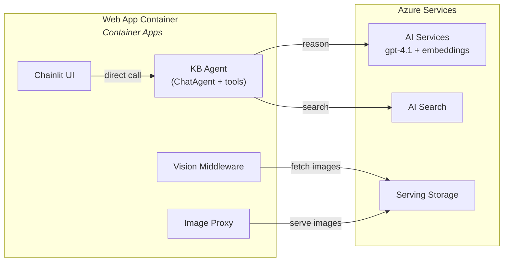
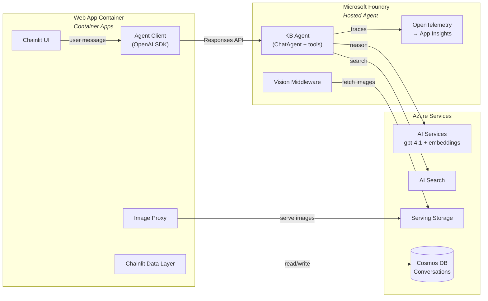

# Epic 005 — Hosted Agent on Foundry + Conversation History

> **Status:** In Progress
> **Created:** February 24, 2026
> **Updated:** February 26, 2026

## Objective

Extract the KB agent from the Chainlit web app into a standalone **Hosted Agent** deployed on **Microsoft Foundry** (new Foundry, not classic). The agent exposes the OpenAI-compatible **Responses API** and runs as a published Agent Application with its own identity, auto-scale compute, and full OpenTelemetry observability flowing into Foundry. The web app becomes a thin Chainlit client that calls the agent endpoint, stores conversation history in **Cosmos DB** (serverless), and provides a conversation list panel for resuming previous chats.

## Validation Principle

> **All changes are validated exclusively via Makefile targets.** No one-off terminal commands. If a new capability needs validation, a Makefile target must exist for it first. Anyone who clones this repo must be able to run everything using the Makefile and succeed.

## Success Criteria

- [ ] A Foundry project exists under the existing `ai-kbidx-{env}` AIServices resource
- [ ] The KB agent runs as a Hosted Agent on Foundry with a published endpoint
- [ ] `make agent` runs the agent locally on `localhost:8088` (no Docker needed)
- [ ] `make azure-agent` deploys and publishes the agent to Foundry
- [ ] The web app calls the agent via the Responses API (both local and deployed)
- [ ] Conversation history is persisted in Cosmos DB and surverable from the UI
- [ ] OpenTelemetry traces (agent spans, tool calls, model calls) are visible in Foundry portal
- [ ] All existing functionality is preserved (search, vision, images, citations)
- [ ] `make app` starts the local web app pointing at a local agent (`localhost:8088`)

---

## Architecture

### Before (Current — Epic 002)



### After (Epic 005)



### Key Design Decisions

| # | Decision | Rationale |
|---|----------|-----------|
| 1 | **Foundry project under existing AIServices** | The `ai-kbidx-{env}` resource is already `kind: AIServices` — the same resource type that backs Foundry. Creating a project as a child avoids duplicate model deployments; all existing models (gpt-4.1, text-embedding-3-small) are automatically available. |
| 2 | **Published agent (not dev mode)** | Dev mode uses a shared project identity. Publishing gives a dedicated Entra agent identity, auto-scale compute, and a stable endpoint URL — required for production use. |
| 3 | **Responses API (stateless)** | The hosted agent's Responses API is OpenAI-compatible. Conversation state is managed client-side (web app). This is the only protocol currently supported for custom clients. |
| 4 | **Client-side conversation management** | The Responses API is stateless — the client must send conversation context with each request. The web app stores conversations in Cosmos DB and sends relevant history with each agent call. |
| 5 | **Cosmos DB serverless** | Pay-per-request pricing, no minimum RU charge — ideal for dev/low-traffic. Conversation documents are small (text + image URL references, no binary data). |
| 6 | **Chainlit data layer** | Chainlit has a built-in `ChainlitDataLayer` interface for conversation persistence. Implementing it with Cosmos DB gives us conversation list + resume for "free" in the Chainlit UI. |
| 7 | **Keep image proxy in web app** | The agent outputs markdown image references (``), not base64 data. Conversations stored in Cosmos DB contain only text. The web app proxy downloads images from blob storage on demand. This keeps conversations lightweight. |
| 8 | **Agent has blob access** | The vision middleware downloads images from blob storage and injects them as `DataContent` for LLM vision reasoning. The agent's published identity needs `Storage Blob Data Reader` on the serving storage account. |
| 9 | **gpt-4.1 for agent reasoning** | Proven model with vision capabilities needed for image reasoning. Already deployed. |
| 10 | **Local dev without Docker** | The hosting adapter (`azure-ai-agentserver-agentframework`) starts a local HTTP server on `localhost:8088` exposing the same Responses API. `python main.py` is sufficient for local development. |

### Image Flow (Unchanged)

The image flow is preserved from Epic 002. The key insight: **the LLM outputs only text** (markdown image references). Images are never part of the stored conversation. Vision middleware injects base64 images into the LLM conversation as input (so the LLM can reason about them), but the LLM's output is always markdown text like ``.

```
Agent (Foundry)                          Web App (Container Apps)
─────────────────                        ─────────────────────────
1. Search tool → AI Search chunks
2. Vision MW → blob images (base64)
3. LLM sees images + text chunks
4. LLM outputs: ""
                                         5. Chainlit renders markdown
                                         6. Browser GETs /api/images/...
                                         7. Proxy downloads from blob
                                         8. Image displayed to user
```

### Conversation State Management

The Responses API is stateless. The web app manages conversation state:

```
User message → Web App → Build context (system prompt + history from Cosmos) → POST /responses → Agent → Response
                      ↓
               Save to Cosmos DB (user msg + agent response)
```

**Context window management:** When conversation history exceeds the model's context window, the oldest messages are dropped from the in-memory representation (but not from Cosmos DB). A console log warns when this happens. Future improvement: summarise dropped context.

### Foundry Agent Lifecycle

```
Code → Build Container → Deploy to Foundry → Start (dev mode) → Publish (prod mode)
                                                  │                    │
                                            Shared identity      Agent identity
                                            Project playground   Stable endpoint
                                                                 Auto-scale
                                                                 RBAC on agent
```

---

## Source Layout

### New Files

```
src/
├── agent/                              # NEW — Standalone hosted agent
│   ├── pyproject.toml                   # UV project — agent framework, hosting adapter, Azure SDKs
│   ├── .python-version                  # Python 3.11
│   ├── .env.sample                      # Required environment variables
│   ├── Dockerfile                       # Container image for Foundry deployment
│   ├── main.py                          # Entry point — hosting adapter bootstrap
│   ├── agent.yaml                       # Agent manifest for azd ai agent
│   │
│   ├── agent/
│   │   ├── __init__.py
│   │   ├── kb_agent.py                  # ChatAgent definition (moved from web-app)
│   │   ├── search_tool.py              # AI Search hybrid query tool (moved from web-app)
│   │   ├── image_service.py            # Blob image download (moved from web-app, proxy removed)
│   │   ├── vision_middleware.py        # Vision middleware (moved from web-app)
│   │   └── config.py                    # Agent-specific configuration
│   │
│   └── tests/
│       ├── __init__.py
│       ├── conftest.py
│       ├── test_search_tool.py
│       └── test_kb_agent.py
│
infra/
│   └── modules/
│       ├── foundry-project.bicep        # NEW — Foundry project under AIServices
│       └── cosmos-db.bicep              # NEW — Cosmos DB serverless account + database
```

### Modified Files

```
src/web-app/
├── pyproject.toml                       # Add openai SDK, azure-cosmos, remove agent-framework
├── app/
│   ├── main.py                          # Replace direct agent call with Responses API client
│   ├── config.py                        # Add AGENT_ENDPOINT, COSMOS_ENDPOINT
│   ├── image_service.py                 # Kept for proxy URL helpers only
│   ├── kb_agent.py                      # REMOVED (moved to src/agent/)
│   ├── search_tool.py                   # REMOVED (moved to src/agent/)
│   └── vision_middleware.py             # REMOVED (moved to src/agent/)

infra/
├── main.bicep                           # Add Foundry project + Cosmos DB modules
Makefile                                 # Add agent targets
azure.yaml                              # Add agent service
```

---

## Stories

---

### Story 1 — Foundry Project & Cosmos DB Infrastructure ✅

> **Status:** Done

Add Bicep IaC for the Foundry project (child of existing AIServices resource) and Cosmos DB serverless account.

#### Deliverables

- [x] Create `infra/modules/foundry-project.bicep`:
  - Foundry project as child resource of `ai-kbidx-{env}` (`Microsoft.CognitiveServices/accounts/projects`)
  - Name pattern: `proj-kbidx-{env}`
  - No model deployments needed (inherited from parent)
  - Link Application Insights for tracing
  - Output: project name, project endpoint

- [x] Create `infra/modules/cosmos-db.bicep`:
  - Cosmos DB account (NoSQL API, serverless capacity mode)
  - Name pattern: `cosmos-kbidx-{env}`
  - Database: `kb-agent`
  - Container: `conversations` (partition key: `/userId`)
  - Managed identity auth (no keys)
  - Minimum TLS 1.2, HTTPS only
  - Output: account endpoint, database name

- [x] Update `infra/main.bicep`:
  - Add Foundry project module
  - Add Cosmos DB module
  - RBAC for web app Container App MI: Cosmos DB Data Contributor
  - RBAC for Foundry agent identity: Cognitive Services OpenAI User, Search Index Data Reader, Storage Blob Data Reader (on serving storage)
  - New outputs: `FOUNDRY_PROJECT_NAME`, `FOUNDRY_PROJECT_ENDPOINT`, `COSMOS_ENDPOINT`, `COSMOS_DATABASE_NAME`

- [x] Update container app module to pass new env vars:
  - `AGENT_ENDPOINT` — Foundry agent endpoint URL (set after publish)
  - `COSMOS_ENDPOINT` — Cosmos DB endpoint
  - `COSMOS_DATABASE_NAME` — Database name

| File | Status |
|------|--------|
| `infra/modules/foundry-project.bicep` | ✅ |
| `infra/modules/cosmos-db.bicep` | ✅ |
| `infra/main.bicep` | ✅ |
| `infra/modules/container-app.bicep` | ✅ |

#### Definition of Done

- [x] `make azure-provision` creates the Foundry project and Cosmos DB without errors
- [x] Foundry project is visible in the Foundry portal under the AIServices resource
- [x] Cosmos DB account, database, and `conversations` container exist
- [x] All RBAC assignments are applied
- [x] No secrets or keys in app settings
- [x] `make dev-setup-env` exports new environment variables (FOUNDRY_*, COSMOS_*) to `.env` files

---

### Story 2 — Hosted Agent Package ✅

> **Status:** Done

Extract the agent code from `src/web-app/app/` into a standalone `src/agent/` project that can run locally and deploy to Foundry as a hosted agent.

#### Deliverables

- [x] Create `src/agent/pyproject.toml`:
  ```
  dependencies:
    agent-framework-core
    agent-framework-azure-ai
    azure-ai-agentserver-core
    azure-ai-agentserver-agentframework
    azure-identity
    azure-search-documents
    azure-ai-inference
    azure-storage-blob
    azure-monitor-opentelemetry
    opentelemetry-sdk
    azure-core-tracing-opentelemetry
    python-dotenv
  ```

- [x] Create `src/agent/main.py` — hosting adapter entry point:
  ```python
  from azure.ai.agentserver.agentframework import from_agent_framework
  from agent.kb_agent import create_agent

  app = from_agent_framework(create_agent())

  if __name__ == "__main__":
      app.run()  # Starts local server on localhost:8088
  ```

- [x] Move and adapt agent modules from `src/web-app/app/`:
  - `kb_agent.py` — `ChatAgent` with search tool + vision middleware. Refactor to export a `create_agent()` factory function.
  - `search_tool.py` — Unchanged (hybrid search + embeddings)
  - `vision_middleware.py` — Unchanged (download images, inject as DataContent)
  - `image_service.py` — Keep blob download logic. Remove proxy URL helpers (only needed in web app). Replace `get_image_url()` with returning raw blob-relative paths.
  - `config.py` — Agent-specific config (AI Services endpoint, Search endpoint, Serving blob endpoint, model names)

- [x] Set up OpenTelemetry:
  - Configure `azure-monitor-opentelemetry` to export traces to App Insights
  - The hosting adapter provides built-in OTel setup; connect it to the Foundry project's App Insights
  - Enable content recording via `AZURE_TRACING_GEN_AI_CONTENT_RECORDING_ENABLED` env var (opt-in)

- [x] Create `src/agent/Dockerfile`:
  - Python 3.11 base
  - Install UV + sync deps
  - Expose port 8088
  - `CMD ["python", "main.py"]`

- [x] Create `src/agent/agent.yaml`:
  - Agent manifest for `azd ai agent` CLI integration
  - Protocol: `responses` (v1)
  - Container CPU/memory configuration

- [x] Create `src/agent/.env.sample`:
  ```
  # Azure AI Services (Foundry)
  PROJECT_ENDPOINT=https://ai-kbidx-{env}.services.ai.azure.com/api/projects/proj-kbidx-{env}
  AI_SERVICES_ENDPOINT=https://ai-kbidx-{env}.cognitiveservices.azure.com/
  AGENT_MODEL_DEPLOYMENT_NAME=gpt-4.1
  EMBEDDING_DEPLOYMENT_NAME=text-embedding-3-small

  # Azure AI Search
  SEARCH_ENDPOINT=https://srch-kbidx-{env}.search.windows.net
  SEARCH_INDEX_NAME=kb-articles

  # Azure Blob Storage — serving account (images for vision)
  SERVING_BLOB_ENDPOINT=https://stkbidxserving{env}.blob.core.windows.net/
  SERVING_CONTAINER_NAME=serving

  # OpenTelemetry (auto-configured by hosting adapter in Foundry)
  # APPLICATIONINSIGHTS_CONNECTION_STRING=...
  # AZURE_TRACING_GEN_AI_CONTENT_RECORDING_ENABLED=true
  ```

- [x] Add Makefile targets:
  - `agent` — `cd src/agent && uv run python main.py` (local, port 8088)
  - `agent-test` — `cd src/agent && uv run pytest tests/ -v`

- [x] Unit tests:
  - Port existing tests from `src/web-app/tests/` where applicable
  - Test that `create_agent()` returns a properly configured `ChatAgent`
  - Test search tool independently
  - Test vision middleware image injection

| File | Status |
|------|--------|
| `src/agent/pyproject.toml` | ✅ |
| `src/agent/.python-version` | ✅ |
| `src/agent/.env.sample` | ✅ |
| `src/agent/main.py` | ✅ |
| `src/agent/Dockerfile` | ✅ |
| `src/agent/agent.yaml` | ✅ |
| `src/agent/agent/__init__.py` | ✅ |
| `src/agent/agent/kb_agent.py` | ✅ |
| `src/agent/agent/search_tool.py` | ✅ |
| `src/agent/agent/image_service.py` | ✅ |
| `src/agent/agent/vision_middleware.py` | ✅ |
| `src/agent/agent/config.py` | ✅ |
| `src/agent/tests/__init__.py` | ✅ |
| `src/agent/tests/conftest.py` | ✅ |
| `src/agent/tests/test_search_tool.py` | ✅ |
| `src/agent/tests/test_kb_agent.py` | ✅ |
| `Makefile` (updated) | ✅ |

#### Definition of Done

- [x] `make dev-setup` installs all dependencies (including agent)
- [x] `make dev-setup-env` writes `.env` for agent project
- [x] `make agent` starts the agent on `localhost:8088`
- [x] `make agent-test` passes all tests (22/22)
- [x] Agent uses gpt-4.1 for reasoning and text-embedding-3-small for search
- [x] Vision middleware successfully downloads images and injects them into the LLM conversation
- [x] OpenTelemetry traces are emitted (visible in console or local collector)
- [x] Agent runs without Docker locally
- [x] No one-off commands needed — all validated via Makefile targets

---

### Story 3 — Web App Client Refactor ✅

> **Status:** Done

Refactor the web app to call the agent via the Responses API instead of importing the agent directly. Remove the embedded agent code; keep the Chainlit UI, image proxy, citation handling, and image normalisation.

#### Deliverables

- [x] Update `src/web-app/pyproject.toml`:
  - Add: `openai>=1.60.0` (Responses API client)
  - Add: `azure-cosmos>=4.9.0` (conversation persistence — used in Story 4)
  - Remove: `agent-framework-core`, `agent-framework-azure-ai` (no longer needed in web app)

- [x] Update `src/web-app/app/config.py`:
  - Add `agent_endpoint: str` — agent URL (local: `http://localhost:8088`, deployed: Foundry endpoint)
  - Add `cosmos_endpoint: str` — Cosmos DB endpoint
  - Add `cosmos_database_name: str` — database name
  - Keep existing: image proxy config, search config (for citation URL generation)

- [x] Refactor `src/web-app/app/main.py`:
  - Replace `KBAgent` import with OpenAI SDK client:
    ```python
    from openai import OpenAI
    from azure.identity import DefaultAzureCredential, get_bearer_token_provider

    # For local agent (no auth needed):
    client = OpenAI(base_url=config.agent_endpoint, api_key="local")

    # For Foundry agent (Entra auth):
    token_provider = get_bearer_token_provider(
        DefaultAzureCredential(), "https://ai.azure.com/.default"
    )
    client = OpenAI(
        base_url=config.agent_endpoint,
        api_key=token_provider,
    )
    ```
  - Call agent via `client.responses.create(input=..., stream=True)`
  - Build conversation context: include previous messages from session/Cosmos
  - Handle streaming SSE response → Chainlit `msg.stream_token()`
  - Extract citations and image references from the response
  - Keep: image normalisation, citation de-dup, ref remapping, image proxy endpoint

- [x] Keep `src/web-app/app/image_service.py` — only the proxy URL helpers (`get_image_url()`, `download_image()`), blob client singleton.

- [x] Remove from web app:
  - `app/kb_agent.py` (moved to `src/agent/`)
  - `app/search_tool.py` (moved to `src/agent/`)
  - `app/vision_middleware.py` (moved to `src/agent/`)

- [x] Update `src/web-app/.env.sample`:
  ```
  # Agent endpoint (local or Foundry)
  AGENT_ENDPOINT=http://localhost:8088

  # Azure AI Services (still needed for token provider scope when calling Foundry agent)
  # AI_SERVICES_ENDPOINT is no longer needed directly — agent handles this

  # Azure Blob Storage — serving account (image proxy still needs this)
  SERVING_BLOB_ENDPOINT=https://stkbidxserving{env}.blob.core.windows.net/
  SERVING_CONTAINER_NAME=serving

  # Cosmos DB (conversation history)
  COSMOS_ENDPOINT=https://cosmos-kbidx-{env}.documents.azure.com:443/
  COSMOS_DATABASE_NAME=kb-agent
  ```

- [x] **Conversation context management:**
  - Maintain an in-memory list of `{role, content}` messages per session
  - On each request, prepend system prompt + last N messages from history
  - If total tokens exceed context window estimate (128K for gpt-4.1, estimated via char count heuristic), drop oldest messages from in-memory representation
  - Log to console: `"Context window trimmed: dropped N oldest messages (estimated X tokens)"`
  - Conversation history in Cosmos DB is never modified (append-only)

- [x] **Dual-mode client configuration:**
  - Local mode (`AGENT_ENDPOINT=http://localhost:8088`): no auth, plain HTTP
  - Deployed mode (`AGENT_ENDPOINT=https://<foundry>.../protocols/openai`): Entra token auth
  - Auto-detect based on URL scheme (http → local, https → Entra)

| File | Status |
|------|--------|
| `src/web-app/pyproject.toml` | ✅ |
| `src/web-app/app/config.py` | ✅ |
| `src/web-app/app/main.py` | ✅ |
| `src/web-app/app/image_service.py` | ✅ |
| `src/web-app/app/kb_agent.py` | REMOVED ✅ |
| `src/web-app/app/search_tool.py` | REMOVED ✅ |
| `src/web-app/app/vision_middleware.py` | REMOVED ✅ |
| `src/web-app/.env.sample` | ✅ |

#### Definition of Done

- [x] `make app-test` passes all web app tests (48/48)
- [x] `make app` starts the web app and connects to a local agent at `localhost:8088`
- [x] Running `make agent` (in another terminal) + `make app` produces a working end-to-end flow
- [x] User can ask questions and receive streamed answers with citations and images
- [x] Image proxy still works (browser GETs `/api/images/...`)
- [x] Citation side panels still work
- [x] Image URL normalisation still works
- [x] No `agent-framework-core` or `agent-framework-azure-ai` dependency in web app
- [x] Web app does not import any agent/search/vision code directly
- [x] No one-off commands needed — all validated via Makefile targets

---

### Story 4 — Cosmos DB Conversation Store & UI ✅

> **Status:** Done

Implement conversation persistence in Cosmos DB and add a conversation list panel to the Chainlit UI for starting new conversations and resuming previous ones.

#### Deliverables

- [x] Implement Chainlit `ChainlitDataLayer` backed by Cosmos DB:
  - `create_thread()` — create a new conversation document
  - `get_thread()` — retrieve a conversation by ID
  - `update_thread()` — add messages to a conversation
  - `list_threads()` — list conversations for the current user (ordered by last updated)
  - `delete_thread()` — soft-delete a conversation

- [x] Cosmos DB document schema:
  ```json
  {
    "id": "<conversation-id (UUID)>",
    "userId": "<user-id (from Entra or 'local')>",
    "title": "<auto-generated from first message, max 80 chars>",
    "createdAt": "<ISO 8601>",
    "updatedAt": "<ISO 8601>",
    "messages": [
      {
        "role": "user|assistant",
        "content": "<message text (markdown with image URL refs, no binary)>",
        "timestamp": "<ISO 8601>",
        "citations": [
          {
            "articleId": "...",
            "title": "...",
            "sectionHeader": "...",
            "imageUrls": ["images/file.png"]
          }
        ]
      }
    ]
  }
  ```

- [x] Conversation list panel (left side of Chainlit UI):
  - Shows list of previous conversations (title + date)
  - Click to resume — loads conversation from Cosmos DB, populates chat history
  - "New conversation" button at the top
  - Auto-title: first user message truncated to 80 chars
  - Sort: most recent first

- [x] Wire up data layer in `main.py`:
  - Register Chainlit data layer on startup
  - On `@cl.on_chat_start`: create new conversation in Cosmos DB
  - On `@cl.on_message`: append user message + agent response to Cosmos DB
  - On conversation resume: load messages from Cosmos DB, rebuild in-memory context

- [x] **Context window management:**
  - When building context for the agent, estimate token count (1 token ≈ 4 chars heuristic)
  - If conversation exceeds ~120K tokens (leaving headroom for response), drop oldest messages from the in-memory context sent to the agent
  - Log: `"Context trimmed: {n} oldest messages dropped ({estimated_tokens} estimated tokens)"`
  - Cosmos DB retains the full conversation (append-only, no trimming)

- [x] Handle user identity:
  - Deployed (Easy Auth): extract user ID from Entra token headers (`X-MS-CLIENT-PRINCIPAL-ID`)
  - Local: use `"local-user"` as default user ID

| File | Status |
|------|--------|
| `src/web-app/app/data_layer.py` | ✅ |
| `src/web-app/app/main.py` (updated) | ✅ |
| `src/web-app/app/config.py` (updated) | ✅ |

#### Definition of Done

- [x] `make app-test` passes all web app tests (including data layer tests, 48/48)
- [x] Conversations are persisted in Cosmos DB after each message exchange
- [x] Conversation list appears in the Chainlit UI left panel
- [x] Clicking a previous conversation loads and displays the full message history
- [x] "New conversation" starts a fresh thread
- [x] Resuming a conversation sends the correct context to the agent
- [x] Context trimming works and logs when messages are dropped
- [x] Images in loaded conversations render correctly via the proxy
- [x] Works both locally and deployed (local user ID vs Entra user ID)
- [x] No one-off commands needed — all validated via Makefile targets

---

### Story 5 — Agent Deployment & Publishing ✅

> **Status:** Done

Deploy the agent to Foundry as a hosted agent, publish it with a dedicated identity, and wire up the full deployment pipeline via AZD and Makefile.

#### Deliverables

- [x] Update `azure.yaml` to add agent service:
  ```yaml
  services:
    agent:
      project: ./src/agent
      language: python
      host: ai.agent   # Foundry hosted agent
      docker:
        path: ./Dockerfile
  ```

- [x] Add Makefile targets:
  - `azure-agent-deploy` — Build container, push to ACR, deploy to Foundry (dev mode)
  - `azure-agent-publish` — Publish the agent (dedicated identity, stable endpoint, auto-scale)
  - `azure-agent` — Runs deploy then publish in sequence
  - `azure-agent-logs` — Stream agent logs from Foundry

- [x] Deployment workflow:
  1. `azd deploy --service agent` — Builds Docker image, pushes to ACR, deploys to Foundry project
  2. Agent starts in dev mode (shared project identity)
  3. `az cognitiveservices agent publish ...` — Publishes the agent:
     - Creates a dedicated Entra agent identity
     - Allocates auto-scale compute
     - Produces a stable endpoint URL
  4. Post-publish RBAC script:
     - Grant the published agent identity: Cognitive Services OpenAI User (AI Services), Search Index Data Reader (AI Search), Storage Blob Data Reader (Serving Storage)
  5. Update web app `AGENT_ENDPOINT` env var with published agent URL

- [x] ACR access for agent container:
  - Reuse existing Container Registry (`crkbidx{env}`)
  - Agent image tags: `crkbidx{env}.azurecr.io/kb-agent:latest`

- [x] Agent environment variables (in Foundry deployment):
  - `PROJECT_ENDPOINT` — Foundry project endpoint
  - `AI_SERVICES_ENDPOINT` — AI Services endpoint
  - `AGENT_MODEL_DEPLOYMENT_NAME` — `gpt-4.1`
  - `EMBEDDING_DEPLOYMENT_NAME` — `text-embedding-3-small`
  - `SEARCH_ENDPOINT` — AI Search endpoint
  - `SEARCH_INDEX_NAME` — `kb-articles`
  - `SERVING_BLOB_ENDPOINT` — Serving storage endpoint
  - `SERVING_CONTAINER_NAME` — `serving`
  - `APPLICATIONINSIGHTS_CONNECTION_STRING` — App Insights (for OTel)

- [x] Verify end-to-end:
  - Deploy agent → Publish → Update web app env → Test via deployed web app

| File | Status |
|------|--------|
| `azure.yaml` | ✅ |
| `Makefile` | ✅ |
| `scripts/publish-agent.sh` | ✅ |

#### Definition of Done

- [x] `make azure-agent-deploy` builds and deploys the agent to Foundry (dev mode)
- [x] Agent is visible in Foundry portal under the project
- [x] `make azure-agent-publish` publishes the agent with a dedicated identity
- [x] Published agent has a stable endpoint URL
- [x] RBAC is correctly assigned to the published agent identity
- [x] `make azure-agent` does deploy + publish in one step
- [x] `make azure-deploy-app` deploys web app with updated AGENT_ENDPOINT
- [x] Deployed web app connects to the published agent endpoint
- [x] End-to-end: user asks question in deployed web app → agent answers with citations + images
- [x] No one-off commands needed — all validated via Makefile targets

---

### Story 6 — Observability & Telemetry ✅

> **Status:** Done

Verify and configure OpenTelemetry tracing so that agent telemetry flows into Foundry/App Insights with maximum visibility.

#### Deliverables

- [x] Verify hosting adapter auto-telemetry:
  - The `azure-ai-agentserver-agentframework` hosting adapter provides built-in OTel setup
  - Verify: agent spans, tool calls, model calls are automatically traced
  - Connection: traces exported to App Insights linked to the Foundry project

- [x] Enable content recording (opt-in):
  - Set `AZURE_TRACING_GEN_AI_CONTENT_RECORDING_ENABLED=true` in agent env vars
  - Verify: prompt contents, tool inputs/outputs, model responses are recorded
  - Note: may include PII — document this in .env.sample

- [x] Validate trace visibility:
  - Open Foundry portal → Project → Tracing
  - Confirm: agent execution spans, search tool calls, vision middleware operations, model call latencies are all visible
  - Check: distributed trace correlation across agent → AI Services → AI Search

- [x] Local tracing:
  - When running locally (`make agent`), traces export to console by default
  - Document: how to use AI Toolkit VS Code extension for local OTLP collection
  - Document: how to point at Aspire Dashboard for richer local trace visualization

- [x] Metrics:
  - Verify: request count, latency, error rate metrics are available in App Insights
  - Verify: model token usage metrics are captured

- [x] Update documentation:
  - Add tracing section to architecture.md
  - Document opt-in content recording and PII implications
  - Document local tracing options

| File | Status |
|------|--------|
| `src/agent/main.py` (tracing config) | ✅ |
| `docs/specs/architecture.md` (updated) | ✅ |

#### Definition of Done

- [x] `make agent` starts the agent and emits traces to console
- [x] Traces are visible in Foundry portal (Tracing tab) for deployed agent
- [x] Tool call spans show search queries + result counts
- [x] Model call spans show latency + token usage
- [x] Content recording works when enabled
- [x] Local tracing outputs to console
- [x] Architecture docs updated with observability section
- [x] No one-off commands needed — all validated via Makefile targets

---

### Story 7 — Documentation Update ✅

> **Status:** Done

Update all project documentation to reflect the new architecture: standalone Foundry hosted agent, Cosmos DB conversation store, and refactored web app.

#### Deliverables

- [x] Update `README.md`:
  - Architecture overview reflects agent ↔ web app split
  - New prerequisites (Foundry project, Cosmos DB)
  - Updated quickstart / getting started (run agent + web app)
  - New `make` targets documented (`agent`, `azure-agent`, etc.)

- [x] Update `docs/specs/architecture.md`:
  - Add Foundry hosted agent as a top-level component
  - Update component diagram (agent is a separate service, web app is a thin client)
  - Document Responses API integration pattern
  - Add conversation flow (web app → agent → AI Search / AI Services)
  - Add vision middleware flow (agent downloads images from blob)
  - Add observability / tracing section

- [x] Update `docs/specs/infrastructure.md`:
  - Add Foundry project (under AIServices)
  - Add Cosmos DB serverless account + database + containers
  - Update RBAC table with published agent identity and Cosmos DB roles
  - Document new Bicep modules (`foundry-project.bicep`, `cosmos-db.bicep`)

- [x] Update `.github/copilot-instructions.md`:
  - Update Solution Structure section (`src/agent/` folder)
  - Add any new conventions (Foundry agent, Cosmos DB, Responses API)

- [x] Review and update if needed:
  - `docs/epics/` — prior epics unchanged (historical), but verify no stale cross-references
  - `Makefile` header comments (if any)
  - `azure.yaml` inline comments

| File | Status |
|------|--------|
| `README.md` | ✅ |
| `docs/specs/architecture.md` | ✅ |
| `docs/specs/infrastructure.md` | ✅ |
| `.github/copilot-instructions.md` | ✅ |

#### Definition of Done

- [x] README accurately describes the current architecture and how to run locally
- [x] Architecture spec matches the implemented component diagram and data flows
- [x] Infrastructure spec lists all Azure resources including Foundry project and Cosmos DB
- [x] Copilot instructions reflect the updated solution structure
- [x] No stale references to `app/agent/` subfolder or direct agent embedding in web app

---

### Story 8 — Test Suite: Unit & Integration Tests ✅

> **Status:** Done

Refactor and extend the test suite to provide meaningful validation that the system works without manual testing. Current tests (70 total) are all unit tests with mocked dependencies — they validate logic in isolation but cannot detect wiring issues, auth problems, or API contract breakage. This story adds FastAPI endpoint tests (with `TestClient`), and integration tests that hit real running/deployed services.

#### Philosophy

- **Unit tests:** Test pure logic and data transformations. Keep them fast (no I/O), use mocks for external clients. Don't over-test — focus on functions that have real branching/logic.
- **FastAPI endpoint tests:** Use `httpx.AsyncClient` / FastAPI `TestClient` to test the HTTP layer (request/response contracts, status codes, streaming) with the agent/LLM mocked out. These are essentially in-process integration tests that don't need Azure.
- **Integration tests:** Hit real running/deployed services to validate the full stack works end-to-end. Require `az login` + provisioned infrastructure. Marked with `@pytest.mark.integration` so they're excluded from the fast test pass.

#### Test Tiers & Makefile Naming

Tests follow the existing Makefile naming convention: local targets have no prefix, Azure targets get `azure-` prefix. Test targets use `test-*` (verb-first).

**Tier 1 — Fast (no external deps, CI-safe).** In local sections:

| Target | Command | Scope |
|--------|---------|-------|
| `test-agent` | `cd src/agent && uv run pytest tests/ -v -m "not integration"` | Agent unit + endpoint tests (mocked agent) |
| `test-app` | `cd src/web-app && uv run pytest tests/ -v -m "not integration"` | Web app unit tests (mocked deps) |
| `test` | `make test-agent && make test-app` | All fast tests |

**Tier 2 — Local integration (needs running local agent + Azure backends).** In local section:

| Target | Command | Scope |
|--------|---------|-------|
| `test-agent-integration` | `cd src/agent && uv run pytest tests/ -v -m integration` | Integration tests against `localhost:8088` |

**Tier 3 — Azure integration (needs deployed infra + `az login`).** In Azure section:

| Target | Command | Scope |
|--------|---------|-------|
| `azure-test-agent` | Reads `AGENT_ENDPOINT` from AZD, runs same integration tests against Foundry endpoint | Agent integration tests (deployed) |
| `azure-test-app` | `cd src/web-app && uv run pytest tests/ -v -m integration` | Cosmos DB + Blob Storage integration tests |
| `azure-test` | `make azure-test-agent && make azure-test-app` | All Azure integration tests |

**Rename:** Existing `agent-test` → `test-agent`, `app-test` → `test-app` for consistency (verb-first, grouped by action).

#### Test Inventory

##### 8a — Agent: FastAPI Endpoint Tests (mocked agent)

Use FastAPI `TestClient` with the agent's `ChatAgent` mocked. Validates HTTP contract without needing Azure credentials.

| Test | What it validates |
|------|-------------------|
| `GET /health` returns 200 + `{"status": "healthy"}` | Health endpoint contract |
| `GET /v1/entities` returns agent list | Entity listing contract |
| `POST /v1/responses` (non-streaming) returns valid response | Non-streaming happy path |
| `POST /v1/responses` (stream=True) returns SSE events ending with `[DONE]` | Streaming contract — delta events + completion event + sentinel |
| `POST /v1/responses` when agent throws returns 500 + error detail | Error propagation |

##### 8b — Agent: Integration Tests (against running agent)

Hit a running agent instance (local `http://localhost:8088` or deployed Foundry endpoint). Same test file, different Makefile targets set the endpoint URL.

| Test | What it validates |
|------|-------------------|
| Health check returns 200 | Agent is alive |
| Entity list includes `kb-agent` | Agent is registered |
| Non-streaming response to a KB question returns a meaningful answer | Full agent pipeline: search → vision → LLM |
| Streaming response produces valid SSE events | Streaming works end-to-end |
| Response contains `[Ref #N]` citations | Search tool found results and agent cited them |

The agent endpoint URL is read from `AGENT_ENDPOINT` env var (defaults to `http://localhost:8088`). Auth is auto-detected: `http://` → no auth, `https://` → Entra token.

##### 8c — Web App: Data Layer Integration Tests (against real Cosmos DB)

Hit a real Cosmos DB instance to validate CRUD operations. Require `COSMOS_ENDPOINT` env var + `az login`.

| Test | What it validates |
|------|-------------------|
| Create user → get user returns same data | Basic round-trip |
| Create thread → list threads shows it | Thread lifecycle |
| Create thread + steps → get thread returns steps | Step persistence |
| Delete thread → get thread returns None | Delete works |

Uses the production database but creates test documents with unique IDs. Cleanup runs in fixture teardown.

##### 8d — Web App: Image Proxy Integration Tests (against real Blob Storage)

| Test | What it validates |
|------|-------------------|
| Download a known image from serving container returns bytes + correct content type | Blob access works with current credentials |
| Download non-existent blob returns None | Error handling |

Requires `SERVING_BLOB_ENDPOINT` env var + `az login` + at least one article with images in the serving container.

#### Implementation Scope

| File | Status | Changes |
|------|--------|---------|
| `src/agent/tests/test_endpoints.py` | ✅ | FastAPI endpoint tests (8a) |
| `src/agent/tests/test_agent_integration.py` | ✅ | Integration tests against running agent (8b) |
| `src/web-app/tests/test_data_layer_integration.py` | ✅ | Cosmos DB integration tests (8c) |
| `src/web-app/tests/test_image_service_integration.py` | ✅ | Blob Storage integration tests (8d) |
| `src/agent/pyproject.toml` | ✅ | Add `httpx` test dep, register `integration` marker |
| `src/web-app/pyproject.toml` | ✅ | Register `integration` marker |
| `Makefile` | ✅ | Rename targets, add integration targets |

#### Definition of Done

- [x] Agent endpoint tests pass with mocked agent (`make test-agent`)
- [x] Agent integration tests pass against a running local agent (`make test-agent-integration`)
- [ ] Agent integration tests pass against Foundry endpoint (`make azure-test-agent`)
- [ ] Cosmos DB integration tests pass against real Cosmos (`make azure-test-app`)
- [ ] Image proxy integration tests pass against real Blob Storage (`make azure-test-app`)
- [x] Existing unit tests unchanged and still pass (22 agent + 48 web app)
- [x] `make test-agent` and `make test-app` exclude integration tests by default (fast CI pass)
- [x] `make azure-test` runs all Azure integration tests
- [x] No hardcoded credentials — all integration tests use `DefaultAzureCredential` / env vars

---

### Story 9 — Entra ID Authentication

> **Status:** Not Started
> **Points:** 3

#### Goal

Add Azure Entra ID (Azure AD) authentication to the web app so that users must log in via the organisation's Azure tenant before accessing the chat interface. In Azure, the Container App uses Easy Auth; locally, the app falls back to `"local-user"` (no login prompt). The authenticated user's identity flows through to Cosmos DB as the `userId` partition key, enabling per-user conversation isolation.

#### Scope

| Area | What Changes |
|------|-------------|
| **Chainlit OAuth callback** | Implement `@cl.oauth_callback` in `app/main.py` using Azure AD as the OAuth provider. Return a `cl.User` with the user's OID as identifier. |
| **Chainlit config** | No `config.toml` changes needed — Chainlit auto-enables login when an `@cl.oauth_callback` is registered AND the `OAUTH_AZURE_AD_*` env vars are set. |
| **Environment variables** | Set `OAUTH_AZURE_AD_CLIENT_ID`, `OAUTH_AZURE_AD_CLIENT_SECRET`, and `OAUTH_AZURE_AD_TENANT_ID` (mapped from existing `ENTRA_CLIENT_ID` / `ENTRA_CLIENT_SECRET`). Add `CHAINLIT_AUTH_SECRET` for JWT signing. |
| **`_get_user_id()` update** | Prefer `cl.user_session.get("user").identifier` (Chainlit's authenticated user) over raw header inspection. Keep `X-MS-CLIENT-PRINCIPAL-ID` as secondary fallback for Easy Auth passthrough. |
| **Entra App Registration** | Add redirect URI `https://<container-app-url>/.well-known/openid-configuration` (or `/auth/oauth/azure-ad/callback`). Script `setup-entra-auth.sh` may need updating. |
| **Bicep / infra** | Pass `OAUTH_AZURE_AD_*` env vars to Container App module via app settings. Generate and store `CHAINLIT_AUTH_SECRET` in Key Vault. |
| **Local dev** | When `OAUTH_AZURE_AD_CLIENT_ID` is unset, no login prompt — `_get_user_id()` returns `"local-user"`. |
| **Tests** | Unit tests for `_get_user_id()` covering: authenticated Chainlit user, Easy Auth header, local fallback. |

#### Acceptance Criteria

- [ ] Azure-deployed web app shows a login page; users authenticate via Azure AD
- [ ] Authenticated user's OID is used as Cosmos DB `userId` partition key
- [ ] Conversations are isolated per user (user A cannot see user B's threads)
- [ ] Local `make app` works without login (falls back to `"local-user"`)
- [ ] `setup-entra-auth.sh` configures the Entra App Registration with correct redirect URIs
- [ ] `OAUTH_AZURE_AD_*` env vars are passed to Container App via Bicep
- [ ] `CHAINLIT_AUTH_SECRET` is generated and stored securely
- [ ] Unit tests cover all three `_get_user_id()` code paths
- [ ] Existing tests still pass (`make test-app`, `make test-agent`)

#### Implementation Scope

| File | Status | Notes |
|------|--------|-------|
| `src/web-app/app/main.py` | ⬜ | Add `@cl.oauth_callback`, update `_get_user_id()` |
| `src/web-app/.env` | ⬜ | Add `OAUTH_AZURE_AD_*` and `CHAINLIT_AUTH_SECRET` vars |
| `scripts/setup-entra-auth.sh` | ⬜ | Add redirect URI for Chainlit OAuth callback |
| `infra/modules/container-app.bicep` | ⬜ | Pass OAuth env vars to web app container |
| `src/web-app/tests/test_main.py` | ⬜ | Add `_get_user_id()` unit tests |
| `Makefile` | ⬜ | No changes expected |

#### Definition of Done

- [ ] `make app` works locally without login prompt
- [ ] Azure-deployed app redirects to Azure AD login
- [ ] Authenticated user identity propagates to Cosmos DB `userId`
- [ ] All tests pass: `make test-app`, `make test-agent`, `make test-functions`
- [ ] `setup-entra-auth.sh` script updated and tested
- [ ] Infra templates updated with OAuth env vars

---

## RBAC Summary (Final State)

| Principal | Resource | Role | Purpose |
|-----------|----------|------|---------|
| Function App MI | Staging Storage | Storage Blob Data Contributor | Read source articles |
| Function App MI | Serving Storage | Storage Blob Data Contributor | Write processed articles |
| Function App MI | Functions Storage | Storage Blob Data Owner | Runtime storage |
| Function App MI | Container Registry | AcrPull | Pull images |
| Function App MI | AI Services | Cognitive Services OpenAI User | Embeddings + models |
| Function App MI | AI Services | Cognitive Services User | Content Understanding |
| Function App MI | AI Search | Search Index Data Contributor | Push documents |
| Function App MI | AI Search | Search Service Contributor | Create/manage indexes |
| **Published Agent Identity** | **AI Services** | **Cognitive Services OpenAI User** | **Agent reasoning + embeddings** |
| **Published Agent Identity** | **AI Search** | **Search Index Data Reader** | **Query search index** |
| **Published Agent Identity** | **Serving Storage** | **Storage Blob Data Reader** | **Download images for vision** |
| Web App MI | AI Services | Cognitive Services OpenAI User | ~~Direct model access~~ → **Token provider for agent auth** |
| Web App MI | AI Search | Search Index Data Reader | _May no longer be needed (agent handles search)_ |
| Web App MI | Serving Storage | Storage Blob Data Reader | Image proxy |
| Web App MI | Container Registry | AcrPull | Pull images |
| **Web App MI** | **Cosmos DB** | **Cosmos DB Built-in Data Contributor** | **Read/write conversations** |
| **Web App MI** | **Published Agent** | **Azure AI User** | **Call agent Responses API** |

> **Bold** = new or changed in this epic. ~~Strikethrough~~ = role purpose changed.

---

## Makefile Targets (Final State)

### New Targets

| Target | Command | Purpose |
|--------|---------|---------|
| `agent` | `cd src/agent && uv run python main.py` | Run agent locally on `localhost:8088` |
| `agent-test` | `cd src/agent && uv run pytest tests/ -v` | Run agent unit tests |
| `azure-agent-deploy` | `azd deploy --service agent` | Deploy agent to Foundry (dev mode) |
| `azure-agent-publish` | `bash scripts/publish-agent.sh` | Publish agent (dedicated identity + stable endpoint) |
| `azure-agent` | `make azure-agent-deploy && make azure-agent-publish` | Deploy + publish in one step |
| `azure-agent-logs` | _TBD_ | Stream agent logs from Foundry |

### Updated Targets

| Target | Change |
|--------|--------|
| `dev-setup` | Also install `src/agent` dependencies |
| `dev-setup-env` | Also write `.env` for `src/agent` |

---

## Dependencies & Risks

| # | Risk | Mitigation |
|---|------|------------|
| 1 | Hosted agents API is in public preview (billing no earlier than April 2026) | Preview is GA-trajectory; core Responses API is stable. No cost risk during preview. |
| 2 | Responses API is stateless only — no server-side conversation state | Client-side conversation management via Cosmos DB. Future Foundry releases will add server-side state. |
| 3 | Published agent RBAC must be reassigned after publishing | Automated via `scripts/publish-agent.sh` post-publish step. |
| 4 | Image proxy URLs (`/api/images/...`) are relative to the web app origin | This already works and is origin-agnostic. No change needed. |
| 5 | Chainlit data layer API may change across versions | Pin Chainlit version; data layer interface is stable since 2.0. |
| 6 | Context window trimming is a heuristic (char-based) | Sufficient for dev; can switch to tiktoken for precise counting later. |

---

## Out of Scope

- MCP server for search (future consideration — would make search reusable across agents)
- Agent-to-agent orchestration (single agent for now)
- Conversation summarisation for context window management (simple trimming for now)
- Migration of pipeline models to Foundry project (pipeline stays on AIServices directly)
- Teams / M365 Copilot channel integration (Responses API via custom web app only)
- Conversation search / filtering in the UI (simple chronological list for now)
