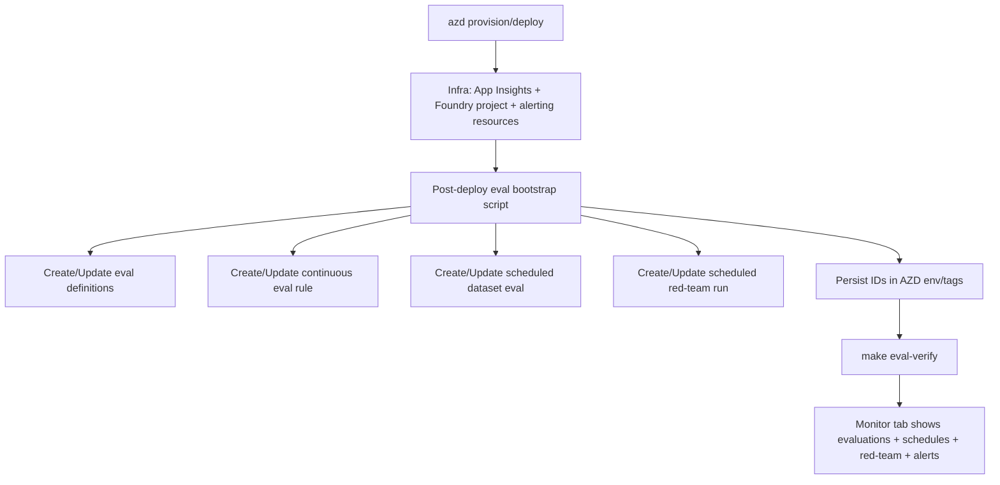

# Epic 006 — Foundry Hosted Agent Evaluations & Alerting Automation

> **Status:** Draft
> **Created:** February 26, 2026
> **Updated:** February 26, 2026

## Objective

Enable meaningful, production-style evaluation and monitoring for the deployed **Foundry hosted agent** (`kb-agent`) with **zero manual UI configuration**.

This epic defines and automates, as part of deployment:

1. Foundry project observability wiring to **Application Insights** (`appi-kbidx-dev` in dev).
2. A minimal but useful evaluation baseline for the hosted agent.
3. Continuous evaluation for deployed agent traffic, including dev traffic.
4. Scheduled evaluation runs on a fixed test dataset.
5. Scheduled red-teaming runs.
6. Azure Monitor alerting for evaluation and safety regressions.

## Non-Negotiable Delivery Constraint

> **No manual setup in the Foundry/Azure portal is allowed for this epic.**
>
> All configuration must be declarative or scripted and executed at deploy time (`azd provision` / `azd deploy` hooks + Makefile targets).
>
> If required setup cannot be completed programmatically, deployment must fail (except explicitly allowed soft-fail behavior in dev for non-critical eval provisioning).

## Validation Principle

> **All verification is executed through Makefile targets** so a fresh clone can reproduce setup, checks, and troubleshooting without ad-hoc commands.

## Scope (MVP)

### Evaluation Baseline (approved)

- **Task Adherence** (`builtin.task_adherence`)
- **Coherence** (`builtin.coherence`)
- **Violence** (`builtin.violence`)

### Schedules (approved)

- **Scheduled evaluation:** daily
- **Scheduled red team:** weekly

### Alerts (approved)

- **Notification channel:** Azure Monitor Action Group with email receiver(s)

### Deployment policy (approved)

- **Soft-fail in dev** for evaluation/scheduling automation only (warning + explicit verification failure signal)
- Production/staging hardening policy to be finalized in a follow-up epic
- **Continuous evaluation is enabled in dev** (sampled dev traffic is evaluated by default)

### Continuous Evaluation Sampling Targets (explicit)

- **dev**: sample **100%** of eligible agent responses, with `max_hourly_runs=100`
- **prod default for this epic**: sample **10%** of eligible agent responses, with `max_hourly_runs=100`
- These values are environment-driven and must be set by deployment configuration (no portal edits)

---

## Success Criteria

- [ ] Foundry project is connected to `appi-kbidx-{env}` automatically during deployment (no portal actions)
- [ ] Continuous evaluation rule exists and is enabled for `kb-agent`
- [ ] Scheduled dataset-based evaluation exists and is enabled (daily cadence)
- [ ] Scheduled red-team run exists and is enabled (weekly cadence)
- [ ] Baseline evaluators are created and used in all relevant evaluation flows
- [ ] Azure Monitor alerts are provisioned and linked to an Action Group email receiver
- [ ] `make eval-verify` confirms all automation artifacts are present and enabled
- [ ] `make azure-agent` (or deployment equivalent) leaves environment evaluation-ready by default
- [ ] Documentation clearly explains automated flow, ownership, and runbooks

---

## Architecture (Automation Flow)

---

## Stories

---

### Story 1 — Deployment-time Foundry ↔ Application Insights Connection

> **Status:** Not Started

Automate project-level observability connection so the deployed Foundry project uses the environment Application Insights resource (`appi-kbidx-{env}`) without manual portal work.

#### Deliverables

- [ ] Add script to create/update Foundry project connection for Application Insights using Azure CLI project connection commands and versioned connection spec file.
- [ ] Add deployment hook integration in `azure.yaml` (post-provision or post-deploy as appropriate).
- [ ] Add idempotent checks to avoid duplicate connection creation.
- [ ] Persist verification outputs (connection name/id) in AZD env variables.

| File | Status |
|------|--------|
| `scripts/foundry/connect-appinsights.sh` | ⬜ |
| `infra/foundry/connections/appinsights.connection.json` (or `.yaml`) | ⬜ |
| `azure.yaml` (hook wiring) | ⬜ |
| `Makefile` (`eval-connect-appi`, `eval-verify`) | ⬜ |

#### Definition of Done

- [ ] `make eval-connect-appi` succeeds in a fresh environment
- [ ] `make eval-verify` confirms project connection points to `appi-kbidx-{env}`
- [ ] No portal/manual steps required

---

### Story 2 — Define Baseline Evaluation Artifacts for Hosted Agent

> **Status:** Not Started

Create reusable evaluation definitions targeting hosted agent runs with the approved MVP metrics.

#### Deliverables

- [ ] Add evaluation bootstrap script (Python SDK `azure-ai-projects >= 2.0.0b4`).
- [ ] Define evaluator configuration and data mappings for:
  - Task Adherence
  - Coherence
  - Violence
- [ ] Support idempotent create-or-update behavior (by deterministic names/ids).
- [ ] Store created evaluation IDs for downstream continuous/scheduled automation.

| File | Status |
|------|--------|
| `src/agent/evals/bootstrap.py` | ⬜ |
| `src/agent/evals/config/baseline-evaluators.json` | ⬜ |
| `src/agent/pyproject.toml` (deps) | ⬜ |
| `Makefile` (`eval-bootstrap`) | ⬜ |

#### Definition of Done

- [ ] `make eval-bootstrap` creates/updates baseline evaluation artifacts
- [ ] Re-running is idempotent (no duplicate logical resources)
- [ ] `make eval-verify` confirms evaluator set matches approved MVP bundle

---

### Story 3 — Continuous Evaluation Automation

> **Status:** Not Started

Enable continuous evaluation for `kb-agent` at deployment time via SDK evaluation rules.

#### Deliverables

- [ ] Create/update continuous evaluation rule (`evaluation_rules.create_or_update`).
- [ ] Bind rule to hosted agent response completion events.
- [ ] Configure explicit sampling targets and bounded run rate (hourly max), environment-specific:
  - dev: 100%, `max_hourly_runs=100`
  - prod default: 10%, `max_hourly_runs=100`
- [ ] Export/report rule ID in AZD env for diagnostics.

| File | Status |
|------|--------|
| `src/agent/evals/continuous.py` | ⬜ |
| `scripts/foundry/setup-continuous-eval.sh` | ⬜ |
| `Makefile` (`eval-continuous`, integrated in deploy target) | ⬜ |

#### Definition of Done

- [ ] `make eval-continuous` succeeds after agent deploy
- [ ] Rule is enabled and attached to `kb-agent`
- [ ] `make eval-verify` confirms configured sampling target and hourly cap for the environment
- [ ] New traffic produces evaluation runs visible via API/CLI verification

---

### Story 4 — Scheduled Dataset Evaluations (Daily)

> **Status:** Not Started

Automate scheduled quality/safety evaluation run using a small curated dataset.

#### Deliverables

- [ ] Add versioned seed dataset (`JSONL`) for MVP checks.
- [ ] Upload dataset and create/update scheduled evaluation task.
- [ ] Daily recurrence schedule (`RecurrenceTrigger` + daily schedule).
- [ ] Keep schedule IDs deterministic and environment-scoped.

| File | Status |
|------|--------|
| `src/agent/evals/data/mvp-agent-eval.jsonl` | ⬜ |
| `src/agent/evals/scheduled_eval.py` | ⬜ |
| `Makefile` (`eval-schedule-daily`) | ⬜ |

#### Definition of Done

- [ ] `make eval-schedule-daily` creates/updates one active daily schedule
- [ ] `make eval-verify` can list schedule and at least one run record after execution window
- [ ] Schedule survives redeploy without duplication

---

### Story 5 — Scheduled Red-Teaming Runs (Weekly)

> **Status:** Not Started

Automate weekly red-team run scheduling against the hosted agent.

#### Deliverables

- [ ] Create/update red-team evaluation container and taxonomy generation flow.
- [ ] Configure weekly schedule for red-team run task.
- [ ] Start with constrained attack strategy/risk scope suitable for MVP cost profile.
- [ ] Persist schedule/run IDs for auditability.

| File | Status |
|------|--------|
| `src/agent/evals/redteam.py` | ⬜ |
| `src/agent/evals/scheduled_redteam.py` | ⬜ |
| `Makefile` (`eval-schedule-redteam-weekly`) | ⬜ |

#### Definition of Done

- [ ] `make eval-schedule-redteam-weekly` creates/updates enabled weekly schedule
- [ ] `make eval-verify` confirms red-team schedule exists and is enabled
- [ ] No manual UI setup required

---

### Story 6 — Evaluation & Safety Alerting as Code

> **Status:** Not Started

Provision alerting resources and rules tied to evaluation/operational signals.

#### Deliverables

- [ ] Add Azure Monitor Action Group module with email receiver configuration.
- [ ] Add alert rules (log/metric as supported) for:
  - sustained latency degradation
  - evaluation failure/regression signal
  - red-team risk finding signal
- [ ] Wire alert scopes to Application Insights / Log Analytics resources.
- [ ] Expose alert resource IDs in outputs for verification.

| File | Status |
|------|--------|
| `infra/modules/alerts.bicep` | ⬜ |
| `infra/main.bicep` (module integration + outputs) | ⬜ |
| `infra/main.parameters.json` (if needed) | ⬜ |
| `Makefile` (`eval-alerts-verify`) | ⬜ |

#### Definition of Done

- [ ] `azd provision` creates/updates action group + alert rules
- [ ] `make eval-alerts-verify` confirms enabled rules and action bindings
- [ ] Alerts are environment-scoped and idempotent across redeploys

---

### Story 7 — Deployment Orchestration & Verification Gate

> **Status:** Not Started

Integrate all evaluation setup into deployment lifecycle and expose deterministic validation targets.

#### Deliverables

- [ ] Add `make eval-setup` orchestration target:
  - connect App Insights
  - bootstrap baseline evals
  - configure continuous eval
  - configure scheduled eval
  - configure scheduled red-team
- [ ] Add `make eval-verify` gate target with clear pass/fail output.
- [ ] Wire into `azure-agent` and/or `azd` hook chain.
- [ ] Implement approved soft-fail dev behavior with explicit warning and non-zero verify when incomplete.

| File | Status |
|------|--------|
| `Makefile` | ⬜ |
| `scripts/foundry/eval-setup.sh` | ⬜ |
| `scripts/foundry/eval-verify.sh` | ⬜ |
| `azure.yaml` (hook integration) | ⬜ |

#### Definition of Done

- [ ] One command path produces fully configured eval setup after deploy
- [ ] Verification output clearly identifies missing components
- [ ] Behavior is deterministic across clean and existing environments

---

### Story 8 — Docs, Runbooks, and Epic State Hygiene

> **Status:** Not Started

Document deployment-time evaluation automation, operations model, and troubleshooting.

#### Deliverables

- [ ] Update architecture/infrastructure docs with evaluation automation flow.
- [ ] Add operational runbook for scheduled runs and alert triage.
- [ ] Document environment variables and ownership for alert recipients.
- [ ] Keep epic file updated per project conventions as stories complete.

| File | Status |
|------|--------|
| `docs/specs/architecture.md` | ⬜ |
| `docs/specs/infrastructure.md` | ⬜ |
| `README.md` (evaluation section) | ⬜ |
| `docs/epics/006-foundry-agent-evaluations.md` | ⬜ |

#### Definition of Done

- [ ] New contributor can run deployment + eval setup using documented commands only
- [ ] Troubleshooting path exists for common SDK/permission/schedule issues
- [ ] Epic checklist reflects implementation reality at all times

---

## Risks & Mitigations

- **SDK/preview API churn**
  - Mitigation: pin SDK versions, isolate eval logic in dedicated scripts, add smoke verification target.
- **Cost growth from continuous/scheduled runs**
  - Mitigation: conservative evaluator set + cadence, explicit rate caps, follow-up epic for tuning.
- **RBAC propagation delays**
  - Mitigation: retry-with-backoff in setup scripts; clear diagnostics in `eval-verify` output.
- **Connection schema incompatibilities across CLI versions**
  - Mitigation: versioned connection spec file, CLI preflight check, fail-fast guidance.

## Out of Scope (for this MVP Epic)

- Advanced evaluator expansion beyond the approved baseline bundle
- Multi-environment policy matrix (prod hard-fail enforcement design)
- Complex statistical gating/benchmark comparison workflows
- Teams/Slack/PagerDuty notification integrations (email only in MVP)

## Exit Criteria

Epic is complete when a freshly provisioned environment can run one deployment path and end with:

1. Foundry project connected to App Insights,
2. continuous + scheduled + red-team evaluations enabled,
3. alerting configured,
4. all checks passing via Makefile targets,
5. no manual portal actions performed.
