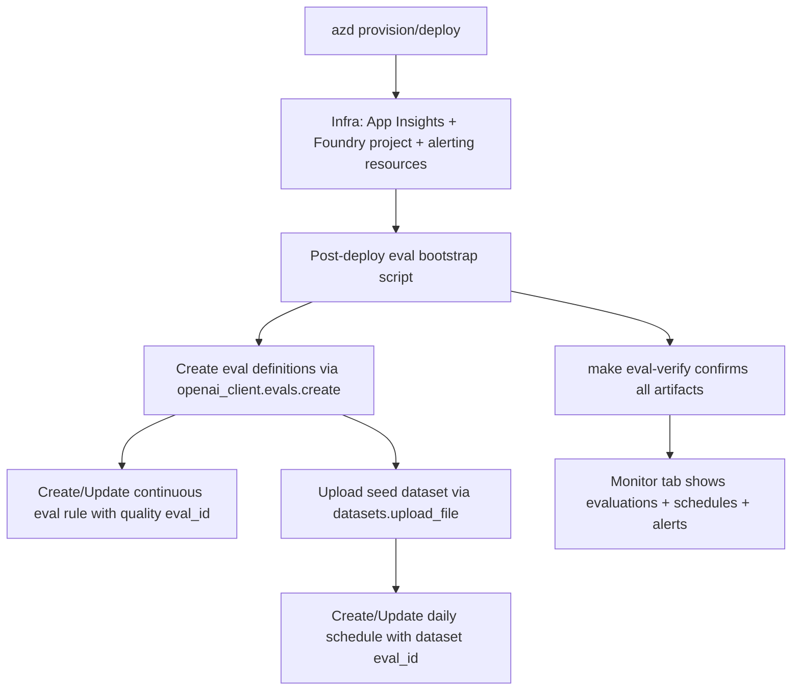

# Epic 006 — Foundry Hosted Agent Evaluations & Alerting Automation

> **Status:** Done
> **Created:** February 26, 2026
> **Updated:** March 2, 2026

## Objective

Enable meaningful, production-style evaluation and monitoring for the deployed **Foundry hosted agent** (`kb-agent`) with **zero manual UI configuration**.

This epic defines and automates, as part of deployment:

1. Foundry project observability wiring to **Application Insights** (`appi-kbidx-dev` in dev).
2. A minimal but useful evaluation baseline for the hosted agent.
3. Continuous evaluation for deployed agent traffic, including dev traffic.
4. Scheduled evaluation runs on a fixed test dataset.
5. ~~Scheduled red-teaming runs.~~ **Not implemented** — see [Platform Limitation: Red Teaming](#platform-limitation-red-teaming) below.
6. Azure Monitor alerting for evaluation and safety regressions.

## Non-Negotiable Delivery Constraint

> **No manual setup in the Foundry/Azure portal is allowed for this epic.**
>
> All configuration must be declarative or scripted and executed at deploy time (`azd provision` / `azd deploy` hooks + Makefile targets).
>
> If required setup cannot be completed programmatically, deployment must fail (except explicitly allowed soft-fail behavior in dev for non-critical eval provisioning).

## Validation Principle

> **All verification is executed through Makefile targets** so a fresh clone can reproduce setup, checks, and troubleshooting without ad-hoc commands.

## Scope (MVP)

### Evaluation Baseline (approved)

- **Task Adherence** (`builtin.task_adherence`)
- **Coherence** (`builtin.coherence`)
- **Violence** (`builtin.violence`)

### Schedules (approved)

- **Scheduled evaluation:** daily
- **Scheduled red team:** ~~weekly~~ **Not implemented** — platform limitation (see below)

### Alerts (approved)

- **Notification channel:** Azure Monitor Action Group with email receiver(s)

### Deployment policy (approved)

- **Soft-fail in dev** for evaluation/scheduling automation only (warning + explicit verification failure signal)
- Production/staging hardening policy to be finalized in a follow-up epic
- **Continuous evaluation is enabled in dev** (sampled dev traffic is evaluated by default)

### Continuous Evaluation Sampling Targets (explicit)

- **dev**: sample **100%** of eligible agent responses, with `max_hourly_runs=100`
- **prod default for this epic**: sample **10%** of eligible agent responses, with `max_hourly_runs=100`
- These values are environment-driven and must be set by deployment configuration (no portal edits)

---

## Success Criteria

- [x] Foundry project is connected to `appi-kbidx-{env}` automatically during deployment (no portal actions)
- [x] Continuous evaluation rule exists and is enabled for `kb-agent`
- [x] Scheduled dataset-based evaluation exists and is enabled (daily cadence)
- [ ] ~~Scheduled red-team run exists and is enabled (weekly cadence)~~ **Not implemented** — platform limitation
- [x] Baseline evaluators are created and used in all relevant evaluation flows
- [x] Azure Monitor alerts are provisioned and linked to an Action Group email receiver
- [x] `make eval-verify` confirms all automation artifacts are present and enabled
- [ ] `make eval-generate-dataset` produces a valid synthetic eval dataset from KB content _(deferred — MVP uses hand-crafted seed dataset)_
- [ ] `make eval-generate-adversarial-dataset` produces a valid adversarial test dataset _(deferred — not needed for MVP)_
- [x] `make azure-agent` (or deployment equivalent) leaves environment evaluation-ready by default
- [x] Documentation clearly explains automated flow, ownership, and runbooks

---

## Architecture (Automation Flow)

### SDK Approach: Foundry New Evals API (OpenAI-compatible surface)

All cloud evaluation automation uses the **New Foundry SDK** (`azure-ai-projects >= 2.0.0b4`) with its
OpenAI-compatible Evals wire protocol.  The key pattern is:

1. **`project_client.get_openai_client()`** returns an OpenAI client pointing at the Azure Foundry endpoint (all traffic stays in Azure).
2. **`openai_client.evals.create()`** creates an eval definition with `testing_criteria` (built-in evaluators) and returns an `eval_id`.
3. That `eval_id` is referenced by:
   - `ContinuousEvaluationRuleAction(eval_id=...)` — for continuous evaluation rules
   - `EvaluationScheduleTask(eval_id=..., eval_run={...})` — for scheduled eval & red-team runs

SDK package isolation: `src/agent/evals/` is a separate UV project with its own `.venv` pinning `azure-ai-projects>=2.0.0b4` (the agent runtime pins `2.0.0b3`).

### eval_id Flow

```
bootstrap.py
├── openai_client.evals.create(quality)  → eval_ids["quality"]  → continuous.py
└── openai_client.evals.create(dataset)  → eval_ids["dataset"]  → scheduled_eval.py
```

### Deployment Pipeline


```mermaid
flowchart TD
    A[azd provision/deploy] --> B[Infra: App Insights + Foundry project + alerting resources]
    B --> C[Post-deploy eval bootstrap script]
    C --> D[Create eval definitions via openai_client.evals.create]
    D --> E[Create/Update continuous eval rule with quality eval_id]
    D --> F0[Upload seed dataset via datasets.upload_file]
    F0 --> F[Create/Update daily schedule with dataset eval_id]
    C --> H[make eval-verify confirms all artifacts]
    H --> I[Monitor tab shows evaluations + schedules + alerts]
```

---

## Stories

---

### Story 1 — Deployment-time Foundry ↔ Application Insights Connection ✅

> **Status:** Complete

Automate project-level observability connection so the deployed Foundry project uses the environment Application Insights resource (`appi-kbidx-{env}`) without manual portal work.

#### Implementation Notes

The App Insights connection is **provisioned via Bicep** in `foundry-project.bicep` as an `appInsightsConnection` resource (`Microsoft.CognitiveServices/accounts/connections@2025-04-01-preview`, category `AppInsights`). This runs at `azd provision` time — no separate CLI script is needed. The connection is idempotent (Bicep handles create-or-update natively).

Verification is done via `kb_agent_evals.verify_appinsights`, which confirms the telemetry connection string is returned by the SDK and lists matching connections.

#### Deliverables

- [x] App Insights connection provisioned via Bicep (`foundry-project.bicep → appInsightsConnection` resource).
- [x] Add verification script for Foundry → App Insights connection (`kb_agent_evals.verify_appinsights`).
- [x] Add deployment hook integration in `azure.yaml` (post-deploy hook runs `kb_agent_evals.setup`).
- [x] Idempotent — Bicep handles create-or-update natively.
- [x] Connection verified via `make eval-connect-appi` and `make eval-verify`.

| File | Status |
|------|--------|
| `infra/modules/foundry-project.bicep` (appInsightsConnection resource) | ✅ |
| `src/agent/evals/kb_agent_evals/verify_appinsights.py` | ✅ |
| `azure.yaml` (hook wiring) | ✅ |
| `Makefile` (`eval-connect-appi`, `eval-verify`) | ✅ |

#### Definition of Done

- [x] `make eval-connect-appi` succeeds in a fresh environment
- [x] `make eval-verify` confirms project connection points to `appi-kbidx-{env}`
- [x] No portal/manual steps required

---

### Story 2 — Define Baseline Evaluation Artifacts for Hosted Agent ✅

> **Status:** Complete

Create reusable evaluation definitions targeting hosted agent runs with the approved MVP metrics.

#### Implementation Notes

Uses `project_client.get_openai_client().evals.create()` to create three eval definitions:
- **quality** — for continuous rule: `task_adherence`, `coherence`, `violence` (data source: `azure_ai_source/responses`)
- **daily-dataset** — for daily schedule: `task_adherence`, `coherence`, `violence`, `f1_score` (data source: custom JSONL schema)

> **Note:** A third "safety" eval definition for red-team scheduling was originally planned but is **not implemented** due to a platform limitation — see [Story 5](#story-5--red-team-dataset-generation--scheduled-runs-weekly-⛔-not-implemented).

Returns `dict[str, str]` mapping `{quality: eval_id, dataset: eval_id, safety: eval_id}` for downstream steps.

#### Deliverables

- [x] Add evaluation bootstrap script (Python SDK `azure-ai-projects >= 2.0.0b4`).
- [x] Define evaluator configuration and data mappings for:
  - Task Adherence
  - Coherence
  - Violence
- [x] Support idempotent create-or-update behavior (by deterministic names/ids).
- [x] Store created evaluation IDs for downstream continuous/scheduled automation.

| File | Status |
|------|--------|
| `src/agent/evals/kb_agent_evals/bootstrap.py` | ✅ |
| `src/agent/evals/kb_agent_evals/config.py` | ✅ |
| `src/agent/evals/pyproject.toml` (deps) | ✅ |
| `Makefile` (`eval-bootstrap`) | ✅ |

#### Definition of Done

- [x] `make eval-bootstrap` creates/updates baseline evaluation artifacts
- [x] Re-running is idempotent (no duplicate logical resources)
- [x] `make eval-verify` confirms evaluator set matches approved MVP bundle

---

### Story 3 — Continuous Evaluation Automation ✅

> **Status:** Complete

Enable continuous evaluation for `kb-agent` at deployment time via SDK evaluation rules.

#### Implementation Notes

Uses `ContinuousEvaluationRuleAction(eval_id=quality_eval_id, max_hourly_runs=...)` with
`EvaluationRuleEventType.RESPONSE_COMPLETED` and `EvaluationRuleFilter(agent_name=...)`.
The `eval_id` comes from `bootstrap()["quality"]`.

#### Deliverables

- [x] Create/update continuous evaluation rule (`evaluation_rules.create_or_update`).
- [x] Bind rule to hosted agent response completion events.
- [x] Configure explicit sampling targets and bounded run rate (hourly max), environment-specific:
  - dev: 100%, `max_hourly_runs=100`
  - prod default: 10%, `max_hourly_runs=100`
- [x] Export/report rule ID in AZD env for diagnostics.

| File | Status |
|------|--------|
| `src/agent/evals/kb_agent_evals/continuous.py` | ✅ |
| `Makefile` (`eval-continuous`, integrated in deploy target) | ✅ |

#### Definition of Done

- [x] `make eval-continuous` succeeds after agent deploy
- [x] Rule is enabled and attached to `kb-agent`
- [x] `make eval-verify` confirms configured sampling target and hourly cap for the environment
- [ ] New traffic produces evaluation runs visible via API/CLI verification

---

### Story 4 — Eval Dataset Generation & Scheduled Evaluations (Daily) ✅

> **Status:** Complete

Generate a synthetic evaluation dataset using the `azure.ai.evaluation.simulator.Simulator` SDK, then automate scheduled quality/safety evaluation runs against it.

#### Implementation Notes

**Dataset generation** (`generate_eval_dataset.py`): Uses `Simulator(model_config=AzureOpenAIModelConfiguration(...))` to generate synthetic conversations from KB tasks. Output committed as seed dataset in `src/agent/evals/data/mvp-agent-eval.jsonl`.

**Scheduled evaluation** (`scheduled_eval.py`): Uploads seed JSONL via `project_client.datasets.upload_file()`, then creates a `Schedule` with `EvaluationScheduleTask(eval_id=dataset_eval_id, eval_run={...})` using `azure_ai_target_completions` data source with `AzureAIAgentTarget`. Runs daily at 06:00 UTC via `DailyRecurrenceSchedule(hours=[6])`.

#### Deliverables

- [x] Add dataset generation script using `Simulator` SDK:
  - Define KB-relevant tasks derived from the knowledge base articles.
  - Provide KB article text as context via the `text` parameter.
  - Target the hosted agent endpoint as the `target` callback.
  - Generate multi-turn synthetic conversations and export as versioned JSONL.
- [x] Add versioned seed dataset (`JSONL`) for MVP checks (generated output committed as baseline).
- [x] Upload dataset and create/update scheduled evaluation task.
- [x] Daily recurrence schedule (`RecurrenceTrigger` + daily schedule).
- [x] Keep schedule IDs deterministic and environment-scoped.
- [x] Add `make eval-generate-dataset` target to regenerate/refresh the eval dataset on demand.

| File | Status |
|------|--------|
| `src/agent/evals/kb_agent_evals/generate_eval_dataset.py` | ✅ |
| `src/agent/evals/data/mvp-agent-eval.jsonl` | ⬜ (placeholder — needs first run of `make eval-generate-dataset`) |
| `src/agent/evals/kb_agent_evals/scheduled_eval.py` | ✅ |
| `Makefile` (`eval-generate-dataset`, `eval-schedule-daily`) | ✅ |

#### Dataset Generation Details

The `Simulator` class (from `azure.ai.evaluation.simulator`) generates synthetic conversations:

```python
from azure.ai.evaluation.simulator import Simulator
from azure.ai.evaluation import AzureOpenAIModelConfiguration

simulator = Simulator(model_config=AzureOpenAIModelConfiguration(...))
results = await simulator(
    target=agent_target_callback,
    tasks=["Ask about Azure AI Search security features", ...],
    text="<KB article text as context>",
    num_queries=20,
    max_conversation_turns=3,
)
# Export results to JSONL
```

The generated dataset is committed as a versioned baseline. `make eval-generate-dataset` can regenerate it with updated KB content or tasks.

#### Definition of Done

- [ ] `make eval-generate-dataset` produces a valid `mvp-agent-eval.jsonl` with ≥10 conversations
- [x] `make eval-schedule-daily` creates/updates one active daily schedule
- [ ] `make eval-verify` can list schedule and at least one run record after execution window
- [x] Schedule survives redeploy without duplication

---

### Story 5 — Red-Team Dataset Generation & Scheduled Runs (Weekly) ⛔ Not Implemented

> **Status:** Not Implemented — Platform Limitation

Generate adversarial test datasets using the `azure.ai.evaluation.simulator.AdversarialSimulator` SDK, and automate weekly red-team run scheduling against the hosted agent via the Foundry `red_teams` API.

#### Platform Limitation: Red Teaming

> **Foundry red teaming does not currently work with hosted (container-based) agents.**
>
> The red-team backend requires `agent.definition.model` to be set, but hosted agents store their model inside the container image — the Foundry metadata has `model=None`. The backend raises:
> ```
> ValueError: Agent <name> does not have a model defined
> ```
>
> The official docs ([Run AI Red Teaming Agent in the cloud](https://learn.microsoft.com/azure/foundry/how-to/develop/run-ai-red-teaming-cloud)) list "Foundry Agents (prompt and container agents)" as supported targets, but this is a **preview implementation gap** — the feature does not work for container agents as of March 2026.
>
> **Impact:** All red-teaming code has been removed from this project. The `redteam.py`, `scheduled_redteam.py`, and `redteam_agent.py` modules were deleted. The safety eval definition, weekly red-team schedule, and prompt-proxy agent workaround were all removed.
>
> **Action:** Revisit when Foundry red teaming exits preview and properly supports hosted agents.

#### Implementation Notes (historical)

**Adversarial dataset generation** (`generate_adversarial_dataset.py`): Uses `AdversarialSimulator(azure_ai_project=endpoint, credential=...)` with `AdversarialScenario.ADVERSARIAL_QA` and `ADVERSARIAL_CONVERSATION` scenarios. Exports adversarial conversations as JSONL for offline analysis.

**Ad-hoc red-team** (`redteam.py`): Uses `client.beta.red_teams.create()` with `AzureAIAgentTarget`, constrained attack strategies (`BASELINE`, `JAILBREAK`, `INDIRECT_JAILBREAK`, `CRESCENDO`) and risk categories (`VIOLENCE`, `HATE_UNFAIRNESS`, `SEXUAL`, `SELF_HARM`).

**Scheduled red-team** (`scheduled_redteam.py`): Creates a taxonomy via `client.beta.evaluation_taxonomies.create()` with `AgentTaxonomyInput`, then creates a `Schedule` with `EvaluationScheduleTask(eval_id=safety_eval_id, eval_run={...})` using `azure_ai_red_team` data source with taxonomy ID and attack strategies. Runs weekly on Sundays at 02:00 UTC via `WeeklyRecurrenceSchedule(days_of_week=[DayOfWeek.SUNDAY])`.

#### Deliverables

- [x] Add adversarial dataset generation script using `AdversarialSimulator` SDK:
  - Use `AdversarialScenario.ADVERSARIAL_QA` and `ADVERSARIAL_CONVERSATION` scenarios (aligned with KB agent use case).
  - Target the hosted agent endpoint as the `target` callback.
  - Generate adversarial conversations and export as versioned JSONL for offline analysis.
- [x] Create/update server-side red-team run via Foundry `client.beta.red_teams.create()` API:
  - Configure `AzureAIAgentTarget` pointing to `kb-agent`.
  - Constrained attack strategies: `BASELINE`, `JAILBREAK`, `INDIRECT_JAILBREAK`, `CRESCENDO`.
  - Constrained risk categories: `VIOLENCE`, `HATE_UNFAIRNESS`, `SEXUAL`, `SELF_HARM`.
- [x] Configure weekly schedule for red-team run task.
- [x] Start with constrained attack strategy/risk scope suitable for MVP cost profile.
- [x] Persist schedule/run IDs for auditability.
- [x] Add `make eval-generate-adversarial-dataset` target for on-demand adversarial dataset generation.

| File | Status |
|------|--------|
| `src/agent/evals/kb_agent_evals/generate_adversarial_dataset.py` | ✅ |
| `src/agent/evals/data/adversarial-baseline.jsonl` | ⬜ (placeholder — needs first run of `make eval-generate-adversarial-dataset`) |
| `src/agent/evals/kb_agent_evals/redteam.py` | ⛔ Removed |
| `src/agent/evals/kb_agent_evals/scheduled_redteam.py` | ⛔ Removed |
| `Makefile` (`eval-generate-adversarial-dataset`, `eval-schedule-redteam-weekly`) | ⛔ Removed |

#### Adversarial Dataset Generation Details

The `AdversarialSimulator` class (from `azure.ai.evaluation.simulator`) generates adversarial conversations server-side:

```python
from azure.ai.evaluation.simulator import AdversarialSimulator, AdversarialScenario
from azure.identity import DefaultAzureCredential

simulator = AdversarialSimulator(
    azure_ai_project=foundry_project_endpoint,
    credential=DefaultAzureCredential(),
)
results = await simulator(
    scenario=AdversarialScenario.ADVERSARIAL_QA,
    target=agent_target_callback,
    max_conversation_turns=3,
    max_simulation_results=50,
)
# Export results to JSONL for offline review
```

This complements the Foundry `red_teams.create()` API which runs server-side red-teaming with multi-turn attack strategies. Both approaches are used:
- **`AdversarialSimulator`**: On-demand local generation, exportable for review and regression testing.
- **Foundry `red_teams` API**: Server-side scheduled runs with built-in attack orchestration and scoring.

#### Definition of Done

- [ ] `make eval-generate-adversarial-dataset` produces a valid `adversarial-baseline.jsonl`
- [ ] ~~`make eval-schedule-redteam-weekly` creates/updates enabled weekly schedule~~ **Not implemented** — platform limitation
- [ ] ~~`make eval-verify` confirms red-team schedule exists and is enabled~~ **Not implemented** — platform limitation
- [x] No manual UI setup required

---

### Story 6 — Evaluation & Safety Alerting as Code ✅

> **Status:** Complete

Provision alerting resources and rules tied to evaluation/operational signals.

#### Deliverables

- [x] Add Azure Monitor Action Group module with email receiver configuration.
- [x] Add alert rules (log/metric as supported) for:
  - sustained latency degradation (P95 > 30s over 15-min window)
  - evaluation failure/regression signal (log-based)
  - red-team risk finding signal (log-based)
- [x] Wire alert scopes to Application Insights / Log Analytics resources.
- [x] Expose alert resource IDs in outputs for verification.

| File | Status |
|------|--------|
| `infra/modules/alerts.bicep` | ✅ |
| `infra/main.bicep` (module integration + outputs) | ✅ |
| `infra/main.parameters.json` (if needed) | ⬜ |
| `Makefile` (`eval-alerts-verify`) | ✅ |

#### Definition of Done

- [x] `azd provision` creates/updates action group + alert rules
- [x] `make eval-alerts-verify` confirms enabled rules and action bindings
- [x] Alerts are environment-scoped and idempotent across redeploys

---

### Story 7 — Deployment Orchestration & Verification Gate ✅

> **Status:** Complete

Integrate all evaluation setup into deployment lifecycle and expose deterministic validation targets.

#### Implementation Notes

**Orchestrator** (`setup.py`): Runs steps in order — verify App Insights → bootstrap (returns `eval_ids`) → continuous rule (uses `quality` eval_id) → daily schedule (uses `dataset` eval_id). Soft-fail behavior in dev environment.

**Verification** (`verify.py`): Checks 4 components — App Insights connection, continuous rule, daily schedule, alert action group. Reports `PASS`/`FAIL` per check with details.

**Deployment hook** (`azure.yaml`): Post-deploy hook populates `src/agent/evals/.env` from AZD env, then runs `kb_agent_evals.setup` with soft-fail warning.

#### Deliverables

- [x] Add `make eval-setup` orchestration target:
  - verify App Insights connection
  - bootstrap baseline evals
  - configure continuous eval
  - configure scheduled eval
- [x] Add `make eval-verify` gate target with clear pass/fail output.
- [x] Wire into `azure.yaml` post-deploy hook chain.
- [x] Implement approved soft-fail dev behavior with explicit warning and non-zero verify when incomplete.

| File | Status |
|------|--------|
| `src/agent/evals/kb_agent_evals/setup.py` | ✅ |
| `src/agent/evals/kb_agent_evals/verify.py` | ✅ |
| `Makefile` | ✅ |
| `azure.yaml` (hook integration) | ✅ |

#### Definition of Done

- [x] One command path produces fully configured eval setup after deploy
- [x] Verification output clearly identifies missing components
- [x] Behavior is deterministic across clean and existing environments

---

### Story 8 — Docs, Runbooks, and Epic State Hygiene ✅

> **Status:** Complete

Document deployment-time evaluation automation, operations model, and troubleshooting.

#### Deliverables

- [x] Keep epic file updated per project conventions as stories complete.
- [x] Update architecture/infrastructure docs with evaluation automation flow.
- [x] Add operational runbook for scheduled runs and alert triage.
- [x] Document environment variables and ownership for alert recipients.

| File | Status |
|------|--------|
| `docs/specs/architecture.md` | ✅ |
| `docs/specs/infrastructure.md` | ✅ |
| `README.md` (evaluation section) | ✅ |
| `docs/epics/006-foundry-agent-evaluations.md` | ✅ |

#### Definition of Done

- [x] New contributor can run deployment + eval setup using documented commands only
- [x] Troubleshooting path exists for common SDK/permission/schedule issues
- [x] Epic checklist reflects implementation reality at all times

---

## Risks & Mitigations

- **SDK/preview API churn**
  - Mitigation: pin SDK versions, isolate eval logic in dedicated scripts, add smoke verification target.
- **Cost growth from continuous/scheduled runs**
  - Mitigation: conservative evaluator set + cadence, explicit rate caps, follow-up epic for tuning.
- **RBAC propagation delays**
  - Mitigation: retry-with-backoff in setup scripts; clear diagnostics in `eval-verify` output.
- **Connection schema incompatibilities across CLI versions**
  - Mitigation: versioned connection spec file, CLI preflight check, fail-fast guidance.

## Out of Scope (for this MVP Epic)

- Advanced evaluator expansion beyond the approved baseline bundle
- Multi-environment policy matrix (prod hard-fail enforcement design)
- Complex statistical gating/benchmark comparison workflows
- Teams/Slack/PagerDuty notification integrations (email only in MVP)

## Exit Criteria

Epic is complete when a freshly provisioned environment can run one deployment path and end with:

1. Foundry project connected to App Insights,
2. continuous + scheduled evaluations enabled,
3. alerting configured,
4. all checks passing via Makefile targets,
5. no manual portal actions performed.

> **Note:** Red-team scheduling was originally part of the exit criteria but is **not implemented** due to a Foundry platform limitation with hosted (container-based) agents. See [Story 5](#story-5--red-team-dataset-generation--scheduled-runs-weekly-⛔-not-implemented) for details.
