# Architecture

> **Status:** Updated — February 17, 2026

## Overview

The solution is a two-stage Azure Functions pipeline that transforms HTML knowledge base articles into an AI-searchable index with image support.

- **Stage 1 (`fn-convert`)** — Converts source articles (HTML + images) into clean Markdown with AI-generated image descriptions, outputting to a normalized serving layer. Two interchangeable backends are available: **Content Understanding** (`fn_convert_cu`) and **Mistral Document AI** (`fn_convert_mistral`), selected at runtime via the `analyzer=` Makefile argument.
- **Stage 2 (`fn-index`)** — Chunks the Markdown, embeds it, and pushes chunks + image references into Azure AI Search.

The two stages are decoupled by a **serving layer** (Blob Storage), making `fn-index` source-format agnostic. Future source types (PDF, audio, PowerPoint) only require new `fn-convert` variants — `fn-index` stays unchanged.

## Pipeline Flow

```mermaid
flowchart LR
    subgraph Staging["Staging Layer<br/><i>Azure Blob Storage</i>"]
        SRC["📁 article-id/<br/>index.html<br/>*.image"]
    end

    subgraph Convert["fn-convert<br/><i>Azure Function</i>"]
        C1["Read HTML + images"]
        C2["Extract text & structure"]
        C3["Analyze images individually"]
        C4["Merge MD + image descriptions"]
    end

    subgraph Analyzer["Analyzer ✱"]
        A1["HTML Analyzer<br/>HTML → Markdown"]
        A2["Image Analyzer<br/>Image → Description"]
    end

    subgraph Serving["Serving Layer<br/><i>Azure Blob Storage</i>"]
        OUT["📁 article-id/<br/>article.md<br/>images/*.png"]
    end

    subgraph Index["fn-index<br/><i>Azure Function</i>"]
        I1["Chunk MD by headings"]
        I2["Map image refs per chunk"]
        I3["Embed chunks"]
        I4["Push to index"]
    end

    subgraph Embed["Azure AI<br/>Foundry"]
        EMB["text-embedding-3-small"]
    end

    subgraph Search["Azure AI Search"]
        IDX[("kb-articles<br/>index")]
    end

    SRC --> C1
    C1 --> C2 --> C4
    C1 --> C3 --> C4
    C2 -.-> A1
    C3 -.-> A2
    C4 --> OUT
    OUT --> I1 --> I2 --> I3 --> I4
    I3 -.-> EMB
    I4 -.-> IDX
```



**✱ Analyzer** — two interchangeable backends, selected at runtime via `analyzer=`:

| Component | Content Understanding (`fn_convert_cu`) | Mistral Document AI (`fn_convert_mistral`) |
|---|---|---|
| **HTML Analyzer** | CU `prebuilt-documentSearch` (HTML-direct) | Playwright HTML → PDF + Mistral OCR (`mistral-document-ai-2512`) |
| **Image Analyzer** | Custom CU `kb-image-analyzer` (GPT-4.1) | GPT-4.1 vision (direct calls, same prompt schema) |

## Azure Services Map


**✱ Analyzer** — Content Understanding (`fn_convert_cu`) or Mistral Document AI + GPT-4.1 vision (`fn_convert_mistral`). See [Pipeline Flow](#pipeline-flow) legend for component details.

## Context Aware & Vision Grounded KB Agent

The solution consists of two services: a standalone **KB Agent** deployed as a **Foundry hosted agent** and a **Chainlit thin client** web app that calls the agent via the OpenAI-compatible **Responses API** and stores conversation history in **Cosmos DB**.

### Agent (Foundry Hosted Agent)

The agent runs as a FastAPI service on port 8088 (locally) or as a Foundry hosted agent (deployed). It exposes three endpoints:

| Endpoint | Method | Purpose |
|----------|--------|---------|
| `/health` | GET | Health check |
| `/v1/entities` | GET | List available agents |
| `/v1/responses` | POST | Process a user message (streaming + non-streaming) |

#### Agent Components

- **KB Agent** — A `ChatAgent` (from `agent-framework-core` + `agent-framework-azure-ai`) with a single tool: `search_knowledge_base`. The agent uses `gpt-4.1` for reasoning and calls the tool to perform hybrid search (vector + keyword) against the index.
- **Search Tool** — Embeds the agent's query with `text-embedding-3-small`, performs hybrid search via `azure-search-documents`, and returns ranked chunks with image references.
- **Vision Middleware** — A `ChatMiddleware` on the Azure OpenAI chat client that intercepts tool results, detects image URLs in the search response JSON, downloads the images from blob storage, and injects them into the LLM conversation as `DataContent` (base64 image payloads). This enables GPT-4.1's vision capabilities — the LLM can **see** the actual images (diagrams, screenshots, architecture charts) and reason about their visual content when composing answers.
- **Image Service** — Downloads images from blob storage for the vision middleware. Uses `DefaultAzureCredential` for blob access.

### Web App (Chainlit Thin Client)

The web app is a Chainlit-based UI that calls the agent via the Responses API. It does **not** contain any agent logic, search code, or vision middleware — those all live in the agent package.

#### Web App Components

- **OpenAI SDK Client** — Calls the agent via `client.responses.create(input=..., stream=True)`. Dual-mode auth: `http://` → no auth (local), `https://` → Entra token via `get_bearer_token_provider`.
- **Context Window Management** — Maintains in-memory conversation history per session. Estimates tokens (4 chars ≈ 1 token) and drops oldest messages when context exceeds 120K tokens (leaving headroom for response). Cosmos DB retains the full conversation (append-only).
- **Cosmos DB Data Layer** — `CosmosDataLayer(BaseDataLayer)` stores conversations in Cosmos DB NoSQL (serverless). Partition key: `/userId`. Auto-title from first user message (80 chars max). Supports thread listing, resume, and deletion.
- **Image Proxy** — A FastAPI endpoint (`/api/images/{article_id}/{image_path}`) that downloads images from the serving blob account on demand. Chainlit renders standard `` markdown natively, and the browser fetches images from this same-origin proxy.
- **Image Normaliser** — Post-processing step that normalises all `` references in the LLM output to clean `/api/images/...` proxy URLs. Handles the variety of URL formats the LLM may generate (hallucinated domains, missing leading slashes, `attachment:` schemes) via pattern matching and filename-to-citation lookup.
- **Chainlit Chat UI** — Streaming chat interface with real-time token display, native Markdown rendering (including inline images via the proxy), clickable `[Ref #N]` citation links with side-panel detail views, and conversation history panel.

### Conversation Flow

```
User message → Web App → Build context (system prompt + history from Cosmos)
                       → POST /v1/responses (stream=True)
                       → Agent (FastAPI) → ChatAgent.run_stream()
                                         → search_knowledge_base tool
                                         → Vision middleware (download + inject images)
                                         → LLM response (streamed SSE)
                       ← Stream tokens to Chainlit UI
                       → Save to Cosmos DB (user message + agent response)
```

### Image Flow: From Index to Browser

The image-aware chunks created by the ingestion pipeline (Epic 001) are the foundation of the vision-grounded capabilities. Here is the end-to-end flow across both services:


**Key insight:** Each search chunk carries an `image_urls` array of blob paths. This is used twice:
1. **Vision middleware** downloads the images and injects them as base64 `DataContent` into the LLM conversation — the LLM can *see* diagrams and screenshots.
2. **Search tool** converts the blob paths to `/api/images/...` proxy URLs in the tool result JSON — the LLM copies these URLs into its markdown output for the browser to render.

### Image URL Normalisation

Despite explicit system prompt instructions, LLMs generate image URLs in many creative formats. The post-processing normaliser handles all observed patterns:

| LLM Output | Normalised To |
|---|---|
| `/api/images/article/images/file.png` | `/api/images/article/images/file.png` (already correct) |
| `api/images/article/images/file.png` | `/api/images/article/images/file.png` (add leading `/`) |
| `https://learn.microsoft.com/api/images/article/images/file.png` | `/api/images/article/images/file.png` (strip domain) |
| `attachment:/api/images/article/images/file.png` | `/api/images/article/images/file.png` (strip prefix) |
| `attachment:file.png` | `/api/images/article/images/file.png` (filename lookup from citations) |
| `https://learn.microsoft.com/en-us/azure/.../file.png` | `/api/images/article/images/file.png` (filename lookup from citations) |

### Key Design Decisions

| # | Decision | Rationale |
|---|----------|-----------|
| 1 | Two-service split (Agent + Web App) | Agent is a standalone Foundry hosted agent with its own identity and RBAC. Web app is a thin client — no agent logic, search code, or vision middleware. Clean separation of concerns. |
| 2 | Microsoft Agent Framework | Provides `ChatAgent` with built-in tool calling, conversation threading, and Azure OpenAI integration — avoids manual Responses API loop management. |
| 3 | Responses API integration | Web app calls agent via OpenAI SDK `client.responses.create()`. Standard protocol, dual-mode auth (no auth local, Entra token deployed), streaming SSE. |
| 4 | Vision middleware for image injection | `ChatMiddleware` intercepts tool results and injects images as `DataContent`. The framework auto-converts to OpenAI's vision format. The LLM can reason about visual content (diagrams, architecture charts) not just text descriptions — producing higher-fidelity answers. |
| 5 | Cosmos DB conversation persistence | Serverless NoSQL with `/userId` partition key. Replaces in-memory-only thread storage. Supports conversation resume, history panel, and cross-session continuity. |
| 6 | Same-origin image proxy | Avoids SAS URL complexity (token expiry, CORS). Chainlit renders `` as native markdown; browser fetches from same origin. Images persist across `msg.update()` re-renders. |
| 7 | Post-processing normalisation (not base64 ``) | Chainlit strips HTML `` tags on `msg.update()`, causing grey boxes. Native markdown `` survives re-rendering. The normaliser ensures all URLs point to the proxy. |
| 8 | Hybrid search | Best relevance — combines vector similarity and keyword matching. |
| 9 | Chainlit | Purpose-built chat UI with native streaming, `cl.Text` side panels for citations, and markdown rendering. Single `chainlit run` command. |

For implementation details, see [Epic 002](../epics/002-kb-search-web-app.md) and [Epic 005](../epics/005-hosted-agent-foundry.md).

### Deployment

The solution deploys two services:

1. **Agent** — Published as a **Foundry hosted agent** via `az cognitiveservices account agent publish`. The agent container is built from `src/agent/Dockerfile` and deployed to the Foundry project within Azure AI Services.
2. **Web App** — Deployed to **Azure Container Apps** with **Entra ID Easy Auth** (single-tenant).

#### Agent Deployment (Foundry)

- **Container image** built from `src/agent/Dockerfile` (Python 3.11, FastAPI + uvicorn, port 8088)
- **AZD service** defined in `azure.yaml` as `host: ai.agent` — `azd deploy --service agent` pushes the container
- **Publish script** (`scripts/publish-agent.sh`) publishes the agent and assigns RBAC roles to the published agent's identity:
  - Cognitive Services OpenAI User → AI Services
  - Search Index Data Reader → AI Search
  - Storage Blob Data Reader → Serving Storage
- **Agent endpoint** stored in AZD env as `AGENT_ENDPOINT` for the web app to consume

#### Web App Deployment (Container Apps)

- **Container image** built from `src/web-app/Dockerfile` and pushed to **Azure Container Registry** (Basic SKU)
- **Container App** runs on a Consumption-plan **Container Apps Environment** linked to Log Analytics
- Single container: 0.5 vCPU / 1 GiB memory, scale 0–1 (scale-to-zero for cost savings)
- Ingress: external, port 8080, HTTPS-only
- Application settings (Agent endpoint, Cosmos endpoint, AI Services endpoint, Search endpoint, Blob endpoint, deployment names) injected as environment variables from Bicep outputs

#### Authentication — Entra ID Easy Auth

Container Apps Easy Auth is a platform-level sidecar that intercepts all HTTP requests before they reach the application container. No authentication code is needed in the Chainlit app.

1. User navigates to the Container App URL
2. Easy Auth intercepts the unauthenticated request
3. User is auto-redirected to Microsoft Entra login
4. After sign-in, Entra issues a token; Easy Auth validates it (single-tenant)
5. Authenticated request reaches the Chainlit app transparently

Only users in the Azure AD tenant can access the app. An **Entra App Registration** (single-tenant) defines the client ID, tenant ID, and redirect URIs.

#### Managed Identity RBAC

Each service has its own identity with least-privilege roles:

**Published Agent Identity** (assigned by `scripts/publish-agent.sh`):

| Role | Resource | Purpose |
|------|----------|---------|
| Cognitive Services OpenAI User | AI Services | Call GPT-4.1 and embedding models |
| Search Index Data Reader | AI Search | Query the `kb-articles` index |
| Storage Blob Data Reader | Serving Storage | Download article images for vision middleware |

**Web App Container App Managed Identity**:

| Role | Resource | Purpose |
|------|----------|---------|
| Cognitive Services OpenAI User | AI Services | Call agent via Responses API |
| Storage Blob Data Reader | Serving Storage | Download article images via proxy |
| Cosmos DB Built-in Data Contributor | Cosmos DB | Read/write conversation history |
| AcrPull | Container Registry | Pull Docker images |

For infrastructure details, see [Infrastructure](../specs/infrastructure.md). For deployment epics, see [Epic 003](../epics/003-web-app-azure-deployment.md) and [Epic 005](../epics/005-hosted-agent-foundry.md).

---

## Stage 1: `fn-convert` — Detail

`fn-convert` transforms a source HTML article into a clean Markdown file with AI-generated image descriptions placed in their original document context, plus the source images renamed as PNGs.

There are **two interchangeable backend implementations** that share the same input/output contract:

| Backend | Module | Approach | Gateway-Compatible |
|---------|--------|----------|--------------------|
| **Content Understanding** | `fn_convert_cu` | HTML-direct text extraction via CU `prebuilt-documentSearch`, individual image analysis via custom `kb-image-analyzer` | No — CU's internal LLM calls are opaque |
| **Mistral Document AI** | `fn_convert_mistral` | HTML → PDF rendering (Playwright) with `[[IMG:filename]]` markers, Mistral OCR for text extraction, GPT-4.1 vision for image descriptions | Yes — both OCR and GPT-4.1 are standard Foundry endpoints |

Both backends produce the same output: `article.md` + `images/` folder in the serving layer. `fn-index` is completely unaware of which backend generated the content — the serving layer is the contract boundary.

The backend is selected at runtime via the `analyzer=` Makefile argument:
```bash
make convert analyzer=content-understanding   # uses fn_convert_cu
make convert analyzer=mistral-doc-ai          # uses fn_convert_mistral
```

### Content Understanding Backend (`fn_convert_cu`)

#### Why HTML-Direct (No PDF Conversion)

Content Understanding processes HTML directly for text extraction with high quality — headings, paragraphs, tables, and an AI-generated summary are all faithfully produced. However, CU does **not** detect figures or hyperlinks from HTML input (figure analysis is only supported for PDF and image file formats). Rather than converting HTML → PDF to unlock CU's figure detection — which adds complexity (Playwright/Chromium), degrades image quality (rasterize + re-crop), and introduces fragile bounding-polygon parsing — we process HTML for text and analyze each image individually through CU. This yields better image descriptions (each image gets dedicated analysis with a domain-tuned prompt) and preserves the original image quality.

### Sub-Steps

| Step | What Happens |
|------|-------------|
| **1a. HTML → CU** | Send the article HTML to `prebuilt-documentSearch` (content type `text/html`). Returns Markdown with text, tables, headings, and a Summary field. |
| **1b. Parse HTML DOM** | Use BeautifulSoup to extract an **image map** (each `` tag's filename + its position in the document hierarchy) and a **link map** (each `<a href>` tag's label + URL). |
| **2. Analyze images** | Send each image file (the `.image` files are PNGs, 13–40 KB each) individually to the custom `kb-image-analyzer`. Returns a `Description`, `UIElements`, and `NavigationPath` per image. |
| **3. Merge & reconstruct** | Start with the CU Markdown from step 1a. Re-inject hyperlinks by text-matching link labels from the link map. Insert image description blocks at the correct positions using the image map. Each image block links to the PNG in the `images/` subfolder. |
| **4. Write outputs** | Write `article.md` + copy/rename `.image` files to `images/<filename>.png` in the serving layer. |

### Image Position Matching

The source HTML articles are DITA-generated with a consistent structure: images appear inside step `<div class="info">` blocks, always following a step instruction. The CU Markdown preserves the same text almost verbatim (confirmed empirically). The matching approach:

1. Walk the HTML DOM to build an ordered list of `(preceding_text, image_filename)` pairs
2. For each image, find the preceding text in the CU Markdown
3. Insert the image description block immediately after the matched text

This works reliably because each image follows a unique step instruction, making text matching unambiguous.

### Hyperlink Recovery

CU strips hyperlink URLs from HTML input (the link label text survives but the URL is lost). We recover them from the HTML DOM directly: for each `<a href>` tag, we record the link text and URL, then find the matching text in the CU Markdown and wrap it as a proper Markdown link.

### Image Analysis — Custom Analyzer

Each image is analyzed individually through a **custom Content Understanding analyzer** (`kb-image-analyzer`) based on `prebuilt-image`. The analyzer uses a domain-tuned field schema designed for UI screenshots and technical diagrams commonly found in KB articles:

```json
{
  "analyzerId": "kb_image_analyzer",
  "baseAnalyzerId": "prebuilt-image",
  "models": { "completion": "gpt-4.1" },
  "fieldSchema": {
    "fields": {
      "Description": {
        "type": "string",
        "method": "generate",
        "description": "A detailed description of the screenshot or UI image, focusing on: what screen/page is shown, key UI elements visible, any highlighted or annotated areas, navigation steps illustrated, and any text visible in the image."
      },
      "UIElements": {
        "type": "array",
        "method": "generate",
        "description": "List of key UI elements visible in the image (buttons, menus, fields, labels)",
        "items": { "type": "string" }
      },
      "NavigationPath": {
        "type": "string",
        "method": "generate",
        "description": "The navigation path shown in the image, e.g. 'Settings > Security > Manage user security'"
      }
    }
  }
}
```

The custom analyzer produces richer, more contextual descriptions than the generic `prebuilt-documentSearch` — each image gets dedicated analysis with a prompt tuned for UI screenshots. The extracted `UIElements` and `NavigationPath` fields further enrich the Markdown output and improve search relevance.

The analyzer definition is stored in `src/analyzers/kb-image-analyzer.json` and managed via `src/functions/manage_analyzers.py`. It must be created once in the Content Understanding resource before running the pipeline (deployed via `make azure-deploy`). Note: CU requires model defaults to be set via `manage_analyzers.py setup` — the `deploy` command auto-runs this. CU forbids hyphens in analyzer IDs, so the actual ID is `kb_image_analyzer`.

### Output Format

The resulting `article.md` looks like (excerpt from the Content Understanding overview article):

```markdown
# What is Azure Content Understanding in Foundry Tools?

### Key components of Content Understanding

The Content Understanding framework processes unstructured content through multiple stages,
transforming inputs into structured, actionable outputs. The following table describes each
component from left to right as shown in the diagram:

> **[Image: content-understanding-framework-2025](images/content-understanding-framework-2025.png)**
> This image presents a 'Content Understanding Framework' diagram. It visually explains
> the process of transforming various input types (Documents, Image, Video, Audio) into
> structured output (Markdown or JSON schema) using a series of analyzers.

| Component | Description |
| - | - |
| Inputs | The source content that Content Understanding processes. Supports multiple modalities. |
| Analyzer | The core component that defines how your content is processed. |
| Content extraction | Transforms unstructured input into normalized, structured text and metadata. |

Content Understanding is a [Foundry](https://learn.microsoft.com/en-us/azure/ai-services/what-are-ai-services) service.
```

Image descriptions are inline paragraphs — they stay with their surrounding text through chunking, so the vector embedding naturally captures both the textual context and the image semantics.

### Mistral Document AI Backend (`fn_convert_mistral`)

The Mistral variant takes a fundamentally different approach: instead of processing HTML directly with Content Understanding, it renders the HTML to PDF and uses Mistral Document AI for OCR-based text extraction. This trades CU's native HTML analysis for a pipeline built entirely on standard Foundry model endpoints.

#### Pipeline Steps

| Step | What Happens |
|------|-------------|
| **1. Render PDF** | Replace each `` tag in the HTML with a text marker `[[IMG:filename]]`, inject CSS for clean rendering, then render to PDF via Playwright (headless Chromium). Markers survive the PDF rendering and appear in the OCR output. |
| **2. Mistral OCR** | Send the PDF to Mistral Document AI (`mistral-document-ai-2512`) via the Foundry OCR endpoint. Returns Markdown with text, tables, and structure — plus the `[[IMG:...]]` markers embedded in the text flow. |
| **3. Map image markers** | Scan the OCR Markdown for `[[IMG:filename]]` markers using regex. This maps each image's position in the document without relying on bounding boxes or figure detection. |
| **4. Describe images** | Send each referenced image to GPT-4.1 vision with the same prompt schema used by the CU `kb-image-analyzer` (Description, UIElements, NavigationPath). Uses the OpenAI SDK against the Foundry endpoint. |
| **5. Merge & reconstruct** | Replace each `[[IMG:filename]]` marker with an image description block (`> **[Image: ...](...)**`). Recover hyperlinks stripped during PDF rendering by regex-matching link labels from the original HTML. Copy images to `images/` subfolder. |

#### Key Design Decisions

| # | Decision | Rationale |
|---|----------|-----------|
| 1 | **Marker-based image tracking** | `[[IMG:filename]]` markers injected before PDF rendering survive OCR and provide precise image positioning without bounding-box parsing. Simpler and more reliable than figure detection. |
| 2 | **Playwright for PDF rendering** | Required to convert HTML → PDF for Mistral OCR. Adds a binary dependency (Chromium) but produces high-quality PDF with consistent rendering. |
| 3 | **Standard Foundry endpoints** | Both Mistral OCR and GPT-4.1 vision are standard model endpoints — they can be routed through Azure API Management or any API gateway for monitoring, rate limiting, and access control. |
| 4 | **Same image prompt as CU** | Uses the identical Description/UIElements/NavigationPath schema so image descriptions are comparable across backends. Validated in [spike 002](../spikes/002-mistral-document-ai.md). |

#### Quality Comparison

The spike evaluation across all sample articles showed comparable output quality between the two backends. Key findings:
- Text extraction quality is equivalent — both capture headings, paragraphs, tables, and structure faithfully
- Image descriptions are comparable (both use GPT-4.1 with the same prompt schema)
- Mistral OCR occasionally produces slightly different Markdown formatting (e.g., table alignment) but the semantic content is preserved
- The Mistral variant adds a Playwright/Chromium dependency; the CU variant has no such requirement

For full spike results, see [Spike 002 — Mistral Document AI](../spikes/002-mistral-document-ai.md).

---

## Stage 2: `fn-index` — Detail

`fn-index` reads processed articles from the serving layer, chunks them, embeds them, and pushes everything to Azure AI Search.

### Chunking Strategy

Split `article.md` by **Markdown headers** (H1, H2, H3). Each header-delimited section becomes one chunk. Each chunk inherits its header hierarchy for context (e.g., a chunk under H3 carries the parent H2 and H1 as metadata).

Image descriptions are treated as paragraphs within their section — they stay with the surrounding text in the same chunk. A single chunk may contain 0, 1, or many image references.

### Image-Aware Chunking

After splitting by headers, each chunk is scanned for image references matching the pattern `[Image: <filename>](images/<filename>.png)`. The matched image paths are resolved to their Blob Storage URLs and collected into the chunk's `image_urls` list.

### Embedding

Chunk text is embedded via the Azure AI Foundry embedding endpoint using `text-embedding-3-small` (1536 dimensions). The image descriptions are part of the chunk text, so they are vectorized naturally alongside the surrounding content — no separate image embedding is needed.

### How It Works for an Agent

When an agent queries the index:

- **Text-only chunks:** `content` has the text, `image_urls` is empty. Agent uses text to answer.
- **Chunks with images:** `content` has section text + inline image descriptions (vectorized together). `image_urls` has 1–N Blob Storage URLs. The agent can reason over the descriptions and, when needed, fetch the actual images for visual grounding — delivering higher-fidelity answers than text alone.

---

## Blob Storage Layout

### Staging Account (source of truth)

```
staging/
  └── {article-id}/
        ├── index.html
        ├── image1.image
        ├── image2.image
        └── ...
```

### Serving Account (processed, agent-accessible)

```
serving/
  └── {article-id}/
        ├── article.md
        └── images/
              ├── image1.png
              ├── image2.png
              └── ...
```

The `{article-id}` folder name is preserved from the source and stored as `article_id` in the search index, providing traceability from search result back to source article.

---

## AI Search Index Schema

```json
{
  "name": "kb-articles",
  "fields": [
    { "name": "id",             "type": "Edm.String",  "key": true },
    { "name": "article_id",     "type": "Edm.String",  "filterable": true },
    { "name": "chunk_index",    "type": "Edm.Int32",   "sortable": true },
    { "name": "content",        "type": "Edm.String",  "searchable": true },
    { "name": "content_vector", "type": "Collection(Edm.Single)",
      "searchable": true, "vectorSearchDimensions": 1536,
      "vectorSearchProfileName": "default-profile" },
    { "name": "image_urls",     "type": "Collection(Edm.String)",
      "filterable": false },
    { "name": "source_url",     "type": "Edm.String",  "filterable": false },
    { "name": "title",          "type": "Edm.String",  "searchable": true },
    { "name": "section_header", "type": "Edm.String",  "filterable": true },
    { "name": "key_topics",     "type": "Collection(Edm.String)",
      "filterable": true }
  ]
}
```

| Field | Purpose |
|-------|---------|
| `id` | Unique chunk identifier |
| `article_id` | Source article folder name — links back to staging & serving |
| `chunk_index` | Ordering within article |
| `content` | Chunk text including inline image descriptions |
| `content_vector` | Embedding of chunk text (1536d) |
| `image_urls` | 0–N Blob Storage URLs to related images in the serving layer |
| `source_url` | Original HTML article URL if available |
| `title` | Article title |
| `section_header` | H2/H3 heading this chunk belongs to |
| `key_topics` | Filterable topic tags for the chunk |

---

## Custom Analyzer Lifecycle

The custom `kb-image-analyzer` is not deployed by Bicep infrastructure — it is an **application-level resource** managed by `src/functions/manage_analyzers.py`. The analyzer must exist in the Content Understanding resource before `fn-convert` can process images.

### What Needs to Happen

Content Understanding custom analyzers require a two-step setup:

1. **Register CU model defaults** — CU needs to know which model deployments in your AI Services account map to its internal model references. This is a one-time configuration per AI Services resource. Without it, custom analyzers fail to create and prebuilt analyzers (like `prebuilt-documentSearch`) silently return empty results.

2. **Create the analyzer** — Submit the analyzer JSON definition to the CU resource. CU validates the field schema, links the completion model (`gpt-4.1`), and makes the analyzer available for image analysis. The analyzer is an async resource: creation returns a poller that must be polled until `status: "succeeded"`.

Both steps are handled automatically by `manage_analyzers.py deploy`.

### Prerequisites

| Prerequisite | Why |
|---|---|
| **Azure AI Services resource** provisioned (`azd provision`) | Hosts both Content Understanding and the model deployments |
| **`gpt-4.1` model deployed** | Completion model used by `kb-image-analyzer` to generate image descriptions |
| **`gpt-4.1-mini` + `text-embedding-3-large` models deployed** | Required by `prebuilt-documentSearch` (HTML text extraction). Without either, CU silently returns 0 contents |
| **Cognitive Services User role** on the developer's identity | Required to call CU management APIs via `DefaultAzureCredential` |
| **`.env` configured** with `AI_SERVICES_ENDPOINT` | Points `manage_analyzers.py` to the correct CU resource |

All model deployments are defined in `infra/modules/ai-services.bicep` and provisioned via `azd provision`.

### Analyzer Definition

The analyzer JSON is version-controlled at `src/analyzers/kb-image-analyzer.json`. It defines:

- **Base analyzer:** `prebuilt-image` (CU's image analysis foundation)
- **Completion model:** `gpt-4.1` (generates field values from image content)
- **Field schema:** Three `method: "generate"` fields — `Description`, `UIElements`, `NavigationPath`

> **ID constraint:** CU forbids hyphens in analyzer IDs. The file is named `kb-image-analyzer.json` but the actual analyzer ID registered in CU is `kb_image_analyzer`.

### Management Commands

The CLI (`src/functions/manage_analyzers.py`) provides four subcommands:

| Command | What It Does |
|---|---|
| `python -m manage_analyzers setup` | Registers model deployment mappings as CU defaults. Uses JSON Merge Patch to add new mappings and remove stale ones. Idempotent. |
| `python -m manage_analyzers deploy` | **Auto-runs `setup` first**, then creates or updates the analyzer from `src/analyzers/kb-image-analyzer.json`. Uses `allow_replace=True` so re-running is safe. |
| `python -m manage_analyzers status` | Checks if the analyzer exists and prints its status and field names. |
| `python -m manage_analyzers delete` | Deletes the analyzer from CU. No-ops if already deleted. |

All commands run from `src/functions/` and authenticate via `DefaultAzureCredential` (i.e., `az login`).

### Makefile Integration

The analyzer lifecycle is wired into the standard deployment and cleanup flow:

```
make azure-deploy    # Runs azd deploy, then manage_analyzers deploy (setup + create/update)
make azure-clean     # Deletes storage data, search index, and the analyzer
```

For first-time setup or manual management:

```
cd src/functions
uv run python -m manage_analyzers deploy   # Deploy (or update) the analyzer
uv run python -m manage_analyzers status   # Verify it exists and is ready
uv run python -m manage_analyzers delete   # Remove it from CU
```

### Updating the Analyzer

To change the analyzer (e.g., modify field descriptions, add new fields, or switch the completion model):

1. Edit `src/analyzers/kb-image-analyzer.json`
2. Run `make azure-deploy` (or `python -m manage_analyzers deploy` directly)
3. Re-run `make convert` (or `make azure-convert`) to re-process articles with the updated analyzer

The `deploy` command uses `allow_replace=True`, so it overwrites the existing analyzer definition in-place.

### Model Defaults Registered

`manage_analyzers.py setup` registers these mappings so CU knows which deployments to use:

| CU Model Reference | AI Services Deployment |
|---|---|
| `gpt-4.1` | `gpt-4.1` |
| `gpt-4.1-mini` | `gpt-4.1-mini` |
| `text-embedding-3-small` | `text-embedding-3-small` |
| `text-embedding-3-large` | `text-embedding-3-large` |

Stale mappings (from previously deployed models that no longer exist) are automatically removed to prevent CU errors.

## Observability & Telemetry

The agent emits OpenTelemetry traces, metrics, and logs for full end-to-end visibility. Telemetry is configured via `configure_otel_providers()` from the `agent_framework.observability` module, called at agent startup.

### Telemetry Pipeline

```
Agent (FastAPI)                        Azure Monitor
────────────────                       ──────────────
configure_otel_providers()
    ├── TracerProvider ─── OTLP / AzMon ──→ Application Insights
    ├── MeterProvider  ─── OTLP / AzMon ──→ Application Insights
    └── LoggerProvider ─── OTLP / AzMon ──→ Application Insights
```

### Environment Variables

| Variable | Purpose | Default |
|----------|---------|---------|
| `APPLICATIONINSIGHTS_CONNECTION_STRING` | Export traces/metrics/logs to Azure Monitor | _(none — console only)_ |
| `OTEL_EXPORTER_OTLP_ENDPOINT` | Export to OTLP collector (Aspire Dashboard) | _(none)_ |
| `OTEL_SERVICE_NAME` | Service name in traces | `agent_framework` |
| `AZURE_TRACING_GEN_AI_CONTENT_RECORDING_ENABLED` | Record prompt/response content in traces (opt-in, may contain PII) | `false` |

### What Is Traced

- **Agent execution spans** — top-level span per `/v1/responses` request
- **Tool call spans** — `search_knowledge_base` calls with query + result count
- **Model call spans** — GPT-4.1 invocations with latency + token usage
- **Vision middleware operations** — image download + base64 injection
- **Distributed trace correlation** — traces flow from agent → AI Services → AI Search

### Content Recording

Content recording is **opt-in** via `AZURE_TRACING_GEN_AI_CONTENT_RECORDING_ENABLED=true`. When enabled, traces include:
- System prompts and user messages
- Tool inputs and outputs (search queries, results)
- Model responses (full text)

> **PII warning:** Enabling content recording may capture user messages and KB article content. Use only in development or controlled environments.

### Local Development

| Mode | Configuration | Output |
|------|---------------|--------|
| Console only | No env vars set | Traces/logs to stdout (default) |
| Aspire Dashboard | `OTEL_EXPORTER_OTLP_ENDPOINT=http://localhost:18889` | Rich trace UI at `http://localhost:18888` |
| AI Toolkit (VS Code) | `OTEL_EXPORTER_OTLP_ENDPOINT` per extension config | Traces visible in VS Code AI Toolkit panel |

### Deployed (Foundry)

When deployed to Foundry, `APPLICATIONINSIGHTS_CONNECTION_STRING` is set automatically via Bicep. Traces are visible in:
- **Foundry portal** → Project → Tracing tab
- **Application Insights** → Transaction search / End-to-end transaction details

---

## Design Principles

- **Decoupled stages** — the serving layer is the contract between `fn-convert` and `fn-index`. New source formats only need a new convert function; indexing is reusable.
- **Article ID as key** — the source folder name is the article identifier, carried through every layer (staging → serving → search index).
- **Images served to agents** — image URLs in the index point to the serving blob, so agents can pass them directly to LLMs for visual reasoning, not just display to users.
- **Custom image analyzer** — a domain-tuned CU analyzer (`kb-image-analyzer`) produces richer image descriptions than generic prebuilt analyzers, with structured fields for UI elements and navigation paths.
- **Manual triggers for now** — both functions are manually triggered. Blob-triggered or event-driven invocation can be added later.

## Design Decisions

| # | Decision Area | Resolution |
|---|--------------|------------|
| 1 | **Image hosting** | Azure Blob Storage (serving account). Original article images uploaded during conversion; `image_urls` stores Blob URLs. |
| 2 | **Hyperlink recovery** | Both backends recover hyperlinks from the HTML DOM (CU and Mistral OCR both strip URLs). Re-injected by text-matching link labels. |
| 3 | **Image description quality** | Both backends use GPT-4.1 with the same prompt schema (Description, UIElements, NavigationPath). CU backend uses a custom analyzer; Mistral backend uses direct GPT-4.1 vision calls. |
| 4 | **Chunk granularity** | One chunk = one header-delimited section. Image descriptions are inline paragraphs within their section. A chunk references 0–N images. |
| 5 | **Table format** | Markdown tables. Both CU and Mistral OCR produce Markdown tables from HTML input natively. |
| 6 | **Dual conversion backends** | CU backend processes HTML directly (no PDF); Mistral backend renders to PDF via Playwright for OCR. Both produce identical serving-layer output. The tradeoff is CU's deeper integration vs Mistral's API gateway compatibility. |

## Dependencies

| Package | Used By | Purpose |
|---------|---------|---------|
| `azure-ai-contentunderstanding` | `fn_convert_cu` | Content Understanding SDK (HTML + image analysis) |
| `azure-identity` | All | Azure authentication (DefaultAzureCredential) |
| `azure-storage-blob` | All | Read from staging, write to serving blob containers |
| `azure-search-documents` | `fn_index` | Push chunks to AI Search index |
| `azure-ai-inference` | `fn_index` | Call Azure Foundry embedding model |
| `beautifulsoup4` | `fn_convert_cu`, `fn_convert_mistral` | HTML DOM parsing for image/link extraction |
| `python-dotenv` | All | Environment configuration |
| `playwright` | `fn_convert_mistral` | HTML → PDF rendering (headless Chromium) |
| `httpx` | `fn_convert_mistral` | HTTP client for Mistral OCR endpoint |
| `openai` | `fn_convert_mistral` | GPT-4.1 vision calls via Azure OpenAI SDK |
