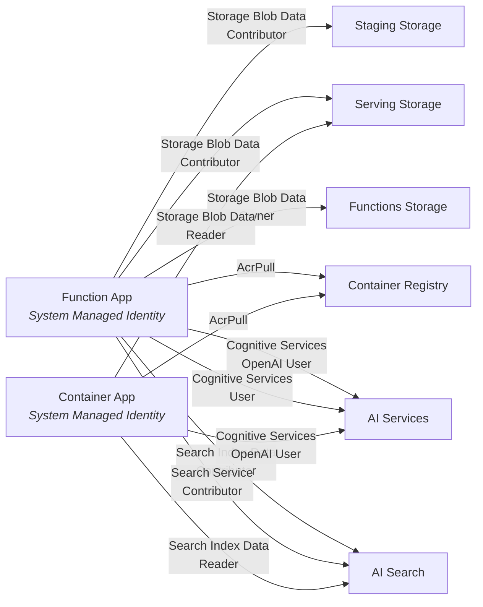

# Infrastructure

> **Status:** Draft — February 24, 2026

## Overview

All infrastructure is defined as **Bicep IaC** under `/infra/` and deployed via **Azure Developer CLI (AZD)**. The design follows zero-trust principles: all inter-service authentication is via **managed identity** with RBAC — no keys, secrets, or connection strings are stored in application settings.

**Region:** East US 2 — selected for availability of all required services: Content Understanding, text-embedding-3-small, gpt-5-mini, Azure AI Search, and Azure Functions Flex Consumption.

## Resource Inventory

| Resource | Bicep Module | Name Pattern | SKU / Tier |
|----------|-------------|--------------|------------|
| Resource Group | _(AZD-managed)_ | `rg-kbidx-{env}` | — |
| Log Analytics Workspace | `monitoring.bicep` | `log-kbidx-{env}` | PerGB2018, 30-day retention |
| Application Insights | `monitoring.bicep` | `appi-kbidx-{env}` | Workspace-based |
| Storage — Staging | `storage.bicep` | `stkbidxstaging{env}` | Standard_LRS, Hot |
| Storage — Serving | `storage.bicep` | `stkbidxserving{env}` | Standard_LRS, Hot |
| Storage — Functions Runtime | `function-app.bicep` | `stkbidxfunc{env}` | Standard_LRS |
| Azure AI Services (Foundry) | `ai-services.bicep` | `ai-kbidx-{env}` | S0 (AIServices kind) |
| → Embedding Deployment | `ai-services.bicep` | `text-embedding-3-small` | GlobalStandard, 120K TPM |
| → Agent Deployment | `ai-services.bicep` | `gpt-5-mini` | GlobalStandard, 30K TPM |
| → CU Completion Deployment | `ai-services.bicep` | `gpt-4.1` | GlobalStandard, 30K TPM |
| → CU Internal: Embedding † | `ai-services.bicep` | `text-embedding-3-large` | GlobalStandard, 120K TPM |
| → CU Internal: Analysis † | `ai-services.bicep` | `gpt-4.1-mini` | GlobalStandard, 30K TPM |
| → Mistral OCR Deployment | `ai-services.bicep` | `mistral-document-ai-2512` | GlobalStandard, capacity 1 |
| Azure AI Search | `search.bicep` | `srch-kbidx-{env}` | Free, 1 partition, 1 replica |
| Function App (Container App) | `function-app.bicep` | `func-kbidx-{env}` | Container App, 1.0 vCPU / 2 GiB, Python 3.11 custom Docker |
| Container Registry | `container-registry.bicep` | `crkbidx{env}` | Basic |
| Container Apps Environment | `container-app.bicep` | `cae-kbidx-{env}` | Consumption |
| Container App (Web App) | `container-app.bicep` | `webapp-kbidx-{env}` | 0.5 vCPU, 1 GiB |
| Entra App Registration | Pre-provision hook | `webapp-kbidx-{env}` | — |

> `{env}` is the AZD environment name (e.g., `dev`, `staging`, `prod`).

## Module Structure

```
infra/
├── main.bicep                  # Orchestration — wires all modules + role assignments
├── main.parameters.json        # AZD parameter file (env name, location, search SKU)
└── modules/
    ├── monitoring.bicep         # Log Analytics + Application Insights
    ├── storage.bicep            # Reusable storage account with containers + RBAC
    ├── ai-services.bicep        # AI Services account + model deployments + RBAC
    ├── search.bicep             # AI Search service + RBAC
    ├── function-app.bicep       # Functions on Container Apps (custom Docker) + runtime storage + AcrPull RBAC
    ├── container-registry.bicep # Azure Container Registry (Basic) + AcrPull RBAC (web app only)
    └── container-app.bicep      # Container Apps Environment + Container App + Easy Auth
```

---

## Service Details

### Monitoring (`monitoring.bicep`)

Provides centralized logging and telemetry for all services.

| Resource | Configuration |
|----------|--------------|
| **Log Analytics Workspace** | SKU `PerGB2018`, 30-day retention |
| **Application Insights** | Workspace-based (linked to Log Analytics), type `web` |

The Application Insights connection string is passed to the Function App as an app setting for automatic telemetry collection.

### Storage (`storage.bicep`)

A reusable module deployed three times — once each for staging, serving, and functions runtime.

| Setting | Value |
|---------|-------|
| Kind | StorageV2 |
| SKU | Standard_LRS |
| Access Tier | Hot |
| Public Blob Access | Disabled |
| Shared Key Access | Disabled (managed identity only) |
| Minimum TLS | 1.2 |
| HTTPS Only | Yes |

**Containers created:**

| Account | Container | Purpose |
|---------|-----------|---------|
| Staging | `staging` | Source HTML articles + images uploaded for processing |
| Serving | `serving` | Processed Markdown articles + PNG images consumed by fn-index and agents |
| Functions | `deployments` | Function App deployment packages (auto-managed) |

The module accepts an optional `contributorPrincipalId` parameter. When provided, it grants the **Storage Blob Data Contributor** role to that principal (used to give the Function App access to staging and serving accounts).

### Azure AI Services (`ai-services.bicep`)

A single **AIServices** (Foundry) resource hosting Content Understanding and six model deployments.

| Setting | Value |
|---------|-------|
| Kind | `AIServices` |
| SKU | S0 |
| Custom Subdomain | `ai-kbidx-{env}` |
| Local Auth | Disabled (`disableLocalAuth: true`) |
| Public Network | Enabled |

**Model Deployments:**

| Deployment | Model | SKU | Capacity | Purpose |
|-----------|-------|-----|----------|---------|
| `text-embedding-3-small` | OpenAI `text-embedding-3-small` v1 | GlobalStandard | 120K TPM | Vector embeddings for fn-index (1536 dimensions) |
| `text-embedding-3-large` | OpenAI `text-embedding-3-large` v1 | GlobalStandard | 120K TPM | CU-internal † — required by `prebuilt-documentSearch` for field extraction |
| `gpt-5-mini` | OpenAI `gpt-5-mini` v2025-08-07 | GlobalStandard | 30K TPM | Future agent chat/reasoning |
| `gpt-4.1` | OpenAI `gpt-4.1` v2025-04-14 | GlobalStandard | 30K TPM | CU custom analyzer completion + Mistral pipeline image descriptions (GPT-4.1 vision) |
| `gpt-4.1-mini` | OpenAI `gpt-4.1-mini` v2025-04-14 | GlobalStandard | 30K TPM | CU-internal † — required by `prebuilt-documentSearch` for document analysis |
| `mistral-document-ai-2512` | Mistral AI `mistral-document-ai-2512` | GlobalStandard | 1 | Mistral Document AI OCR for `fn_convert_mistral` pipeline |

> **†** `text-embedding-3-large` and `gpt-4.1-mini` are **not called by application code** — they are internal dependencies of CU's `prebuilt-documentSearch`. Without either deployed, CU silently returns 0 contents. These models are only needed when using the Content Understanding backend (`fn_convert_cu`).

Model deployments are serialized (`dependsOn`) to avoid Azure API conflicts.

**RBAC Roles (granted to Function App):**

| Role | Role ID | Purpose |
|------|---------|---------|
| Cognitive Services OpenAI User | `5e0bd9bd-7b93-4f28-af87-19fc36ad61bd` | Call embedding and agent model endpoints |
| Cognitive Services User | `a97b65f3-24c7-4388-baec-2e87135dc908` | Access Content Understanding APIs |

### Azure AI Search (`search.bicep`)

| Setting | Value |
|---------|-------|
| SKU | Free |
| Partitions | 1 |
| Replicas | 1 |
| Semantic Search | Free tier |
| Auth | AAD or API Key (`aadOrApiKey`) with `http401WithBearerChallenge` |
| Public Network | Enabled |

The search index (`kb-articles`) is created by application code at runtime, not in Bicep. See the [Architecture spec](architecture.md) for the full index schema.

**RBAC Roles (granted to Function App):**

| Role | Role ID | Purpose |
|------|---------|---------|
| Search Index Data Contributor | `8ebe5a00-799e-43f5-93ac-243d3dce84a7` | Push documents to the search index |
| Search Service Contributor | `7ca78c08-252a-4471-8644-bb5ff32d4ba0` | Create and manage indexes |

### Function App (`function-app.bicep`)

| Setting | Value |
|---------|-------|
| Plan | Flex Consumption (FC1) |
| Runtime | Python 3.11 |
| OS | Linux |
| Max Instance Count | 40 |
| Instance Memory | 2048 MB |
| Identity | System-assigned managed identity |
| Deployment Storage | Blob container (`deployments`) on dedicated functions storage account, authenticated via system identity |

**Application Settings:**

| Setting | Source | Purpose |
|---------|--------|---------|
| `AzureWebJobsStorage__accountName` | Functions storage account name | Functions runtime storage (identity-based) |
| `APPLICATIONINSIGHTS_CONNECTION_STRING` | App Insights output | Telemetry |
| `STAGING_BLOB_ENDPOINT` | Staging storage blob endpoint | Read source articles |
| `SERVING_BLOB_ENDPOINT` | Serving storage blob endpoint | Write processed articles |
| `AI_SERVICES_ENDPOINT` | AI Services endpoint | Content Understanding + embeddings |
| `EMBEDDING_DEPLOYMENT_NAME` | `text-embedding-3-small` | Model deployment name for embeddings |
| `SEARCH_ENDPOINT` | AI Search endpoint | Push chunks to search index |
| `SEARCH_INDEX_NAME` | `kb-articles` (hardcoded default) | Target search index |
| `MISTRAL_DEPLOYMENT_NAME` | `mistral-document-ai-2512` | Mistral Document AI OCR model for `fn_convert_mistral` |

The Function App's own storage account gets **Storage Blob Data Owner** (role `b7e6dc6d-f1e8-4753-8033-0f276bb0955b`) granted to the Function App identity — required for Flex Consumption deployment and `AzureWebJobsStorage` access.

### Container Registry (`container-registry.bicep`)

Hosts Docker images for the Context Aware & Vision Grounded KB Agent container.

| Setting | Value |
|---------|-------|
| SKU | Basic |
| Admin User | Disabled (managed identity pull) |
| Public Network | Enabled |

The module accepts an optional `acrPullPrincipalId` parameter. When provided, it grants the **AcrPull** role to that principal (used to give the web app Container App access to pull images). The Function App's AcrPull role is managed separately in `function-app.bicep` — see [Technical Brief](#technical-brief-bicep-dependency-ordering-for-container-apps) for why.

### Container App (`container-app.bicep`)

Hosts the Context Aware & Vision Grounded KB Agent as a containerized application with Entra ID Easy Auth.

#### Container Apps Environment

| Setting | Value |
|---------|-------|
| Type | Consumption (Consumption + Dedicated plan) |
| Logging | Linked to Log Analytics workspace |

#### Container App

| Setting | Value |
|---------|-------|
| Identity | System-assigned managed identity |
| Container | Single container from ACR |
| CPU / Memory | 0.5 vCPU / 1 GiB |
| Ingress | External, port 8080, HTTPS-only |
| Scale | Min 0, Max 1 (scale-to-zero for cost savings) |

**Application Settings:**

| Setting | Source | Purpose |
|---------|--------|---------|
| `AI_SERVICES_ENDPOINT` | AI Services endpoint | Azure AI Foundry (GPT-4.1 + embeddings) |
| `AGENT_MODEL_DEPLOYMENT_NAME` | `gpt-4.1` | Agent reasoning model |
| `EMBEDDING_DEPLOYMENT_NAME` | `text-embedding-3-small` | Query embedding model |
| `SEARCH_ENDPOINT` | AI Search endpoint | Query the kb-articles index |
| `SEARCH_INDEX_NAME` | `kb-articles` | Target search index |
| `SERVING_BLOB_ENDPOINT` | Serving storage blob endpoint | Article images for proxy + vision |
| `SERVING_CONTAINER_NAME` | `serving` | Blob container name |

#### Entra ID Easy Auth

Authentication is configured as a platform-level sidecar on the Container App — no code changes needed in the Chainlit application.

| Setting | Value |
|---------|-------|
| Provider | Microsoft Entra ID (v2) |
| Tenant Mode | Single-tenant |
| Unauthenticated Action | Redirect to login (return HTTP 302) |
| App Registration | Created via AZD pre-provision hook |
| Redirect URI | `https://<container-app-fqdn>/.auth/login/aad/callback` |

The Entra App Registration is created by the AZD `preprovision` hook script using `az ad app create`. The client ID and secret are stored as AZD environment variables and passed to the Bicep template as parameters.

---

## Security Model

### Zero-Secret Architecture

No keys, connection strings, or secrets appear in application settings or configuration. All service-to-service communication is authenticated via **system-assigned managed identity** — both the Function App and the Container App use this pattern.



### Entra ID Authentication

The Container App uses **Easy Auth** (platform-level) with an **Entra App Registration** (single-tenant). The app registration is created via an AZD pre-provision hook script (`az ad app create`) and its client ID / secret are passed to the Container App's auth configuration. Only users in the Azure AD tenant can access the web app. Unauthenticated requests are automatically redirected to the Microsoft login page.

### Key Security Settings

| Resource | Setting | Value |
|----------|---------|-------|
| Storage (Staging, Serving) | `allowSharedKeyAccess` | `false` |
| Storage (all) | `allowBlobPublicAccess` | `false` |
| Storage (all) | `minimumTlsVersion` | `TLS1_2` |
| AI Services | `disableLocalAuth` | `true` |
| AI Search | Auth mode | `aadOrApiKey` (AAD preferred, API key fallback) |

### RBAC Role Summary

| Principal | Resource | Role |
|-----------|----------|------|
| Function App | Staging Storage | Storage Blob Data Contributor |
| Function App | Serving Storage | Storage Blob Data Contributor |
| Function App | Functions Storage | Storage Blob Data Owner |
| Function App | Container Registry | AcrPull |
| Function App | AI Services | Cognitive Services OpenAI User |
| Function App | AI Services | Cognitive Services User |
| Function App | AI Search | Search Index Data Contributor |
| Function App | AI Search | Search Service Contributor |
| Container App | AI Services | Cognitive Services OpenAI User |
| Container App | AI Search | Search Index Data Reader |
| Container App | Serving Storage | Storage Blob Data Reader |
| Container App | Container Registry | AcrPull |

---

## Deployment

### Prerequisites

- Azure CLI with Bicep (`az bicep version`)
- Azure Developer CLI (`azd version`)
- An Azure subscription with sufficient quota in East US 2

### Commands

```bash
# Initialize AZD environment (first time only)
azd init

# Provision all infrastructure
azd provision

# Deploy application code
azd deploy

# Or provision + deploy in one step
azd up
```

AZD reads `azure.yaml` (project root) and `infra/main.parameters.json` to resolve environment-specific values:

| Parameter | Source | Default |
|-----------|--------|---------|
| `environmentName` | `${AZURE_ENV_NAME}` | — (set during `azd init`) |
| `location` | `${AZURE_LOCATION}` | `eastus2` |
| `searchSkuName` | Hardcoded in parameters file | `free` |

### Makefile Targets

| Target | Command |
|--------|---------|
| `make azure-provision` | `azd provision` |
| `make azure-deploy` | `azd deploy` |

---

## Outputs

The following values are exported by `main.bicep` and available as AZD environment variables after provisioning:

| Output | Example Value |
|--------|--------------|
| `AZURE_LOCATION` | `eastus2` |
| `RESOURCE_GROUP` | `rg-kbidx-dev` |
| `STAGING_STORAGE_ACCOUNT` | `stkbidxstagingdev` |
| `STAGING_BLOB_ENDPOINT` | `https://stkbidxstagingdev.blob.core.windows.net/` |
| `SERVING_STORAGE_ACCOUNT` | `stkbidxservingdev` |
| `SERVING_BLOB_ENDPOINT` | `https://stkbidxservingdev.blob.core.windows.net/` |
| `AI_SERVICES_NAME` | `ai-kbidx-dev` |
| `AI_SERVICES_ENDPOINT` | `https://ai-kbidx-dev.cognitiveservices.azure.com/` |
| `EMBEDDING_DEPLOYMENT_NAME` | `text-embedding-3-small` |
| `AGENT_DEPLOYMENT_NAME` | `gpt-5-mini` |
| `CU_COMPLETION_DEPLOYMENT_NAME` | `gpt-4.1` |
| `MISTRAL_DEPLOYMENT_NAME` | `mistral-document-ai-2512` |
| `SEARCH_SERVICE_NAME` | `srch-kbidx-dev` |
| `SEARCH_ENDPOINT` | `https://srch-kbidx-dev.search.windows.net` |
| `FUNCTION_APP_NAME` | `func-kbidx-dev` |
| `FUNCTION_APP_URL` | `https://func-kbidx-dev.<hash>.<region>.azurecontainerapps.io` |
| `APPINSIGHTS_NAME` | `appi-kbidx-dev` |
| `CONTAINER_REGISTRY_NAME` | `crkbidxdev` |
| `CONTAINER_REGISTRY_LOGIN_SERVER` | `crkbidxdev.azurecr.io` |
| `WEBAPP_NAME` | `webapp-kbidx-dev` |
| `WEBAPP_URL` | `https://webapp-kbidx-dev.<region>.azurecontainerapps.io` |

---

## Design Decisions

| # | Decision | Rationale |
|---|----------|-----------|
| 1 | **Functions on Container Apps** over Flex Consumption | Flex Consumption (FC1) does not support custom Docker containers, which are required for Playwright + headless Chromium (used by the Mistral converter for HTML → PDF rendering). Elastic Premium (EP1) was considered first but unavailable by a zero-VM quota in the subscription. Container Apps provides custom container support, scale-to-zero, and reuses the existing Container Apps Environment already hosting the web app. |
| 2 | **Three separate storage accounts** | Staging, serving, and functions runtime are isolated for security, lifecycle management, and independent scaling. Shared key access is disabled on staging/serving. |
| 3 | **AIServices kind** (Foundry) | Single resource hosts Content Understanding, OpenAI models (embeddings + agent), and Mistral models, avoiding multiple Cognitive Services accounts. |
| 4 | **Free search tier** | Supports up to 3 indexes, 50 MB storage, vector search, and semantic search — sufficient for dev. Upgrade path to Basic/Standard is straightforward. |
| 5 | **System-assigned managed identity** | Simplest identity model — lifecycle tied to the Function App. No credential rotation or secret management required. |
| 6 | **East US 2 region** | Broadest model availability for the required services: Content Understanding (GA), text-embedding-3-small, gpt-5-mini, Flex Consumption, and AI Search. |
| 7 | **Modular Bicep structure** | Each service is a self-contained module with optional RBAC parameters. Modules are re-deployed with role assignments after the Function App identity is available. |
| 8 | **GlobalStandard model SKU** | Provides highest availability and regional flexibility for OpenAI model deployments. Uses Microsoft-managed capacity across Azure regions. |
| 9 | **Mistral Document AI deployment** | `mistral-document-ai-2512` (format `Mistral AI`) is deployed alongside OpenAI models in the same AIServices resource. The `fn_convert_mistral` pipeline depends on this model plus GPT-4.1 for vision. Requires Playwright (headless Chromium) at runtime for HTML → PDF rendering. |
| 10 | **Anonymous function auth** | Container Apps does not support Azure Functions host keys. All three HTTP-triggered functions (`fn_convert`, `fn_convert_mistral`, `fn_index`) use `AuthLevel.ANONYMOUS`. Access control relies on the Container App's built-in ingress authentication and network-level controls instead. |
| 11 | **AcrPull role in function-app module** | The Function App's AcrPull role assignment is co-located in `function-app.bicep` (not in `container-registry.bicep`) to avoid a circular dependency between the Container App resource and the ACR role assignment. See [Technical Brief](#technical-brief-bicep-dependency-ordering-for-container-apps) below. |

---

## Technical Brief: Bicep Dependency Ordering for Container Apps with ACR

When a Container App pulls images from ACR using its **system-assigned managed identity**, three things must happen in the right order:

1. **Container App** is created with a system-assigned managed identity → produces a `principalId`
2. **AcrPull role** is assigned to that `principalId` on the Container Registry
3. **Container App** uses the ACR registry config (`identity: 'system'`) to authenticate image pulls

Steps 1 and 3 are defined on the **same resource** — the Container App includes both the identity declaration and the `registries` configuration. The `registries` block with `identity: 'system'` requires the AcrPull role (step 2) to already be in place, but step 2 requires the `principalId` that only exists after step 1.

### Why the AcrPull Role Lives in `function-app.bicep`

If the AcrPull role assignment is placed in a **separate Bicep module** (e.g., `container-registry.bicep`), ARM cannot resolve the dependencies:

- The Container App module outputs its `principalId` → passed to the ACR module for the role assignment
- But the Container App's `registries` config needs ACR access _during creation_, before the role module runs
- ARM evaluates the `registries` config as part of creating the Container App, not as a post-creation step

This creates a **cross-module circular dependency** that ARM cannot resolve. The deployment hangs indefinitely in `InProgress` rather than failing with a clear error.

The solution is to keep the AcrPull role assignment **in the same module** as the Container App. Using an `existing` resource reference to the ACR:

```bicep
// In function-app.bicep:

resource containerRegistry 'Microsoft.ContainerRegistry/registries@2023-07-01' existing = {
  name: split(acrResourceId, '/')[8]
}

resource acrPullRole 'Microsoft.Authorization/roleAssignments@2022-04-01' = {
  name: guid(acrResourceId, functionApp.id, acrPullRoleId)
  scope: containerRegistry
  properties: {
    principalId: functionApp.identity.principalId
    roleDefinitionId: subscriptionResourceId('Microsoft.Authorization/roleDefinitions', acrPullRoleId)
    principalType: 'ServicePrincipal'
  }
}
```

Within a single module, ARM resolves the implicit dependency via `functionApp.identity.principalId` and orders the operations correctly:

1. Create the Container App (with identity) → `principalId` is known
2. Assign AcrPull role using that `principalId`
3. Registry config is evaluated — ACR pull succeeds

### General Rule

Whenever a resource's configuration depends on a role that requires that resource's own identity, the role assignment must be **co-located in the same Bicep module**. Splitting them across modules creates a circular dependency that ARM cannot resolve.
