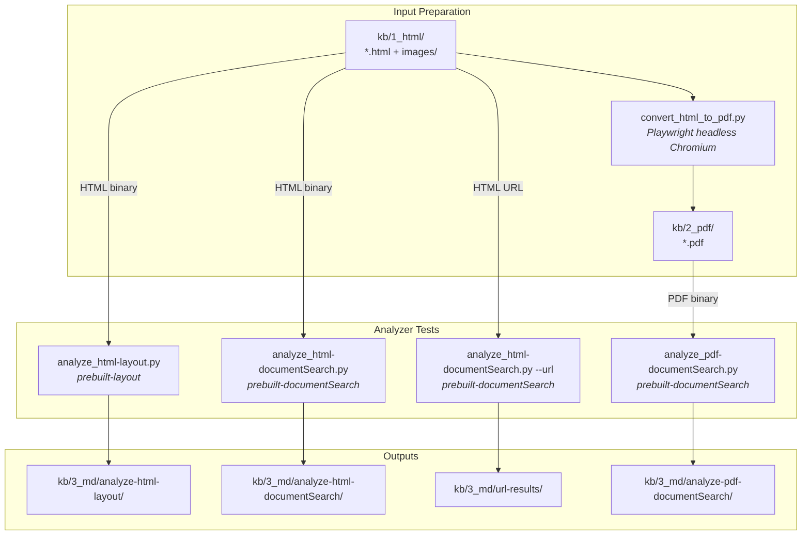

# Spike 001: Azure Content Understanding — Analyzer Evaluation

> **Date:** 2026-02-12
> **Status:** Done ✅
> **Research:** [001-analyzer-options.md](../research/001-analyzer-options.md), [003-content-understanding.md](../research/003-content-understanding.md)
> **Goal:** Determine which Azure Content Understanding analyzer and input format combination can convert HTML KB articles to markdown **with images/figures preserved**.

---

## Objective

Evaluate all viable combinations of CU prebuilt analyzers (`prebuilt-layout`, `prebuilt-documentSearch`) and input formats (HTML binary, HTML URL, PDF binary) to find a working pipeline for converting KB articles from HTML → markdown with figure descriptions.

The core problem: our KB articles are HTML files containing `` references to screenshots and diagrams. CU's `prebuilt-layout` extracts text/tables reliably but **drops images entirely**. This spike tests every proposed approach from the research doc to find one that preserves figures.

### Success Criteria

1. ✅ Identify which analyzer + input format combination detects and describes figures
2. ✅ Validate that `prebuilt-documentSearch` works (resolve the "0 contents" issue from earlier tests)
3. ✅ Test HTML → PDF conversion as a workaround for figure detection
4. ✅ Compare output quality across all tested combinations
5. ✅ Document model deployment requirements and gotchas

### Non-Goals

- No custom analyzer creation (Proposal B from research) — test prebuilt analyzers first
- No hybrid image pipeline (Proposal D from research) — too complex for a first spike
- No production pipeline — scripts only, spike code lives in `src/spikes/001-cu-analyzers/`
- No search indexing or web app integration
- **No code changes outside `src/spikes/001-cu-analyzers/`**

---

## Prerequisites

### Model Deployment

The following models must be deployed to the AI Foundry resource. `prebuilt-documentSearch` silently fails (returns 0 contents with no error) if the required embedding model is missing.

| Model | Purpose | Required By |
|---|---|---|
| `gpt-4.1` | Completion model for field extraction, summarization | `prebuilt-documentSearch` |
| `gpt-4.1-mini` | Lighter completion model | `prebuilt-layout`, general use |
| `text-embedding-3-small` | Embedding model (general) | General use |
| **`text-embedding-3-large`** | **Embedding model for documentSearch** | **`prebuilt-documentSearch`** (hard requirement) |

> **Critical lesson learned**: `prebuilt-documentSearch` requires `text-embedding-3-large` (not `small`). If the model is missing, the API **silently returns 0 contents with no error or warning**. This must be deployed and registered via `setup_defaults.py`.

### Environment

| Variable | Source | Notes |
|---|---|---|
| `CONTENTUNDERSTANDING_ENDPOINT` | Required | Must use `cognitiveservices.azure.com`, **not** `services.ai.azure.com` |
| `MODELS_ENDPOINT` | Required | AI Foundry endpoint |
| `GPT_4_1_DEPLOYMENT` | Optional | Defaults to `gpt-4.1` |
| `GPT_4_1_MINI_DEPLOYMENT` | Optional | Defaults to `gpt-4.1-mini` |
| `TEXT_EMBEDDING_3_SMALL_DEPLOYMENT` | Optional | Defaults to `text-embedding-3-small` |

> **Endpoint gotcha**: The Foundry endpoint (`services.ai.azure.com`) cannot see or manage CU model deployments. Always use the `cognitiveservices.azure.com` endpoint for Content Understanding operations.

### Dependencies

Own `pyproject.toml` with: `azure-ai-contentunderstanding`, `azure-identity`, `playwright`, `python-dotenv`.

Auth: `DefaultAzureCredential` everywhere (Entra ID / keyless). Requires **Cognitive Services User** role on the resource.

---

## Pipeline Overview



Each combination is tested independently. Outputs are saved as markdown + raw JSON for comparison.

---

## File Structure

```
src/spikes/001-cu-analyzers/
├── config.py                        # Env config & credential loading
├── setup_defaults.py                # One-time model deployment registration
├── convert_html_to_pdf.py           # HTML → PDF via Playwright
├── analyze_html-layout.py           # HTML → prebuilt-layout
├── analyze_html-documentSearch.py   # HTML → prebuilt-documentSearch (binary + URL)
└── analyze_pdf-documentSearch.py    # PDF → prebuilt-documentSearch
```

Data directories (under `src/spikes/001-cu-analyzers/kb/`, gitignored):

```
kb/
├── 1_html/          # Source HTML articles (one folder per article)
│   └── <article-id>/
│       ├── *.html
│       └── images/
├── 2_pdf/           # Generated PDFs from html-to-pdf conversion
│   └── <article-id>/
│       └── *.pdf
└── 3_md/            # CU analysis outputs (one folder per method)
    ├── analyze-html-layout/<article-id>/
    │   ├── *-result.md
    │   └── *-result.result.json
    ├── analyze-html-documentSearch/<article-id>/
    │   ├── *-result.md
    │   └── *-result.result.json
    ├── url-results/
    │   ├── *-result.md
    │   └── *-result.result.json
    └── analyze-pdf-documentSearch/<article-id>/
        ├── *-result.md
        └── *-result.result.json
```

---

## Scripts: Inputs, Outputs, and Validation

### `config.py` — Configuration Loader

| | |
|---|---|
| **Goal** | Load environment variables from `.env`, validate required vars, provide `DefaultAzureCredential` |
| **Input** | `.env` file with `CONTENTUNDERSTANDING_ENDPOINT`, `MODELS_ENDPOINT` |
| **Output** | Config dict + credential object |
| **Verify** | Raises `EnvironmentError` if required vars are missing |

### `setup_defaults.py` — One-Time Model Registration

| | |
|---|---|
| **Goal** | Map deployed model names to CU's internal model references so prebuilt analyzers can find them |
| **Input** | Config from `.env` (model deployment names) |
| **Output** | Model mappings registered on the CU resource |
| **Verify** | Script prints current defaults after update; `prebuilt-documentSearch` stops returning 0 contents |

Uses `ContentUnderstandingClient.update_defaults()` to register `gpt-4.1`, `gpt-4.1-mini`, and `text-embedding-3-small` deployment mappings.

### `convert_html_to_pdf.py` — HTML → PDF Conversion

| | |
|---|---|
| **Goal** | Render HTML KB articles to PDF using Playwright (headless Chromium) for downstream figure analysis |
| **Input** | `kb/1_html/<article>/*.html` + local images |
| **Output** | `kb/2_pdf/<article>/*.pdf` |
| **Verify** | Open the PDF — images are visible, layout is reasonable, content flows across pages |

Key implementation details:
- Uses Playwright `page.pdf()` — Chrome's print-to-PDF automatically scales content and flows across pages with no per-document tuning
- Custom route handler intercepts resource requests to serve local images (handles absolute server paths like `/sites/KMSearch/...` and non-standard extensions like `.image`)
- MIME type detection falls back to magic bytes for files with non-standard extensions
- WeasyPrint was tried first but **cannot generically scale images** to fit pages (CSS page-based layout clips oversized images)

### `analyze_html-layout.py` — HTML + `prebuilt-layout`

| | |
|---|---|
| **Goal** | Test the baseline: analyze HTML with `prebuilt-layout` and measure what's extracted |
| **Input** | `kb/1_html/<article>/*.html` (binary upload, `content_type="text/html"`) |
| **Output** | `kb/3_md/analyze-html-layout/<article>/*-result.md` + `*-result.result.json` |
| **Verify** | Markdown produced for text content; figure count in output |

**Finding:** Text, headings, paragraphs, tables extracted reliably. **Images are dropped entirely** — no URLs, no alt text, no descriptions.

### `analyze_html-documentSearch.py` — HTML + `prebuilt-documentSearch`

| | |
|---|---|
| **Goal** | Test the RAG-optimized analyzer on HTML input (both binary upload and URL-based) |
| **Input** | Binary mode: `kb/1_html/<article>/*.html`; URL mode: `--url https://...` |
| **Output** | `kb/3_md/analyze-html-documentSearch/<article>/*-result.md` or `kb/3_md/url-results/*-result.md` |
| **Verify** | Content count > 0; check for figures, hyperlinks, summary, fields |

Supports two modes:
- **Binary upload** (`begin_analyze_binary` with `content_type="text/html"`)
- **URL-based** (`begin_analyze` with `AnalyzeInput(url=...)`) — tests whether CU fetching the URL itself resolves `` references

**Finding:** Both modes extract text, summary, and hyperlinks. **Neither mode detects figures in HTML input.** The "0 contents" issue from earlier tests was caused by missing `text-embedding-3-large` deployment, not a fundamental HTML limitation.

### `analyze_pdf-documentSearch.py` — PDF + `prebuilt-documentSearch`

| | |
|---|---|
| **Goal** | Test figure detection on PDF input — the docs confirm figure analysis works for PDF |
| **Input** | `kb/2_pdf/<article>/*.pdf` (binary upload, `content_type="application/pdf"`) |
| **Output** | `kb/3_md/analyze-pdf-documentSearch/<article>/*-result.md` + `*-result.result.json` |
| **Verify** | Figures detected with descriptions; markdown length ≥ HTML versions |

Requires running `convert_html_to_pdf.py` first to produce the PDF.

**Finding:** **Full figure descriptions generated.** This is the only combination that detects and describes images.

---

## Run Sequence

```bash
cd src/spikes/001-cu-analyzers

# 1. Install deps + Playwright browsers
uv sync
uv run playwright install chromium

# 2. Configure environment
cp .env.sample .env
# Edit .env with cognitiveservices.azure.com endpoint

# 3. One-time: register model deployments
uv run python setup_defaults.py

# 4. Convert HTML articles to PDF
uv run python convert_html_to_pdf.py --article <article-id>

# 5. Run each analyzer combination
uv run python analyze_html-layout.py --article <article-id>
uv run python analyze_html-documentSearch.py --article <article-id>
uv run python analyze_html-documentSearch.py --url https://learn.microsoft.com/...
uv run python analyze_pdf-documentSearch.py --article <article-id>

# 6. Compare outputs in kb/3_md/
```

Batch processing is available via Makefile targets: `make html-to-pdf`, `make html-layout`, `make html-documentSearch`, `make pdf-documentSearch`, `make all`.

---

## Validation Checklist

| # | Check | Result |
|---|---|---|
| 1 | **`prebuilt-layout` extracts text from HTML** | ✅ Text, headings, paragraphs, tables extracted reliably |
| 2 | **`prebuilt-layout` detects figures in HTML** | ❌ Images dropped entirely from output |
| 3 | **`prebuilt-documentSearch` returns contents for HTML** | ✅ Works once `text-embedding-3-large` is deployed and registered |
| 4 | **`prebuilt-documentSearch` detects figures in HTML (binary)** | ❌ No figures detected |
| 5 | **`prebuilt-documentSearch` detects figures in HTML (URL)** | ❌ No figures detected — URL input does not resolve images |
| 6 | **HTML → PDF conversion works** | ✅ Playwright produces clean PDFs; images rendered inline |
| 7 | **`prebuilt-documentSearch` detects figures in PDF** | ✅ **Full figure descriptions generated** (2 figures per article) |
| 8 | **Hyperlinks extracted** | ✅ `prebuilt-documentSearch` extracts hyperlinks (85 for test article) |
| 9 | **Summary generated** | ✅ `prebuilt-documentSearch` auto-generates article summary |
| 10 | **Markdown quality comparable** | ✅ PDF output is longer (16K vs 10.7K chars) due to figure descriptions |

---

## Challenges Encountered & Resolved

| Challenge | Resolution |
|---|---|
| `prebuilt-documentSearch` returns 0 contents with no error | Deploy `text-embedding-3-large` (not `small`) and register via `setup_defaults.py` |
| WeasyPrint clips oversized images in PDF output | Switch to **Playwright** (headless Chromium `page.pdf()`) — auto-scales content |
| Local HTML with absolute image paths (e.g. `/sites/KMSearch/...`) | Custom Playwright route handler resolves by filename against local article directory |
| Non-standard image extensions (`.image`) | MIME type detection falls back to magic bytes (PNG/JPEG/GIF/WEBP header signatures) |
| Foundry endpoint can't manage CU model deployments | Use `cognitiveservices.azure.com` endpoint, not `services.ai.azure.com` |
| Figure analysis confirmed "PDF and image formats only" | HTML → PDF conversion is the required workaround (validates Proposal C from research) |

---

## Definition of Done

- [x] All 4 analyzer + input format combinations tested
- [x] Scripts for each combination in `src/spikes/001-cu-analyzers/`
- [x] HTML → PDF conversion via Playwright working
- [x] Model deployment requirements documented (especially `text-embedding-3-large`)
- [x] Output comparison data collected
- [x] CU's HTML vs PDF image limitations characterized empirically
- [x] Results documented — informed architecture decisions (ARD-001, ARD-003, ARD-004)

---

## Results

### Output Comparison (same article: `content-understanding-html_en-us`)

| Metric | HTML + layout | HTML + docSearch | PDF + docSearch |
|---|---|---|---|
| Markdown length | 10,713 chars | 10,713 chars | 16,080 chars |
| Figures detected | 0 | 0 | **2 (with descriptions)** |
| Summary | N/A | Yes | Yes |
| Hyperlinks | N/A | Yes (85) | Yes (85) |

### Key Findings

1. **Figure analysis is PDF/image-only — confirmed empirically.** Neither HTML binary upload nor URL-based input triggers figure detection in any analyzer. The documentation's statement that "figure analysis is only supported for PDF and image file formats" is accurate. This means images must be handled separately from the HTML text extraction.

2. **HTML text extraction via `prebuilt-documentSearch` is high quality.** Despite not detecting figures, the HTML → `prebuilt-documentSearch` path produces excellent markdown for text, tables, headings, hyperlinks, and auto-generated summaries. This is a strong foundation for text extraction without any format conversion.

3. **PDF pipeline works but adds unnecessary complexity.** While HTML → PDF → `prebuilt-documentSearch` does unlock figure detection, it introduces Playwright/Chromium dependencies, image quality degradation (rasterization + re-cropping), and bounding polygon complexity. The images are already available as source files — they don't need to be re-discovered from a PDF.

4. **Images can be analyzed individually via CU.** Since CU's figure analysis works on image file formats, each source image can be sent directly to a custom CU analyzer. This preserves original image quality and eliminates the entire PDF conversion step — the insight that led to the production architecture.

5. **`text-embedding-3-large` is a silent hard requirement.** `prebuilt-documentSearch` requires this specific embedding model. Without it, the analyzer returns 0 contents with no error message — an extremely misleading failure mode. This is not documented prominently.

6. **Endpoint matters: `cognitiveservices.azure.com` only.** The Foundry endpoint (`services.ai.azure.com`) cannot see CU model deployments or analyzer operations. All CU work must use the cognitive services endpoint.

7. **Playwright > WeasyPrint for HTML → PDF.** If PDF conversion is needed, Playwright's Chrome print-to-PDF automatically scales content and handles diverse HTML structures. WeasyPrint clips oversized images.

8. **URL-based input does not help with images.** Proposal A from the research doc (pass live URL to `prebuilt-documentSearch`) was disproven — CU does not resolve `` references when fetching from a URL.

### Research Proposals Validated

| Research Proposal | Tested | Result |
|---|---|---|
| **A** — URL-based `prebuilt-documentSearch` | ✅ | ❌ No figure detection for HTML via URL |
| **B** — Custom analyzer with figure flags | ⬜ Not tested | Deferred — prebuilts tested first |
| **C** — HTML → PDF conversion first | ✅ | ✅ Works, but adds unnecessary complexity |
| **D** — Hybrid pipeline (separate image processing) | ⬜ Not tested in this spike | Later became the production approach |

### Conclusion

The spike's most important finding was **what didn't work** — CU cannot detect images in HTML input, regardless of analyzer or input method. However, this negative result, combined with the observation that CU *can* analyze individual image files, opened the path to a **better architecture** than any of the original proposals.

Rather than forcing images through a PDF intermediary (Proposal C), the production pipeline adopted a **decoupled approach** (closest to Proposal D):

1. **HTML → CU `prebuilt-documentSearch`** — text extraction (markdown, tables, headings, summary, hyperlinks)
2. **Each image → CU `kb_image_analyzer`** — individual image analysis via a custom analyzer with domain-tuned prompts for UI screenshots
3. **Merge** — recover hyperlinks from the HTML DOM, insert image description blocks at correct positions

This architecture, documented in [ARD-001](../ards/ARD-001-html-direct-processing.md) (eliminate PDF conversion) and [ARD-004](../ards/ARD-004-custom-image-analyzer.md) (custom image analyzer), is simpler, faster, and preserves original image quality. The spike's PDF path was a valid proof-of-concept but was superseded by the cleaner HTML-direct + individual image analysis design. The two-stage pipeline structure (`fn-convert` → serving layer → `fn-index`) is documented in [ARD-003](../ards/ARD-003-decoupled-two-stage-pipeline.md).

---

## References

- [Research: Analyzer Options](../research/001-analyzer-options.md)
- [Research: Content Understanding](../research/003-content-understanding.md)
- [Research: Architecture Research](../research/002-architecture-research.md)
- [ARD-001: HTML Direct Processing](../ards/ARD-001-html-direct-processing.md)
- [ARD-003: Decoupled Two-Stage Pipeline](../ards/ARD-003-decoupled-two-stage-pipeline.md)
- [ARD-004: Custom CU Image Analyzer](../ards/ARD-004-custom-image-analyzer.md)
- [Analyzer Definition](../../src/analyzers/kb-image-analyzer.json)
- [Production fn-convert pipeline](../../src/functions/fn_convert/__init__.py)
- [Content Understanding overview](https://learn.microsoft.com/en-us/azure/ai-services/content-understanding/overview)
- [prebuilt-documentSearch](https://learn.microsoft.com/en-us/azure/ai-services/content-understanding/prebuilt/document-search)
- [Python SDK docs](https://learn.microsoft.com/python/api/overview/azure/ai-contentunderstanding-readme?view=azure-python-preview)
