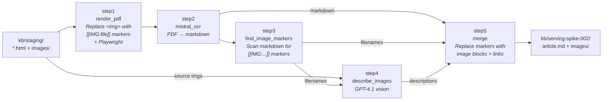

# Spike 002: Mistral Document AI Pipeline

> **Date:** 2026-02-20
> **Status:** Done ✅
> **Research:** [005-mistral-document-ai.md](../research/005-mistral-document-ai.md)
> **Goal:** Validate that `mistral-document-ai-2512` can replace Azure Content Understanding for KB article conversion, producing comparable or better output.

---

## Objective

Build a minimal script-based pipeline that converts KB articles from `kb/staging/` → `kb/serving-spike-002/` using Mistral Document AI + GPT-4.1 vision, so we can **side-by-side compare** the output against `kb/serving/` (current CU pipeline).

This spike answers the open questions from the research doc (§8) with empirical evidence, not theory.

### Success Criteria

1. ✅ All 3 staging articles produce `article.md` + `images/` in `kb/serving-spike-002/`
2. ✅ Image markers are correctly read by Mistral OCR → source images map to placeholders
3. ✅ Image descriptions generated by GPT-4.1 are comparable quality to CU's `kb-image-analyzer`
4. ✅ Hyperlinks from the original HTML survive in the output markdown
5. ✅ Output format is compatible with the existing `fn-index` pipeline (same structure as `kb/serving/`)

### Non-Goals

- No changes to existing `fn-convert`, `fn-index`, infra Bicep, or the web app
- No Azure Function deployment — scripts only
- No search indexing — just produce the serving output for comparison
- No production readiness — spike code lives in `src/spikes/002-mistral-pipeline/`
- **No code changes outside `src/spikes/002-mistral-pipeline/`** — no Makefile, no `scripts/`, no infra

---

## Prerequisites

### Model Deployment

Deploy `mistral-document-ai-2512` to the existing AI Foundry resource via `deploy_model.sh` (inside the spike folder). Use `az cognitiveservices account deployment create`. The implementing agent should verify the correct `--model-format`, `--sku-name`, and capacity values via `az cognitiveservices account list-models` or the Foundry portal. If CLI deployment isn't straightforward for Mistral serverless models, deploy manually via the portal and document the steps.

### Environment

Reuse `src/functions/.env` (already populated by `make dev-setup-env`). The spike needs:

| Variable | Source | Notes |
|---|---|---|
| `AI_SERVICES_ENDPOINT` | Existing | Shared AI Services endpoint |
| `AGENT_DEPLOYMENT_NAME` | Existing | GPT-4.1 deployment for image descriptions |
| `MISTRAL_DEPLOYMENT_NAME` | New | Defaults to `mistral-document-ai-2512` |
| `RESOURCE_GROUP` | Existing | For model deployment script |
| `AI_SERVICES_ACCOUNT` | Existing | For model deployment script |

### Dependencies

Own `pyproject.toml` with: `playwright`, `azure-identity`, `openai`, `python-dotenv`, `httpx`.

Auth: `DefaultAzureCredential` everywhere (Entra ID / keyless). Same pattern as rest of codebase.

---

## Pipeline Overview



---

## File Structure

```
src/spikes/002-mistral-pipeline/
├── pyproject.toml
├── Makefile
├── deploy-model.bicep
├── deploy_model.sh
├── run.py
├── step1_render_pdf.py
├── step2_mistral_ocr.py
├── step3_map_images.py
├── step4_describe_images.py
├── step5_merge.py
└── compare.py
```

---

## Scripts: Inputs, Outputs, and Validation

### `deploy_model.sh` / `deploy-model.bicep` — One-Time Model Deployment

| | |
|---|---|
| **Goal** | Deploy `mistral-document-ai-2512` to existing Foundry resource |
| **Input** | `.env` vars: `RESOURCE_GROUP`, `AI_SERVICES_ACCOUNT` |
| **Output** | Model deployment visible in Foundry portal |
| **Verify** | Script exits 0; `az cognitiveservices account deployment show` returns the deployment |

> **Finding:** CLI deployment via `az cognitiveservices account deployment create` fails for Mistral models. Deployment uses **Bicep** (`deploy-model.bicep`) with `format: 'Mistral AI'`, SKU `GlobalStandard`, API version `2024-04-01-preview`.

### `step1_render_pdf.py` — HTML → PDF with Image Markers

| | |
|---|---|
| **Goal** | Replace each `` tag with a visible `[[IMG:<filename>]]` text marker, then render the HTML to PDF using Playwright (headless Chromium) |
| **Input** | `kb/staging/<article>/<name>.html` + `images/` |
| **Output** | `<output>/<article>/article.pdf` |
| **Verify** | Open the PDF — images are gone, `[[IMG:...]]` markers appear as normal text |

The markers are `<p>` elements (14px text) that replace each `` tag entirely. Wrapping `<a>` lightbox links are unwrapped first. Images are not included in the PDF at all — we use the source files directly from the staging directory.

### `step2_mistral_ocr.py` — PDF → Mistral OCR

| | |
|---|---|
| **Goal** | Send the PDF to Mistral Document AI and get back structured markdown |
| **Input** | `<output>/<article>/article.pdf` |
| **Output** | Raw OCR JSON response (pages with markdown) |
| **Verify** | Response has `pages[]` with non-empty `markdown` fields; `[[IMG:...]]` markers present in markdown |

**Endpoint:** `POST /providers/mistral/azure/ocr` on `services.ai.azure.com` host. Auth via `DefaultAzureCredential` (Entra ID bearer token, scope `https://cognitiveservices.azure.com/.default`). Uses `httpx` for REST calls (not the `mistralai` SDK).

Saves the raw response as `ocr_response.json` for debugging.

### `step3_map_images.py` — Marker-Based Image Scanning

| | |
|---|---|
| **Goal** | Scan OCR markdown for `[[IMG:<filename>]]` markers and extract the list of source filenames |
| **Input** | Per-page markdown from OCR response |
| **Output** | `tuple[str, list[str]]` — full markdown + ordered list of source filenames |
| **Verify** | Filename count matches `` count in HTML (including duplicates); filenames match staging images |

### `step4_describe_images.py` — GPT-4.1 Image Descriptions

| | |
|---|---|
| **Goal** | For each mapped source image, call GPT-4.1 vision to produce a structured description (Description, UIElements, NavigationPath) — matching the schema from our CU `kb-image-analyzer` |
| **Input** | Source images from `kb/staging/<article>/images/`, image mapping from step 3 |
| **Output** | `dict[str, str]` mapping source filename → description text |
| **Verify** | Every mapped image gets a description; descriptions are comparable quality to CU's output in `kb/serving/*/article.md` |

### `step5_merge.py` — Assemble Final Output

| | |
|---|---|
| **Goal** | Combine OCR markdown + image descriptions + recovered hyperlinks into `article.md`, copy source images |
| **Input** | Full OCR markdown, source filenames, image descriptions, staging dir, link map |
| **Output** | `kb/serving-spike-002/<article>/article.md` + `images/*.png` |
| **Verify** | Output structure matches `kb/serving/` — same `article.md` + `images/` layout, image blocks use format `> **[Image: <stem>](images/<stem>.png)**` |

Merge logic:
1. Replace `[[IMG:<filename>]]` markers with image description blocks
2. Recover hyperlinks from source HTML via word-boundary text matching
3. Copy source images from staging to output as PNGs
4. Write `article.md`

Also contains `extract_link_map()` and `recover_links()` for hyperlink recovery — scans source HTML `<a>` tags and re-injects links into the OCR markdown.

### `run.py` — Orchestrator

| | |
|---|---|
| **Goal** | Process all articles from `kb/staging/` through steps 1–5, output to `kb/serving-spike-002/` |
| **Input** | `kb/staging/` (3 articles), `.env` config |
| **Output** | `kb/serving-spike-002/` with all articles converted |
| **Verify** | All 3 articles in output dir; no errors; temp dir cleaned up |

Loads `.env` from `src/functions/.env`, iterates staging dirs, calls steps 1–5, uses a temp directory for intermediate artifacts (PDF, OCR response).

### `compare.py` — Quality Comparison

| | |
|---|---|
| **Goal** | Compare `kb/serving/` (CU) vs `kb/serving-spike-002/` (Mistral) side-by-side |
| **Input** | Both serving directories |
| **Output** | Per-article stats (char count, line count, image block count, hyperlink count) + unified `.diff` files |
| **Verify** | All 3 articles compared; stats printed; diff files written to `kb/serving-spike-002/` |

---

## Expected Output

```
kb/serving-spike-002/
├── agentic-retrieval-overview-html_en-us/
│   ├── article.md
│   └── images/
├── content-understanding-overview-html_en-us/
│   ├── article.md
│   └── images/
│       └── content-understanding-framework-2025.png
└── search-security-overview-html_en-us/
    ├── article.md
    └── images/
```

The `article.md` format must match the CU convention:
```markdown
> **[Image: <stem>](images/<stem>.png)**
> <description text>
```

---

## Run Sequence

All commands from the spike folder via the local Makefile:

```bash
cd src/spikes/002-mistral-pipeline

# 1. Install deps + Playwright browsers
make install

# 2. Deploy model (one-time, via Bicep)
make deploy

# 3. Run pipeline (processes all 3 staging articles)
make run

# 4. Compare output vs CU
make compare

# 5. Manually inspect kb/serving-spike-002/*/article.md
```

Individual commands can also be run directly with `uv run python run.py` and `uv run python compare.py`.

---

## Validation Checklist

| # | Check | Result |
|---|---|---|
| 1 | **Model deploys** | ✅ Deployed via Bicep (`deploy-model.bicep`). CLI fails for Mistral models. |
| 2 | **PDF renders correctly** | ✅ Images replaced with `[[IMG:...]]` markers. Markers visible as normal text. |
| 3 | **OCR returns pages** | ✅ `ocr_response.json` has `pages[]` with markdown content (4–9 pages per article) |
| 4 | **Markers survive OCR** | ✅ `[[IMG:...]]` markers found in all OCR output — 14px text survives perfectly |
| 5 | **Image mapping correct** | ✅ Marker count matches `` count in HTML, including duplicate-image edge case |
| 6 | **GPT-4.1 descriptions quality** | ✅ Comparable to CU output — same GPT-4.1 model, same prompt schema |
| 7 | **Hyperlinks preserved** | ✅ 30/30, 8/8, 82/82 — recovered from source HTML via word-boundary text matching |
| 8 | **Output structure matches** | ✅ `kb/serving-spike-002/<article>/article.md` + `images/` matches CU format |
| 9 | **compare.py works** | ✅ Stats printed, `.diff` files written per article |
| 10 | **Temp cleaned up** | ✅ Uses `tempfile.TemporaryDirectory`, auto-cleaned |

### Challenges Encountered & Resolved

| Challenge | Resolution |
|---|---|
| CLI deployment fails for Mistral models | Use **Bicep** with `format: 'Mistral AI'`, API version `2024-04-01-preview` |
| OCR endpoint returns 404 at documented paths | Correct path is `/providers/mistral/azure/ocr` on `services.ai.azure.com` (discovered empirically) |
| 6px gray `IMG:` markers dropped by OCR | Replaced `` entirely with 14px `[[IMG:filename]]` markers |
| Positional matching fails for duplicate images | Marker-based approach: each marker self-identifies its source file |
| Hyperlinks lost in PDF rendering | Recover from source HTML `<a>` tags via `extract_link_map()` + `recover_links()` |
| Link recovery inserts links into headings | Word-boundary matching (`\b`) prevents substring matches |
| `\b` too strict for link text ending in `)` | Conditional `\b` — only applied when link text starts/ends with `\w` |

---

## Definition of Done

- [x] `src/spikes/002-mistral-pipeline/` contains all scripts listed above
- [x] `deploy-model.bicep` deploys the model via `az deployment group create`
- [x] `uv run python run.py` processes all 3 staging articles without errors
- [x] `kb/serving-spike-002/` contains `article.md` + `images/` for all 3 articles
- [x] `uv run python compare.py` prints stats and writes `.diff` files
- [x] Output `article.md` format matches CU convention
- [x] Results documented (see Results section below)

---

## Results

### Comparison: CU Pipeline vs Mistral Pipeline

| Article | CU chars | Mistral chars | CU images | Mistral images | CU links | Mistral links |
|---|---|---|---|---|---|---|
| agentic-retrieval | 17,688 | 17,670 | 2 | 2 | 30 | 30 |
| content-understanding | 13,248 | 13,963 | 2 | 2 | 8 | 8 |
| search-security | 34,697 | 34,672 | 2 | 2 | 82 | 82 |

### Key Findings

1. **Image handling: marker-based approach is robust.** Replacing `` tags with `[[IMG:filename]]` text markers works 100% of the time. Handles duplicate images (same file referenced twice), lightbox-wrapped images, and all tested HTML structures.

2. **Hyperlink recovery is identical to CU.** Both pipelines lose hyperlinks during document processing and recover them from the source HTML. The Mistral pipeline's `recover_links()` uses word-boundary matching to avoid substring false positives (e.g., "Foundry Tool" not matching inside "Foundry Tools").

3. **Markdown quality is comparable.** Character counts are within ~5% of CU. Structural differences are minor (whitespace, line breaks). Heading hierarchy, tables, and lists are well-preserved.

4. **Azure deployment requires Bicep, not CLI.** The `az cognitiveservices account deployment create` command fails for Mistral models. Bicep with `format: 'Mistral AI'` works.

5. **OCR endpoint is undocumented.** The correct path (`/providers/mistral/azure/ocr` on `services.ai.azure.com`) was discovered by systematically testing 50+ URL combinations. Neither Azure docs nor Mistral SDK document this.

6. **No `mistralai` SDK needed.** Raw REST calls via `httpx` with Entra ID bearer tokens work well. The SDK adds unnecessary abstraction for the Azure-hosted model.

### Conclusion

The spike is a **success**. Mistral Document AI provides a fully working, LLM-centric alternative to Azure Content Understanding that is independent of CU. The pipeline produces output matching CU's quality across all measured dimensions (images, hyperlinks, markdown structure). It could serve as:

- A **drop-in alternative** if CU becomes unavailable or too expensive
- A **multi-cloud option** since Mistral is available on Azure, Mistral's platform, and self-hosted
- A **reference architecture** for processing other document formats (DOCX, PPTX) that CU doesn't support

---

## References

- [Research: Mistral Document AI](../research/005-mistral-document-ai.md)
- [Research: Architecture Proposal](../research/004-architecture-proposal.md)
- [Research: CU Architecture Research](../research/002-architecture-research.md)
- [ARD-001: HTML Direct Processing](../ards/ARD-001-html-direct-processing.md)
- [Current fn-convert pipeline](../../src/functions/fn_convert/__init__.py)
- [Current convert script](../../scripts/functions/convert.sh)
